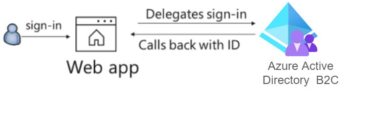

# An ASP.NET Core Web app signing-in users with the Microsoft identity platform in Azure AD B2C

[](https://identitydivision.visualstudio.com/IDDP/_build/latest?definitionId=819)

## Scenario

This sample shows how to build a .NET Core 2.2 MVC Web app that uses OpenID Connect to sign in users in **Azure AD B2C**. It assumes you have some familiarity with **Azure AD B2C**. If you'd like to learn all that B2C has to offer, start with our documentation at aka.ms/aadb2c.



## How to run this sample

To run this sample:

> Pre-requisites: Install .NET Core 2.2 or later (for example for Windows) by following the instructions at [.NET and C# - Get Started in 10 Minutes](https://www.microsoft.com/net/core). In addition to developing on Windows, you can develop on [Linux](https://www.microsoft.com/net/core#linuxredhat), [Mac](https://www.microsoft.com/net/core#macos), or [Docker](https://www.microsoft.com/net/core#dockercmd).

### Step 1: Clone or download this repository

From your shell or command line:

```powershell
git clone https://github.com/Azure-Samples/active-directory-aspnetcore-webapp-openidconnect-v2.git
```

> Given that the name of the sample is very long, and so are the name of the referenced NuGet packages, you might want to clone it in a folder close to the root of your hard drive, to avoid file size limitations on Windows.

### Step 2: Get your own Azure AD B2C tenant

If you don't an Azure AD B2C tenant yet, you'll need to create an Azure AD B2C tenant by following [these instructions](https://azure.microsoft.com/documentation/articles/active-directory-b2c-get-started).

### Step 3: Create your own user flow(policy)

This sample uses a unified sign-up/sign-in user flow(policy). Create this policy by following [the instructions here](https://azure.microsoft.com/documentation/articles/active-directory-b2c-reference-policies). You may choose to include as many or as few identity providers as you wish, but make sure **DisplayName** is checked.

If you already have an existing unified sign-up/sign-in user flow(policy) in your Azure AD B2C tenant, feel free to re-use it. No need to create a new one just for this sample.

Copy this policy name, so you can use it in step 5.

### Step 4: Create your own Web app

Now you need to [register your web app in your B2C tenant](https://docs.microsoft.com/azure/active-directory-b2c/active-directory-b2c-app-registration#register-a-web-application), so that it has its own Application ID.

Your web application registration should include the following information:

- Enable the **Web App/Web API** setting for your application.
- Set the **Reply URL** to `https://localhost:44321//signin/B2C_1_sign_up_in` and `https://localhost:44321//signout/B2C_1_sign_up_in`.
- Copy the Application ID generated for your application, so you can use it in the next step.

### Step 5: Configure the sample with your app coordinates

1. Open the solution in Visual Studio.
1. Open the `appsettings.json` file.
1. Find the assignment for `Instance` and replace the value with `<your-tenant-name>.b2clogin.com`
1. Find the assignment for `Domain` and replace the value with your Azure AD B2C domain name.
1. Find the assignment for `ClientID` and replace the value with the Application ID from Step 4.
1. Find the assignment for `SignUpSignInPolicyId` and replace with the names of the policy you created in Step 3.

```json
{
  "AzureAdB2C": {
    "Instance": "https://<your-tenant-name>.b2clogin.com",
    "ClientId": "<web-app-application-id>",
    "Domain": "<your-b2c-domain>",
    "CallbackPath": "/signin/B2C_1_sign_up_in",
    "SignedOutCallbackPath": "/signout/B2C_1_sign_up_in",
    "SignUpSignInPolicyId": "<your-sign-up-in-policy>"
  }
}
```

### Step 5: Run the sample

1. Build the solution and run it.
1. Open your web browser and make a request to the app. Accept the IIS Express SSL certificate if needed. Click on **SignIn/Up** button.
1. If you don't have an account registered on the **Azure AD B2C** used in this sample, follow the sign up process. Otherwise, input the email and password for your account and click on **Sign in**.

## Troubleshooting

### known issue on iOS 12

ASP.NET core applications create session cookies that represent the identity of the caller. Some Safari users using iOS 12 had issues which are described in [ASP.NET Core #4467](https://github.com/aspnet/AspNetCore/issues/4647) and the Web kit bugs database [Bug 188165 - iOS 12 Safari breaks ASP.NET Core 2.1 OIDC authentication](https://bugs.webkit.org/show_bug.cgi?id=188165).

If your web site needs to be accessed from users using iOS 12, you probably want to disable the SameSite protection, but also ensure that state changes are protected with CSRF anti-forgery mechanism. See the how to fix section of [Microsoft Security Advisory: iOS12 breaks social, WSFed and OIDC logins #4647](https://github.com/aspnet/AspNetCore/issues/4647)

> Did the sample not work for you as expected? Did you encounter issues trying this sample? Then please reach out to us using the [GitHub Issues](../../../../issues) page.

## About The code

This sample shows how to use the OpenID Connect ASP.NET Core middleware to sign in users from a single Azure AD B2C tenant. The middleware is initialized in the `Startup.cs` file by passing it the Client ID of the app, and the URL of the Azure AD B2C tenant where the app is registered. These values are  read from the `appsettings.json` file. The middleware takes care of:

- Requesting OpenID Connect sign-in using the policy from the `appsettings.json` file.
- Processing OpenID Connect sign-in responses by validating the signature and issuer in an incoming JWT, extracting the user's claims, and putting the claims in `ClaimsPrincipal.Current`.
- Integrating with the session cookie ASP.NET Core middleware to establish a session for the user.

You can trigger the middleware to send an OpenID Connect sign-in request by decorating a class or method with the `[Authorize]` attribute or by issuing a challenge (see the [AccountController.cs](https://github.com/aspnet/AspNetCore/blob/master/src/Azure/AzureAD/Authentication.AzureAD.UI/src/Areas/AzureAD/Controllers/AccountController.cs) file which is part of ASP.NET Core).

Here is the middleware example:

```csharp
services.AddAuthentication(options =>
{
    options.DefaultSignInScheme = CookieAuthenticationDefaults.AuthenticationScheme;
    options.DefaultAuthenticateScheme = CookieAuthenticationDefaults.AuthenticationScheme;
    options.DefaultChallengeScheme = "B2C_1_sign_up_in";
}).AddOpenIdConnect("B2C_1_sign_up_in", options =>
{
    options.MetadataAddress = "https://{your-AzureB2C-instance}/{your-AzureB2C-domain-name}/v2.0/.well-known/openid-configuration?p={your-signIn-signUp-policy-name}";
    options.ClientId = "{applicationId found on Azure Portal}";
    options.ResponseType = OpenIdConnectResponseType.IdToken;
    options.CallbackPath = "/signin/B2C_1_sign_up_in";
    options.SignedOutCallbackPath = "/signout/B2C_1_sign_up_in";
    options.SignedOutRedirectUri = "/";
    options.TokenValidationParameters.NameClaimType = "name";
    options.Scope.Add(OpenIdConnectScope.OpenIdProfile);
    options.Scope.Add(OpenIdConnectScope.OfflineAccess);
}).AddCookie();
```

Important things to notice:

- `B2C_1_sign_up_in` is the name of the user flow(policy) created, using the built-in Azure B2C [sign-in/sign-up user flow](https://docs.microsoft.com/en-us/azure/active-directory-b2c/active-directory-b2c-reference-policies) recommended to be used when handling users sign-in or sign-up.
- We are setting the `DefaultChallengeScheme` to `B2C_1_sign_up_in` so that by default, this is the scheme used on an authentication challenge.
- `/signin/B2C_1_sign_up_in` and `/signout/B2C_1_sign_up_in` are the reply urls registered on the app registration. These urls need to match with the callback paths configured on the middleware.
- We are setting `TokenValidationParameters.NameClaimType` to `name`, because that is the name of the claim being returned that holds the field **DisplayName**.

On `AuthController.cs`, we have the methods for **SignIn** and **SignOut**:

```csharp
public IActionResult SignIn()
{
    return Challenge(new AuthenticationProperties { RedirectUri = "/" }, "B2C_1_sign_up_in");
}

[HttpPost]
public async Task SignOut()
{
    await HttpContext.SignOutAsync(CookieAuthenticationDefaults.AuthenticationScheme);
    var scheme = User.Claims.First(x => x.Type == "tfp").Value;
    await HttpContext.SignOutAsync(scheme);
}

```

Important things to notice:

- On the **SignIn** method, we set the `RedirectUri` to the homepage, otherwise, Azure would redirect to the Uri that originated the challenge (in our case `/auth/signin`) and we would enter in a loop.
- Returning a `Challenge` with the scheme **B2C_1_sign_up_in**, will trigger the `OpenIdConnect` that we configured on `Startup.cs`.
- On the **SignOut** method, we set the `HttpPost` attribute and on `_LoginPartial.cshtml` we wrapped the button in a post form. The reason for that is because Chrome for example, prefetches pages to speed up browsing. And prefetching the sign out page would cause the user to sign out without reason, so using a form gets us around that.
- We are signing out the user from the scheme, `CookieAuthenticationDefaults.AuthenticationScheme`, since this is the scheme that we are using on the `Authentication` middleware, but we also want to sign out the user from any currently active authentication session in the **Azure AD** and to do that, we get the scheme from the claim `tfp` and sign it out as well.

## Next steps
Learn how to:
- Change your app to sign-in users from [any organization](../1-2-AnyOrg/README-1-1-to-1-2.md) or [any Microsoft accounts](../1-3-AnyOrgOrPersonal/README-1-1-to-1-3.md)
- Enable users from [National clouds](../1-4-Sovereign) to sign-in to your application
- enable your [Web App to call a Web API on behalf of the signed-in user](../../2-WebApp-graph-user)

## Learn more

To understand more about token validation, see
- [Validating tokens](https://github.com/AzureAD/azure-activedirectory-identitymodel-extensions-for-dotnet/wiki/ValidatingTokens)
To understand more about app registration, see:

- [Quickstart: Register an application with the Microsoft identity platform (Preview)](https://docs.microsoft.com/azure/active-directory/develop/quickstart-register-app)
- [Quickstart: Configure a client application to access web APIs (Preview)](https://docs.microsoft.com/azure/active-directory/develop/quickstart-configure-app-access-web-apis)
