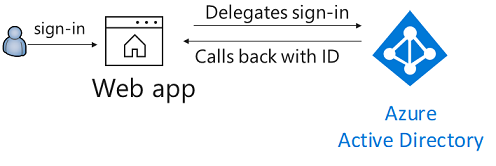

# An ASP.NET Core Web app signing-in users with the Microsoft identity platform in Azure AD B2C using the Embedded sign-in experience with iframe

[](https://identitydivision.visualstudio.com/IDDP/_build/latest?definitionId=819)

## Scenario

This sample shows how to build a .NET Core MVC Web app that uses OpenID Connect to sign in users in **Azure AD B2C** using the embedded sign-in experience. It assumes you have some familiarity with **Azure AD B2C**. If you'd like to learn all that B2C has to offer, start with our documentation at [https://aka.ms/aadb2c](https://aka.ms/aadb2c).



## How to run this sample

To run this sample:

> Pre-requisites: Install .NET Core 3.0 or later (for example for Windows) by following the instructions at [.NET and C# - Get Started in 10 Minutes](https://www.microsoft.com/net/core). In addition to developing on Windows, you can develop on [Linux](https://www.microsoft.com/net/core#linuxredhat), [Mac](https://www.microsoft.com/net/core#macos), or [Docker](https://www.microsoft.com/net/core#dockercmd).

### Step 1: Clone or download this repository

From your shell or command line:

```powershell
git clone https://github.com/Azure-Samples/active-directory-aspnetcore-webapp-openidconnect-v2.git
```

> Given that the name of the sample is very long, and so are the names of the referenced NuGet packages, you might want to clone it in a folder close to the root of your hard drive, to avoid file size limitations on Windows.

Navigate to the `"1-7-B2C-Embedded"` folder

 ```Sh
  cd "1-WebApp-OIDC\1-7-B2C-Embedded"
  ```

## Option 1 - Run the pre-configured sample

1. Build the solution and run it.
1. Open your web browser and make a request to the app. Accept the IIS Express SSL certificate if needed. Click on SignIn/Up button.
1. Click on Sign-In.

## Option 2 (Recommended) - Configure the sample with your own B2C app

### Step 2: Get your own Azure AD B2C tenant

If you don't have an Azure AD B2C tenant yet, you'll need to create an Azure AD B2C tenant by following the [Tutorial: Create an Azure Active Directory B2C tenant](https://azure.microsoft.com/documentation/articles/active-directory-b2c-get-started).

### Step 3: Enable custom domains for Azure Active Directory B2C

To use Azure AD B2C Embedded sign-in, you need to first enable a custom domain with your Azure AD B2C account, and configure it with a custom domain which is on the same domain as your published application, i.e. **Same Origin**. This is required because Azure AD B2C should not allow you to load the sign-in experience in an iframe unless you enable CORS for the source domains loading the iframe using a custom policy. So first, enable a custom domain similar to `login.yourcustomdomain.com` if your application is published on something similar to `www.yourcustomdomain.com`. [Tutorial: Enable custom domains for Azure Active Directory B2C](https://docs.microsoft.com/en-us/azure/active-directory-b2c/custom-domain?pivots=b2c-custom-policy).

>Note: This will effectively disallow you from using sign-in if the application is run from a development machine. To get around that, you may want to create a separate Azure AD Tenant for development, with a development version of the custom policy which has CORS enabled for **<https://localhost:XXXX>**. Also note that this may result in an undesirable user experience Because Azure AD B2C session cookies within an iframe are considered third-party cookies, certain browsers (for example Safari or Chrome in incognito mode) either block or clear these cookies. This should never be done in your production Azure AD B2C tenant.

### Step 4: Create your SignUp/SignIn, Password Reset, and Profile Edit policies (custom policy)

This sample depends on a custom sign-up/sign-in policy. This is because you need to customize the policy to allow **JourneyFraming**, where you allow the user journey to be loaded into an iframe.
You can use one of the policies in the [Azure AD B2C Custom Policy Starter Pack](https://github.com/Azure-Samples/active-directory-b2c-custom-policy-starterpack). Follow the [Tutorial: Create user flows in Azure Active Directory B2C](https://docs.microsoft.com/en-us/azure/active-directory-b2c/tutorial-create-user-flows?pivots=b2c-custom-policy) to deploy such policy.

In your policy, aside from the normal steps in customizing the policy, make sure to add the following in **SignUpOrSignIn.xml**, **PasswordReset.xml**, and **ProfileEdit.xml**, inside the `<RelyingParty>` tag, right after the `<DefaultUserJourney>` tag.

```xml
<!--
<RelyingParty>
  <DefaultUserJourney ReferenceId="SignUpOrSignIn" /> -->
  <UserJourneyBehaviors> 
    <JourneyFraming Enabled="true" Sources="https://yourcustomdomain.com https://www.yourcustomdomain.com" /> 
  </UserJourneyBehaviors>
<!--
</RelyingParty> -->
```

>Note: If you want to allow the custom policies to be used with your development environment, make sure you add **<https://localhost:xxxx>** to the list of sources in the `<JourneyFraming>' tag.

Additionally, make sure the `PublicPolicyUri` element in the `<TrustFrameworkPolicy>` in all policy xml files (including **TrustedFramewordBase.xml** and **TrustedFrameworkExtensions.xml**) is referncing your custom domain, not the instance name. The example below is for **SignUpOrSignin.xml**.

```xml
PublicPolicyUri="http://login.yourcustomdomain.com/B2C_1A_signup_signin"
```

### Step 5: Create your own Web app

Now you need to [register your web app in your B2C tenant](https://docs.microsoft.com/azure/active-directory-b2c/active-directory-b2c-app-registration#register-a-web-application), so that it has its own Application ID.

Your web application registration should include the following information:

- Enable the **Web App/Web API** setting for your application.
- Set the **Reply URL** to `https://www.yourcustomdomain.com/signin-oidc`.
- Copy the Application ID generated for your application, so you can use it in the next step.

### Step 6: Configure the sample with your app coordinates

1. Open the solution in Visual Studio.
1. Open the `appsettings.json` file.
1. Find the assignment for `Instance` and replace the value with your tenant name. For example, `https://login.yourcustomdomain.com`
1. Find the assignment for `Domain` and replace the value with your Azure AD B2C domain name. For example, `yourtenant.onmicrosoft.com`
1. Find the assignment for `ClientID` and replace the value with the Application ID from Step 4.
1. Find the assignment for `SignUpSignInPolicyId` and replace with the name of the `Sign up and sign in` policy you created in Step 4.

```JSon
{
  "AzureAdB2C": {
    "Instance": "https://<your-tenant-name>.b2clogin.com",
    "ClientId": "<web-app-application-id>",
    "Domain": "<your-b2c-domain>",
    "SignedOutCallbackPath": "/signout/<your-sign-up-in-policy>",
    "SignUpSignInPolicyId": "<your-sign-up-in-policy>",
    "ResetPasswordPolicyId": "<your-password-reset-policy>",
    "EditProfilePolicyId": "<your-profile-edit-policy>"
  }
}
```

### Step 7 (Optional): Customize the UI

For a better user experience, you may want to customize the sign-in UI to be more minimal. I chose not to get into those details in this demo, but you can learn more about to [Customize the user interface in Azure Active Directory B2C](https://docs.microsoft.com/en-us/azure/active-directory-b2c/customize-ui?pivots=b2c-custom-policy).

>Note: You may find a JavaScript error `Blocked autofocusing on a <input> element in a cross-origin subframe.` in your browser's console. This is because the default behavior of the sign-in experience attempts to focus the user input on the first available user input in the sign-in page, which is not allowed inside an iframe for security reasons. You may want to attempt to override this behavior in your custom UI.

```error
Blocked autofocusing on a <input> element in a cross-origin subframe.
```

### Step 8: Run the sample

1. Build the solution and run it.
1. Open your web browser and make a request to the app. Accept the IIS Express SSL certificate if needed. Click on **SignIn/Up** button.
1. If you don't have an account registered on the **Azure AD B2C** used in this sample, follow the sign up process. Otherwise, input the email and password for your account and click on **Sign in**.

## Notes about the code

### Defining the Login Modal Dialog

In **_Layout.cshtml**, note the modal dialog definition:

```html
<!-- Modal dialog for loading the login iframe -->
<div class="modal fade" id="loginModal" tabindex="-1" aria-labelledby="loginModal" aria-hidden="true">
  <div class="modal-dialog">
      @if (!User.Identity.IsAuthenticated)
      {
          <!-- Note the src property, which targets the SignIn action in the Account controller provided by the MicrosoftIdentity middleware. -->
          <iframe id="loginframe" frameborder="0" src="/MicrosoftIdentity/Account/SignIn" style="height: 600px;width: 300px;"></iframe>
      }
  </div>
</div>
```

### Showing the Login Modal Dialog

We need to show the modal dialog which contains the iframe when the sign-in button is clicked. We do not need to worry about closing it when the login, is complete, this will be handled when we reload the entire page post-login in the next step.

```html
<!-- Shows the loginModal when the SignIn/SignUp button is clicked-->
<script>
    $("#btn_susi").on("click", function () {
        $("#loginModal").modal("show");
    });
</script>
```

### Javascript required for post-login redirect

Because all the login experience and redirects happen inside the iframe, we need to identify when the user journey is completed, and the user is directed back to our application. We track the **document.referrer** value. If we're coming back form our login domain, we know the user journey is compelted, and we can reload the main window (not the iframe) so it reflects the logged-in user's details.

```html
<!-- Because the authorization flow happens inside the iframe, we need to reload the main page.-->
<script>
    if (document.referrer.startsWith('@Configuration.GetSection("AzureAdB2C")["Instance"]'))
        window.top.location.reload();
</script>
```

>Note: There are other alternatives here which we can do to accomplish the same logic, one being creating your own SignIn action which includes generating your own sign-in challenge and using the *state* parameter of the sign-in request using OpenIdConnect Events to indicate the redirect url. However, for the purposes of demo, this JavaScript snippet will do.

## Troubleshooting

### known issue on iOS 12

ASP.NET core applications create session cookies that represent the identity of the caller. Some Safari users using iOS 12 had issues which are described in [ASP.NET Core #4467](https://github.com/aspnet/AspNetCore/issues/4647) and the Web kit bugs database [Bug 188165 - iOS 12 Safari breaks ASP.NET Core 2.1 OIDC authentication](https://bugs.webkit.org/show_bug.cgi?id=188165).

If your web site needs to be accessed from users using iOS 12, you probably want to disable the SameSite protection, but also ensure that state changes are protected with CSRF anti-forgery mechanism. See the how to fix section of [Microsoft Security Advisory: iOS12 breaks social, WSFed and OIDC logins #4647](https://github.com/aspnet/AspNetCore/issues/4647)

> Did the sample not work for you as expected? Did you encounter issues trying this sample? Then please reach out to us using the [GitHub Issues](../../../../issues) page.
> [Consider taking a moment to share your experience with us.](https://forms.office.com/Pages/ResponsePage.aspx?id=v4j5cvGGr0GRqy180BHbRz0h_jLR5HNJlvkZAewyoWxUNEFCQ0FSMFlPQTJURkJZMTRZWVJRNkdRMC4u)

## About The code

### Where is MSAL?

This sample does NOT use MSAL as it only signs-in users (it does not call a Web API). It uses the built-in ASP.NET Core middleware. MSAL is used for fetching access  for accessing protected APIs (not shown here), as well as ID tokens. For logging-in purposes, it is sufficient to obtain an ID Token, and the middleware is capable of doing this on its own.

### Where is the Account controller?

The `AccountController.cs` used in this sample is part of `Microsoft.Identity.Web.UI` NuGet package, and you can find its implementation [here](https://github.com/AzureAD/microsoft-identity-web/blob/master/src/Microsoft.Identity.Web.UI/Areas/MicrosoftIdentity/Controllers/AccountController.cs). If you want to customize the **Sign-in**, **Sign-up** or **Sign-out** actions, you are encouraged to create your own controller.

### B2C middleware

This sample shows how to use the OpenID Connect ASP.NET Core middleware to sign in users from a single Azure AD B2C tenant. The middleware is initialized in the `Startup.cs` file by passing the default authentication scheme and `OpenIdConnectOptions.cs` options. The options are read from the `appsettings.json` file. The middleware takes care of:

- Requesting OpenID Connect sign-in using the policy from the `appsettings.json` file.
- Processing OpenID Connect sign-in responses by validating the signature and issuer in an incoming JWT, extracting the user's claims, and putting the claims in `ClaimsPrincipal.Current`.
- Integrating with the session cookie ASP.NET Core middleware to establish a session for the user.

You can trigger the middleware to send an OpenID Connect sign-in request by decorating a class or method with the `[Authorize]` attribute or by issuing a challenge (see the [AccountController.cs](https://github.com/AzureAD/microsoft-identity-web/blob/master/src/Microsoft.Identity.Web.UI/Areas/MicrosoftIdentity/Controllers/AccountController.cs) file).

Here is the middleware example:

```csharp
      services.AddMicrosoftIdentityWebAppAuthentication(Configuration, "AzureAdB2C");
```

Important things to notice:

- The method `AddMicrosoftIdentityWebAppAuthentication` will configure the authentication based on the `MicrosoftIdentityOptions.cs` options. Feel free to bind more properties on `AzureAdB2C` section on `appsettings.json` if you need to set more options.
- The URLs you set for `CallbackPath` and `SignedOutCallbackPath` should be registered on the **Reply URLs** of your application, in [Azure Portal](https://portal.azure.com).

## Next steps

Learn how to:

- Enable your [Web App to call a Web API on behalf of the signed-in user](../../2-WebApp-graph-user)

## Learn more

To understand more about Azure AD B2C see:

- [Azure AD B2C documentation](https://docs.microsoft.com/en-us/azure/active-directory-b2c/)
- [Tutorial: Create user flows in Azure Active Directory B2C](https://docs.microsoft.com/en-us/azure/active-directory-b2c/tutorial-create-user-flows?pivots=b2c-custom-policy)
- [Embedded sign-in experience](https://docs.microsoft.com/en-us/azure/active-directory-b2c/embedded-login?pivots=b2c-custom-policy)

To understand more about ASP.NET Core and Azure identity integration

- [ASP.NET Core Azure AD samples](https://github.com/aspnet/AspNetCore/tree/master/src/Azure/AzureAD/samples)

To understand more about token validation, see:

- [Validating tokens](https://github.com/AzureAD/azure-activedirectory-identitymodel-extensions-for-dotnet/wiki/ValidatingTokens)

To understand more about app registration, see:

- [Quickstart: Register an application with the Microsoft identity platform (Preview)](https://docs.microsoft.com/azure/active-directory/develop/quickstart-register-app)
- [Quickstart: Configure a client application to access web APIs (Preview)](https://docs.microsoft.com/azure/active-directory/develop/quickstart-configure-app-access-web-apis)
