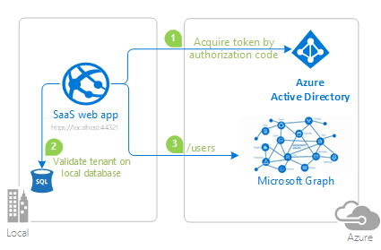
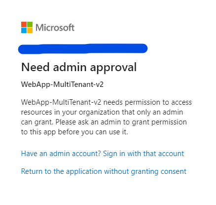
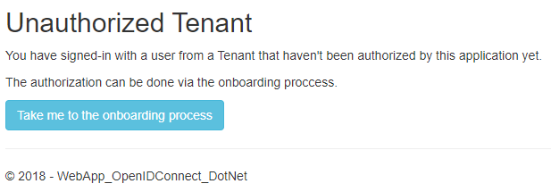
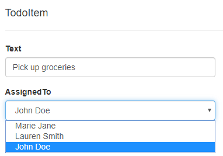

# Build a multi-tenant SaaS web application that calls Microsoft Graph using Azure AD & OpenID Connect

> This sample is for Azure AD, not Azure AD B2C.

[](https://identitydivision.visualstudio.com/IDDP/_build/latest?definitionId=819)

## About this sample

This sample shows how to build an ASP.NET Core MVC web application that uses OpenID Connect to sign in users from multiple Azure AD tenants. Additionally it also introduces developers to the concept of a [multi-tenant](https://docs.microsoft.com/azure/active-directory/develop/single-and-multi-tenant-apps) Azure Active Directory application.

It also introduces developers to the concept of

- Multi-tenant Azure Active Directory application
- [Azure National cloud deployments](https://docs.microsoft.com/en-us/graph/deployments)

> :grey_exclamation: If you want to run this sample in [Azure Worldwide Cloud](https://portal.azure.com/), please navigate to the [README.md](README.md).

### Microsoft National cloud environments

National clouds (aka Sovereign clouds) are physically isolated instances of Azure. These regions of Azure are designed to make sure that data residency, sovereignty, and compliance requirements are honored within geographical boundaries.
In addition to the public cloud​, Azure Active Directory is deployed in the following National clouds:  

- Microsoft Cloud for US Government
- Microsoft Cloud Germany
- Azure and Office 365 operated by 21Vianet in China

### Overview

When it comes to developing apps, developers can choose to configure their app to be either single-tenant or multi-tenant during app registration in the [Azure portal](https://portal.azure.com).

- `Single-tenant` apps are only available in the tenant they were registered in, also known as their home tenant.
- `Multi-tenant` apps are available to users in both their home tenant and other tenants where they are provisioned. Apps that allow users to sign-in using their personal accounts that they use to sign into services like Xbox and Skype are also multi-tenant apps.

For more information about apps and tenancy, see [Tenancy in Azure Active Directory](https://docs.microsoft.com/azure/active-directory/develop/single-and-multi-tenant-apps)



## Scenario

This sample shows how to build a .NET Core MVC web application that uses the [OpenID Connect](https://docs.microsoft.com/azure/active-directory/develop/v2-protocols-oidc) protocol to sign in users from multiple Azure AD tenants and acquire token for [Microsoft Graph](https://graph.microsoft.com) using the [Microsoft Authentication Library (MSAL)](https://docs.microsoft.com/azure/active-directory/develop/msal-overview). It leverages the ASP.NET Core OpenID Connect middleware.

The application puts forward a scenario where a SaaS application invites the administrators of Azure AD tenants to `enroll` their tenants into this app. This process is analogous to a customer `buying` a SaaS product.  

 1. Once you start the application, you will land on the homepage where you can **sign-in** or **onboard** your tenant.
 1. If you try to **Sign-In** before onboarding your tenant, you'd land on the **Unauthorized Tenant** page. Click on the **Take me to the onboarding process** button to onboard your tenant to this application.
 1. On the onboarding page, you will be asked to sign-in as a tenant **administrator** and accept the permissions requested in the **admin consent** screen to successfully provision the application in your tenant.
 1. Once you have **registered your tenant**, all users from that tenant will be able to sign-in and explore the ToDo list.

> :grey_exclamation: Azure Government applications can use Azure AD Government identities, but can also use Azure AD Public identities to authenticate to an application hosted in Azure Government. A multi-tenant application **will not** be accessible using Azure AD Public identities. To know more about choosing identity authority go to [choosing your identity authority in Azure Government](https://docs.microsoft.com/en-us/azure/azure-government/documentation-government-plan-identity#choosing-your-identity-authority).

## How to run this sample

To run this sample:

> Pre-requisites: Install .NET Core 2.2 or later (for example for Windows) by following the instructions at [.NET and C# - Get Started in 10 Minutes](https://www.microsoft.com/net/core). In addition to developing on Windows, you can develop on [Linux](https://www.microsoft.com/net/core#linuxredhat), [Mac](https://www.microsoft.com/net/core#macos), or [Docker](https://www.microsoft.com/net/core#dockercmd).

Ideally, you would want to have two Azure AD tenants so you can test all the aspects of this multi-tenant sample. For more information on how to get an Azure AD tenant, see [How to get an Azure AD tenant](https://azure.microsoft.com/documentation/articles/active-directory-howto-tenant/).

If you are using the automation provided via Powershell to create your app, you need to change the [Configure.ps1](./AppCreationScripts/Configure.ps1) and [Cleanup.ps1](./AppCreationScripts/Cleanup.ps1) as instructed below to append the `-AzureEnvironmentName` parameter. The details on this parameter and its possible values are listed in [Connect-AzureAD](https://docs.microsoft.com/en-us/powershell/module/azuread/connect-azuread?view=azureadps-2.0).

 ```Powershell
 Connect-AzureAD -TenantId $tenantId -AzureEnvironmentName AzureUSGovernment
 ```

### Step 1:  Clone or download this repository

From your shell or command line:

```Shell
git clone https://github.com/Azure-Samples/microsoft-identity-platform-aspnetcore-webapp-tutorial.git
cd "2-WebApp-graph-user\2-3-Multi-Tenant"
```

or download and extract the repository .zip file.

> Given that the name of the sample is quiet long, and so are the names of the referenced NuGet packages, you might want to clone it in a folder close to the root of your hard drive, to avoid file size limitations on Windows.

### Step 2:  Register the sample application with your Azure Active Directory tenant

There is one project in this sample. To register it, you can:

- either follow the steps [Step 2: Register the sample with your Azure Active Directory tenant](#step-2-register-the-sample-with-your-azure-active-directory-tenant) and [Step 3:  Configure the sample to use your Azure AD tenant](#choose-the-azure-ad-tenant-where-you-want-to-create-your-applications)
- or use PowerShell scripts that:
  - **automatically** creates the Azure AD applications and related objects (passwords, permissions, dependencies) for you. Note that this works for Visual Studio only.
  - modify the Visual Studio projects' configuration files.

<details>
  <summary>Expand this section if you want to use this automation:</summary>

1. On Windows, run PowerShell and navigate to the root of the cloned directory
1. In PowerShell run:

   ```PowerShell
   Set-ExecutionPolicy -ExecutionPolicy RemoteSigned -Scope Process -Force
   ```

1. Run the script to create your Azure AD application and configure the code of the sample application accordingly.
1. In PowerShell run:

   ```PowerShell
   cd .\AppCreationScripts\ 
   .\Configure.ps1
   ```

   > Other ways of running the scripts are described in [App Creation Scripts](./AppCreationScripts/AppCreationScripts.md)
   > The scripts also provide a guide to automated application registration, configuration and removal which can help in your CI/CD scenarios.

1. Open the Visual Studio solution and click start to run the code.

</details>

Follow the steps below to manually walk through the steps to register and configure the applications.

### Step 3:  Configure the sample to use your Azure AD tenant

As a first step you'll need to:

1. Sign in to the [National cloud Azure portal](https://docs.microsoft.com/en-us/azure/active-directory/develop/authentication-national-cloud#app-registration-endpoints) using either a work or school account or a personal Microsoft account.
1. If your account is present in more than one Azure AD tenant, select your profile at the top right corner in the menu on top of the page, and then **switch directory**.
   Change your portal session to the desired Azure AD tenant.

#### Register the web app (WebApp-MultiTenant-v2)

1. Navigate to the Microsoft identity platform for developers [App registrations](https://go.microsoft.com/fwlink/?linkid=2083908) page.
1. Click **New registration** on top.
1. In the **Register an application page** that appears, enter your application's registration information:
   - In the **Name** section, enter a meaningful application name that will be displayed to users of the app, for example `WebApp-MultiTenant-v2`.
   - Change **Supported account types** to **Accounts in any organizational directory**.
     > Note that there are more than one redirect URIs used in this sample. You'll need to add them from the **Authentication** tab later after the app has been created successfully.
1. Click on the **Register** button in bottom to create the application.
1. In the app's registration screen, find the **Application (client) ID** value and record it for use later. You'll need it to configure the configuration file(s) later in your code.
1. In the app's registration screen, click on the **Authentication** blade in the left.
   - In the Redirect URIs section, select **Web** in the drop down and enter the following redirect URIs.
           - `https://localhost:44321/`
           - `https://localhost:44321/signin-oidc`
           - `https://localhost:44321/Onboarding/ProcessCode`
        - In the **Advanced settings** section, set **Logout URL** to `https://localhost:44321/signout-oidc`.
        - In the **Advanced settings** | **Implicit grant** section, check the **ID tokens** option as the [AspNetCore security middleware](https://github.com/aspnet/AspNetCore/tree/master/src/Security) used in the sample uses the [Implicit grant flow](https://docs.microsoft.com/azure/active-directory/develop/v2-oauth2-implicit-grant-flow) by default to get the user info right after sign-in.

1. Click the **Save** button on top to save the changes.
1. In the app's registration screen, click on the **Certificates & secrets** blade in the left to open the page where we can generate secrets and upload certificates.
1. In the **Client secrets** section, click on **New client secret**:
   - Type a key description (for instance `app secret`),
   - Select one of the available key durations (**In 1 year**, **In 2 years**, or **Never Expires**) as per your security concerns.
   - The generated key value will be displayed when you click the **Add** button. Copy the generated value for use in the steps later.
   - You'll need this key later in your code's configuration files. This key value will not be displayed again, and is not retrievable by any other means, so make sure to note it from the Azure portal before navigating to any other screen or blade.
1. In the app's registration screen, click on the **API permissions** blade in the left to open the page where we add access to the Apis that your application needs.
   - Click the **Add a permission** button and then,
   - Ensure that the **Microsoft APIs** tab is selected.
   - In the *Commonly used Microsoft APIs* section, click on **Microsoft Graph**
   - In the **Delegated permissions** section, select the **User.Read.All** in the list. Use the search box if necessary.
   - Click on the **Add permissions** button in the bottom.

##### Configure the project (WebApp-OpenIDConnect-DotNet) to use your app registration

Open the project in your IDE (like Visual Studio) to configure the code.
>In the steps below, "ClientID" is the same as "Application ID" or "AppId".

1. Open the `appsettings.json` file
1. Find the app key `Instance` and replace the existing value with the corresponding [Azure AD endpoint](https://docs.microsoft.com/en-us/azure/active-directory/develop/authentication-national-cloud#azure-ad-authentication-endpoints) for the national cloud you want to target.
1. Find the app key `ClientId` and replace the existing value with the application ID (clientId) of the `WebApp-MultiTenant-v2` application copied from the Azure portal.
1. Find the app key `TenantId` and replace the existing value with `organizations`.
1. Find the app key `Domain` and replace the existing value with your Azure AD tenant name.
1. Find the app key `ClientSecret` and replace the existing value with the key you saved during the creation of the `WebApp-MultiTenant-v2` app, in the Azure portal.
1. Find the app keys `GraphAPI:Endpoint` and `GraphAPI:StaticScope` and replace the existing value with the corresponding [Microsoft Graph endpoint](https://docs.microsoft.com/en-us/graph/deployments#microsoft-graph-and-graph-explorer-service-root-endpoints) for the  national cloud you want to target.

### Step 4: Run the sample

Clean the solution, rebuild the solution, and run it.
The sample implements two distinct tasks: the onboarding of a new tenant and a basic ToDo List CRUD operation.

Ideally, you would want to have two Azure AD tenants so you can test the multi-tenant aspect of this sample. For more information on how to get an Azure AD tenant, see [How to get an Azure AD tenant](https://azure.microsoft.com/documentation/articles/active-directory-howto-tenant/).

#### Signing-in

Users can only sign-in if their tenant had been "onboarded" first. The sample will guide them how to do so, but it requires a **tenant admin account** to complete the onboarding process. Once the admin has consented and provisioned the app in their tenant, all users from their tenant will be able to sign-in.

If you try to onboard without an admin account, you will be presented with the following screen. Please switch to an admin account to complete this step:



If you try to sign-in with a tenant that hasn't been "onboarded" yet, you will land on the following page. Please click on **Take me to the onboarding process** button and follow the instructions to get your tenant registered in the sample database:



> :warning: If you had onboarded your tenant using this sample in the past and now getting the **AADSTS650051** error when onboarding again, please refer to the [Error AADSTS650051](#error-aadsts650051) section below to mitigate this error.

#### ToDo List

Users from one tenant can't see the **ToDo** items of users from other tenants. They will be able to perform basic CRUD operations on ToDo items assigned to them. When editing a ToDo item, users can assign it to any other user from their tenant. The list of users in a tenant is fetched from Microsoft Graph, using the [Graph SDK](https://github.com/microsoftgraph/msgraph-sdk-dotnet).

The list of users will be presented in the **Assigned To** dropdown:



## About The code

This sample details the following aspects of a multi-tenant app.

- usage of the `/common` endpoint.
- Service principal provisioning of an app in Azure AD tenants
- Custom Token Validation to allow users from onboarded tenants only.
- Data partitioning in multi-tenant apps.
- Acquiring Access tokens for Microsoft Graph for each tenant.

This sample is using the OpenID Connect ASP.NET Core middleware to sign in users from multiple Azure AD tenants. The middleware is initialized in the `Startup.cs` file by passing it the Client ID of the app, and the URL of the Azure AD tenant where the app is registered. These values are read from the `appsettings.json` file.

You can trigger the middleware to send an OpenID Connect sign-in request by decorating a class or method with the `[Authorize]` attribute or by issuing a challenge (see the [AccountController.cs](https://github.com/aspnet/AspNetCore/blob/master/src/Azure/AzureAD/Authentication.AzureAD.UI/src/Areas/AzureAD/Controllers/AccountController.cs) file which is part of ASP.NET Core):

These steps are encapsulated in the [Microsoft.Identity.Web](..\..\Microsoft.Identity.Web) project, and in particular in the [WebAppServiceCollectionExtensions.cs](..\..\Microsoft.Identity.Web\WebAppServiceCollectionExtensions.cs) file

### Usage of `/common` endpoint

In order to be able to sign-in users from multiple tenants, the [/common endpoint](https://docs.microsoft.com/azure/active-directory/develop/howto-convert-app-to-be-multi-tenant#update-your-code-to-send-requests-to-common) must be used. In the sample, this endpoint is used as a result of setting the value for `TenantId` as `organizations` on the `appsettings.json` file, and configuring the middleware to read the values from it.

```csharp
services.AddAuthentication(AzureADDefaults.AuthenticationScheme)
                .AddAzureAD(options => configuration.Bind(configSectionName, options));
```

 You can read about the various endpoints of the Microsoft Identity Platform [here](https://docs.microsoft.com/azure/active-directory/develop/active-directory-v2-protocols#endpoints).

#### Implications of signing-in guest users on `/common` endpoint

Please note that if you sign-in guest users at the `/common` endpoint, they will be directed to their home tenant for signing-in. So, if your multi-tenant app cares about applying tenant specific conditional access policies, group assignments or app roles to be applied to the guest users, the app should sign-in the guest user on the **tenanted endpoint** (https://login.microsoftonline.com/{tenantId}) instead of the `/common` endpoint.

### Service principal provisioning for new tenants (onboarding process)

For a multi-tenant app to work across tenants, its service principal will need to be provisioned in the users' tenant. It can either happen when the first user signs in, or most tenant admins only allow a tenant admin to carry out the service principal provisioning. For provisioning, we will be using the [admin consent endpoint](https://docs.microsoft.com/azure/active-directory/develop/v2-admin-consent) for the onboarding process. The code for this is provided in the `OnboardingController.cs`. The `Onboard` action and corresponding view, simulate the onboarding flow and experience.

```csharp
[HttpPost]
[ValidateAntiForgeryToken]
public IActionResult Onboard()
{
  ...
  string authorizationRequest = string.Format(
                "{0}organizations/v2.0/adminconsent?client_id={1}&redirect_uri={2}&state={3}&scope={4}",
                azureADOptions.Instance,
                Uri.EscapeDataString(azureADOptions.ClientId),
                Uri.EscapeDataString(currentUri + "Onboarding/ProcessCode"),
                Uri.EscapeDataString(stateMarker),
                Uri.EscapeDataString("https://graph.microsoft.com/.default"));
  return Redirect(authorizationRequest);
}
```

This results in an OAuth2 code grant request that triggers the admin consent flow and creates the service principal in the admin's tenant. The `state` parameter is used to validate the response, preventing a man-in-the-middle attack. Then, the `ProcessCode` action receives the authorization code from Azure AD and, if they appear valid, we create an entry in the application database for the new customer.

The `https://graph.microsoft.com/.default` is a static scope that allows the tenant admin to consent for all permissions in one go. You can find more about static scope on [this link.](https://docs.microsoft.com/azure/active-directory/develop/v2-admin-consent#request-the-permissions-from-a-directory-admin)

### Custom token validation allowing only registered tenants

On the `Startup.cs` we are calling `AddSignIn` to configure the authentication, and within that method, we validates that the token issuer is from AAD.

```csharp
options.TokenValidationParameters.IssuerValidator = AadIssuerValidator.GetIssuerValidator(options.Authority).Validate;
```

To extend this validation to only Azure AD tenants registered in the application database, the event handler `OnTokenValidated` was configured to grab the `tenantId` from the token claims and check if it has an entry on the database. If it doesn't, a custom exception `UnauthorizedTenantException` is thrown, canceling the authentication, and the user is redirected to the `UnauthorizedTenant` view. At this stage, the user is not authenticated in the application.

```csharp
services.Configure<OpenIdConnectOptions>(AzureADDefaults.OpenIdScheme, options =>
{
    options.Events.OnTokenValidated = async context => 
    {
        string tenantId = context.SecurityToken.Claims.FirstOrDefault(x => x.Type == "tid" || x.Type == "http://schemas.microsoft.com/identity/claims/tenantid")?.Value;

        if (string.IsNullOrWhiteSpace(tenantId))
            throw new UnauthorizedAccessException("Unable to get tenantId from token.");

        var dbContext = context.HttpContext.RequestServices.GetRequiredService<SampleDbContext>();

        var authorizedTenant = await dbContext.AuthorizedTenants.FirstOrDefaultAsync(t => t.TenantId == tenantId);

        if (authorizedTenant == null)
            throw new UnauthorizedTenantException("This tenant is not authorized");

    };
    options.Events.OnAuthenticationFailed = (context) =>
    {
        if (context.Exception != null && context.Exception is UnauthorizedTenantException)
        {
            context.Response.Redirect("/Home/UnauthorizedTenant");
            context.HandleResponse(); // Suppress the exception
        }

        return Task.FromResult(0);
    };
});
```

### Data partitioning by tenant

There are two common scenarios regarding data partition on a multi-tenant app. Having a separate database for each tenant or having a single database and using the **tenantId** to separate the data of each tenant. In this sample, we have taken the single database approach to save the ToDo items for all users from all tenants.

If you want to read more about data architecture on multi-tenant apps, please refer to [Multi-tenant SaaS database tenancy patterns](https://docs.microsoft.com/azure/sql-database/saas-tenancy-app-design-patterns)

`TodoListController.cs` has the basic CRUD actions for `ToDoItem` and each operation takes into account the signed user's **tenantId** to separate data from each tenant. The tenantId can be found in the user' claims.

### Acquiring Access token for Microsoft Graph for each tenant

If a multi-tenant app needs to acquire an access token for Microsoft Graph to be able to read data from the signed user's tenant, the token must be issued from their tenanted authority and not from the tenant where the SaaS application is registered. This feature is being showed on the **Edit** action result on `todoListController.cs`.

```csharp
var userTenant = User.GetTenantId();
// Acquiring token for graph using the user's tenant, so it can return all the users from their tenant
var graphAccessToken = await _tokenAcquisition.GetAccessTokenForUserAsync(new string[] { GraphScope.UserReadAll }, userTenant);
```

We are acquiring an access token for Graph with the scope `User.Read.All`, to list all the users from the tenant so you can assign a todo item to them. `GetAccessTokenForUserAsync` is a helper method found on `Microsoft.Identity.Web` project, and it receives a **tenantId** as parameter to acquire a token for the desired authority. For that, we get the current authority from the built `IConfidentialClientApplication` and replace the tenantId. Below is an example of this logic.

```csharp
string signedUserAuthority = confidentialClientApplication.Authority.Replace(new Uri(confidentialClientApplication.Authority).PathAndQuery, $"/{tenant}/");
AuthenticationResult result = await confidentialClientApplication
    .AcquireTokenSilent(new string[] { "User.Read.All" }, account)
    .WithAuthority(signedUserAuthority)
    .ExecuteAsync()
    .ConfigureAwait(false);
```

## Troubleshooting

### Error AADSTS650051

If you are receiving the following error message, you might need to **delete older service principals of this application**. Please [delete the existing [service principal](https://docs.microsoft.com/azure/active-directory/develop/app-objects-and-service-principals) from the **enterprise app** blade of the tenant before re-creating this application]. Click on the **Enterprise Applications** blade in the portal, locate this application `WebApp-MultiTenant-v2`, navigate to its **properties** and click **Delete** to delete the service principal.

> OpenIdConnectProtocolException: Message contains error: 'invalid_client', error_description: 'AADSTS650051: Application '{applicationId}' is requesting permissions that are either invalid or out of date.

If you had provisioned a service principal of this app in the past and created a new one, the tenants that had signed-in in the app might still have the previous service principal registered causing a conflict with the new one. The solution for the conflict is to delete the older service principal from each tenant in the **Enterprise Application** menu.

## Contributing

If you'd like to contribute to this sample, see [CONTRIBUTING.MD](/CONTRIBUTING.md).

This project has adopted the [Microsoft Open Source Code of Conduct](https://opensource.microsoft.com/codeofconduct/). For more information, see the [Code of Conduct FAQ](https://opensource.microsoft.com/codeofconduct/faq/) or contact [opencode@microsoft.com](mailto:opencode@microsoft.com) with any additional questions or comments.

## Learn more

To learn more about single and multi-tenant apps

- [Tenancy in Azure Active Directory](https://docs.microsoft.com/en-us/azure/active-directory/develop/single-and-multi-tenant-apps)
- [How to: Sign in any Azure Active Directory user using the multi-tenant application pattern](https://docs.microsoft.com/en-us/azure/active-directory/develop/howto-convert-app-to-be-multi-tenant)
- [Application and service principal objects in Azure Active Directory](https://docs.microsoft.com/en-us/azure/active-directory/develop/app-objects-and-service-principals)
- [National Clouds](https://docs.microsoft.com/en-us/azure/active-directory/develop/authentication-national-cloud)
- [Endpoints](https://docs.microsoft.com/en-us/azure/active-directory/develop/active-directory-v2-protocols#endpoints)
- [Multi-tenant SaaS database tenancy patterns](https://docs.microsoft.com/azure/sql-database/saas-tenancy-app-design-patterns)

To learn more about admin consent experiences
- [Understanding Azure AD application consent experiences](https://docs.microsoft.com/en-us/azure/active-directory/develop/application-consent-experience)
- [Understand user and admin consent](https://docs.microsoft.com/en-us/azure/active-directory/develop/howto-convert-app-to-be-multi-tenant#understand-user-and-admin-consent)

To learn more about token validation, see
- [Validating tokens](https://github.com/AzureAD/azure-activedirectory-identitymodel-extensions-for-dotnet/wiki/ValidatingTokens)
- [Validating an id_token](https://docs.microsoft.com/en-us/azure/active-directory/develop/id-tokens#validating-an-id_token)

To understand more about app registration, see:

- [Quickstart: Register an application with the Microsoft identity platform (Preview)](https://docs.microsoft.com/azure/active-directory/develop/quickstart-register-app)
- [Quickstart: Configure a client application to access web APIs (Preview)](https://docs.microsoft.com/azure/active-directory/develop/quickstart-configure-app-access-web-apis)

