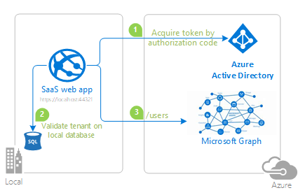
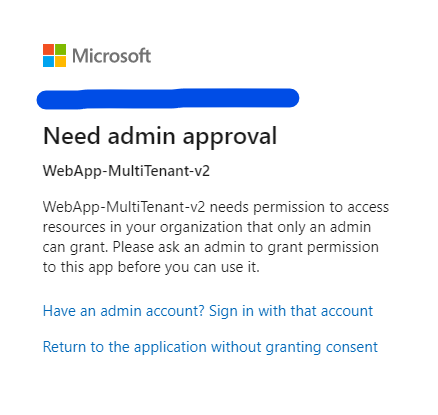
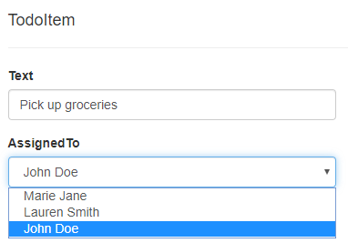

# Integrate an app that authenticates users and calls Microsoft Graph using the multi-tenant integration pattern (SaaS)

[](https://identitydivision.visualstudio.com/IDDP/_build/latest?definitionId=XXX)

* [Overview](#overview)
* [Scenario](#scenario)
* [Scenario](#scenario)
* [Prerequisites](#prerequisites)
* [Setup the sample](#setup-the-sample)
* [Explore the sample](#explore-the-sample)
* [Troubleshooting](#troubleshooting)
* [About The code](#about-the-code)
* [How the code was created](#how-the-code-was-created)
* [Next Steps](#next-steps)
* [Contributing](#contributing)
* [Learn More](#learn-more)

## Overview

This sample demonstrates a ASP.NET Core Web App calling Microsoft Graph.

> :information_source: To learn how to integrate an application with Azure AD as a [multi-tenant](https://aka.ms/multi-tenant) app, consider going through the recorded session:[Develop multi-tenant applications with the Microsoft identity platform](https://www.youtube.com/watch?v=B416AxHoMJ4).

> :information_source: To learn how applications integrate with [Microsoft Graph](https://aka.ms/graph), consider going through the recorded session:: [An introduction to Microsoft Graph for developers](https://www.youtube.com/watch?v=EBbnpFdB92A)

## Scenario

### Overview

When it comes to developing apps, developers can choose to configure their app to be either single-tenant or multi-tenant during app registration in the [Azure portal](https://portal.azure.com).

- `Single-tenant` apps are only available in the tenant they were registered in, also known as their home tenant.
- `Multi-tenant` apps are available to users in both their home tenant and other tenants where they are provisioned. Apps that allow users to sign-in using their personal accounts that they use to sign into services like Xbox and Skype are also multi-tenant apps.

For more information about apps and tenancy, see [Tenancy in Azure Active Directory](https://docs.microsoft.com/azure/active-directory/develop/single-and-multi-tenant-apps)

> A recording of a Microsoft Identity Platform developer session that covered this topic of developing a multi-tenant app with Azure Active Directory is available at [Develop multi-tenant applications with Microsoft identity platform](https://www.youtube.com/watch?v=B416AxHoMJ4).

## Scenario

This sample shows how to build a .NET Core MVC web application that uses the [OpenID Connect](https://docs.microsoft.com/azure/active-directory/develop/v2-protocols-oidc) protocol to sign in users from multiple Azure AD tenants and acquire token for [Microsoft Graph](https://graph.microsoft.com) using the [Microsoft Authentication Library (MSAL)](https://docs.microsoft.com/azure/active-directory/develop/msal-overview). It leverages the ASP.NET Core OpenID Connect middleware.

The application puts forward a scenario where a SaaS application invites the administrators of Azure AD tenants to `enroll` their tenants into this app. This process is analogous to a customer `buying` a SaaS product.  

 1. Once you start the application, you will land on the homepage where you can **sign-in** or **onboard** your tenant.
 1. If you try to **Sign-In** before onboarding your tenant, you'd land on the **Unauthorized Tenant** page. Click on the **Take me to the onboarding process** button to onboard your tenant to this application.
 1. On the onboarding page, you will be asked to sign-in as a tenant **administrator** and accept the permissions requested in the **admin consent** screen to successfully provision the application in your tenant.
 1. Once you have **registered your tenant**, all users from that tenant will be able to sign-in and explore the ToDo list.

> Looking for previous versions of this code sample? Check out the tags on the [releases](../../releases) GitHub page.


## Prerequisites

* Either [Visual Studio](https://visualstudio.microsoft.com/downloads/) or [Visual Studio Code](https://code.visualstudio.com/download) and [.NET Core SDK](https://www.microsoft.com/net/learn/get-started)
* An **Azure AD** tenant. For more information, see: [How to get an Azure AD tenant](https://docs.microsoft.com/azure/active-directory/develop/test-setup-environment#get-a-test-tenant)
* A user account in your **Azure AD** tenant.
>This sample will not work with a **personal Microsoft account**. If you're signed in to the [Azure portal](https://portal.azure.com) with a personal Microsoft account and have not created a user account in your directory before, you will need to create one before proceeding.
* [Microsoft SQL Server](https://www.microsoft.com/sql-server/sql-server-downloads). [Express](https://learn.microsoft.com/sql/sql-server/editions-and-components-of-sql-server-2022?view=sql-server-ver16#sql-server-editions) version will be more than enough.

## Setup the sample

### Step 1: Clone or download this repository

From your shell or command line:

```console
git clone https://github.com/Azure-Samples/microsoft-identity-platform-aspnetcore-webapp-tutorial.git
```

or download and extract the repository *.zip* file.

> :warning: To avoid path length limitations on Windows, we recommend cloning into a directory near the root of your drive.

### Step 2: Navigate to project folder

```console
cd 2-WebApp-graph-user\2-3-Multi-Tenant
```

### Step 3: Register the sample application(s) in your tenant

There is one project in this sample. To register it, you can:

- follow the steps below for manually register your apps
- or use PowerShell scripts that:
  - **automatically** creates the Azure AD applications and related objects (passwords, permissions, dependencies) for you.
  - modify the projects' configuration files.

  <details>
   <summary>Expand this section if you want to use this automation:</summary>

    > :warning: If you have never used **Microsoft Graph PowerShell** before, we recommend you go through the [App Creation Scripts Guide](./AppCreationScripts/AppCreationScripts.md) once to ensure that your environment is prepared correctly for this step.
  
    1. On Windows, run PowerShell as **Administrator** and navigate to the root of the cloned directory
    1. In PowerShell run:

       ```PowerShell
       Set-ExecutionPolicy -ExecutionPolicy RemoteSigned -Scope Process -Force
       ```

    1. Run the script to create your Azure AD application and configure the code of the sample application accordingly.
    1. For interactive process -in PowerShell, run:

       ```PowerShell
       cd .\AppCreationScripts\
       .\Configure.ps1 -TenantId "[Optional] - your tenant id" -AzureEnvironmentName "[Optional] - Azure environment, defaults to 'Global'"
       ```

    > Other ways of running the scripts are described in [App Creation Scripts guide](./AppCreationScripts/AppCreationScripts.md). The scripts also provide a guide to automated application registration, configuration and removal which can help in your CI/CD scenarios.

  </details>

#### Choose the Azure AD tenant where you want to create your applications

To manually register the apps, as a first step you'll need to:

1. Sign in to the [Azure portal](https://portal.azure.com).
1. If your account is present in more than one Azure AD tenant, select your profile at the top right corner in the menu on top of the page, and then **switch directory** to change your portal session to the desired Azure AD tenant.

#### Register the webApp app (WebApp_MultiTenant_v2)

1. Navigate to the [Azure portal](https://portal.azure.com) and select the **Azure Active Directory** service.
1. Select the **App Registrations** blade on the left, then select **New registration**.
1. In the **Register an application page** that appears, enter your application's registration information:
    1. In the **Name** section, enter a meaningful application name that will be displayed to users of the app, for example `WebApp_MultiTenant_v2`.
    1. Under **Supported account types**, select **Accounts in any organizational directory**
    1. Select **Register** to create the application.
1. In the **Overview** blade, find and note the **Application (client) ID**. You use this value in your app's configuration file(s) later in your code.
1. In the app's registration screen, select the **Authentication** blade to the left.
1. If you don't have a platform added, select **Add a platform** and select the **Web** option.
    1. In the **Redirect URI** section enter the following redirect URIs:
        1. `https://localhost:44321/`
        1. `https://localhost:44321/signin-oidc`
        1. `https://localhost:44321/Onboarding/ProcessCode`
    1. In the **Front-channel logout URL** section, set it to `https://localhost:44321/signout-oidc`.
    1. Click **Save** to save your changes.
1. In the app's registration screen, select the **Certificates & secrets** blade in the left to open the page where you can generate secrets and upload certificates.
1. In the **Client secrets** section, select **New client secret**:
    1. Type a key description (for instance `app secret`).
    1. Select one of the available key durations (**6 months**, **12 months** or **Custom**) as per your security posture.
    1. The generated key value will be displayed when you select the **Add** button. Copy and save the generated value for use in later steps.
    1. You'll need this key later in your code's configuration files. This key value will not be displayed again, and is not retrievable by any other means, so make sure to note it from the Azure portal before navigating to any other screen or blade.
    > :bulb: For enhanced security, instead of using client secrets, consider [using certificates](./README-use-certificate.md) and [Azure KeyVault](https://azure.microsoft.com/services/key-vault/#product-overview).
    1. Since this app signs-in users, we will now proceed to select **delegated permissions**, which is is required by apps signing-in users.
    1. In the app's registration screen, select the **API permissions** blade in the left to open the page where we add access to the APIs that your application needs:
    1. Select the **Add a permission** button and then:
    1. Ensure that the **Microsoft APIs** tab is selected.
    1. In the *Commonly used Microsoft APIs* section, select **Microsoft Graph**
    1. In the **Delegated permissions** section, select **User.Read.All** in the list. Use the search box if necessary.
    1. Select the **Add permissions** button at the bottom.

##### Configure Optional Claims

1. Still on the same app registration, select the **Token configuration** blade to the left.
1. Select **Add optional claim**:
    1. Select **optional claim type**, then choose **ID**.
    1. Select the optional claim **acct**.
    > Provides user's account status in tenant. If the user is a **member** of the tenant, the value is *0*. If they're a **guest**, the value is *1*.
    1. Select **Add** to save your changes.

##### Configure the webApp app (WebApp_MultiTenant_v2) to use your app registration

Open the project in your IDE (like Visual Studio or Visual Studio Code) to configure the code.

> In the steps below, "ClientID" is the same as "Application ID" or "AppId".

1. Open the `appsettings.json` file.
1. Find the key `ClientId` and replace the existing value with the application ID (clientId) of `WebApp_MultiTenant_v2` app copied from the Azure portal.
1. Find the key `TenantId` and replace the existing value with 'organizations'.
1. Find the key `Domain` and replace the existing value with your Azure AD tenant domain, ex. `contoso.onmicrosoft.com`.
1. Find the key `ClientSecret` and replace the existing value with the generated secret that you saved during the creation of `WebApp_MultiTenant_v2` copied from the Azure portal.

### Variation: web app using client certificates

Follow [README-use-certificate.md](README-use-certificate.md) to know how to use this option.

### Step 4: Running the sample

From your shell or command line, execute the following commands:

```console
    cd 2-WebApp-graph-user\2-3-Multi-Tenant
    dotnet run
```

## Explore the sample

<details>
 <summary>Expand the section</summary>

Clean the solution, rebuild the solution, and run it.
The sample implements two distinct tasks: the onboarding of a new tenant and a basic ToDo List CRUD operation.

Ideally, you would want to have two Azure AD tenants so you can test the multi-tenant aspect of this sample. For more information on how to get an Azure AD tenant, see [How to get an Azure AD tenant](https://azure.microsoft.com/documentation/articles/active-directory-howto-tenant/).

#### Signing-in

Users can only sign-in if their tenant had been "onboarded" first. The sample will guide them how to do so, but it requires a **tenant admin account** to complete the onboarding process. Once the admin has consented and provisioned the app in their tenant, all users from their tenant will be able to sign-in.

If you try to onboard without an admin account, you will be presented with the following screen. Please switch to an admin account to complete this step:



If you try to sign-in with a tenant that hasn't been "onboarded" yet, you will land on the following page. Please click on **Take me to the onboarding process** button and follow the instructions to get your tenant registered in the sample database:


> :warning: If you had onboarded your tenant using this sample in the past and now getting the **AADSTS650051** error when onboarding again, please refer to the [Error AADSTS650051](#error-aadsts650051) section below to mitigate this error.

#### ToDo List

Users from one tenant can't see the **ToDo** items of users from other tenants. They will be able to perform basic CRUD operations on ToDo items assigned to them. When editing a ToDo item, users can assign it to any other user from their tenant. The list of users in a tenant is fetched from Microsoft Graph, using the [Graph SDK](https://github.com/microsoftgraph/msgraph-sdk-dotnet).

The list of users will be presented in the **Assigned To** dropdown:



> Did the sample not work for you as expected? Did you encounter issues trying this sample? Then please reach out to us using the [GitHub Issues](../../../../issues) page.

> [Consider taking a moment to share your experience with us.](https://forms.office.com/Pages/ResponsePage.aspx?id=v4j5cvGGr0GRqy180BHbRz0h_jLR5HNJlvkZAewyoWxUNEFCQ0FSMFlPQTJURkJZMTRZWVJRNkdRMC4u)

</details>

## Troubleshooting

<details>
 <summary>Expand the section</summary>

 ### Error AADSTS650051

If you are receiving the following error message, you might need to **delete older service principals of this application**. Please [delete the existing [service principal](https://docs.microsoft.com/azure/active-directory/develop/app-objects-and-service-principals) from the **enterprise app** blade of the tenant before re-creating this application]. Click on the **Enterprise Applications** blade in the portal, locate this application `WebApp_MultiTenant_v2`, navigate to its **properties** and click **Delete** to delete the service principal.

> OpenIdConnectProtocolException: Message contains error: 'invalid_client', error_description: 'AADSTS650051: Application '{applicationId}' is requesting permissions that are either invalid or out of date.

If you had provisioned a service principal of this app in the past and created a new one, the tenants that had signed-in in the app might still have the previous service principal registered causing a conflict with the new one. The solution for the conflict is to delete the older service principal from each tenant in the **Enterprise Application** menu.

### Error `The provided request must include a 'response_type' input parameter`

If you try to sign-in with a Microsoft account (MSA), such as hotmail.com, outlook.com, and msn.com, you'd receive this error during admin consent because MSA is not supported at the `/common` endpoint which this sample is using to obtain the admin consent.
Please use an admin account with from the Azure AD tenant for this purpose.

 </details>

## About The code

<details>
 <summary>Expand the section</summary>

This sample details the following aspects of a multi-tenant app.

- usage of the `/common` endpoint.
- Service principal provisioning of an app in Azure AD tenants
- Custom Token Validation to allow users from onboarded tenants only.
- Data partitioning in multi-tenant apps.
- Acquiring Access tokens for Microsoft Graph for each tenant.

This sample is using the OpenID Connect ASP.NET Core middleware to sign in users from multiple Azure AD tenants. The middleware is initialized in the `Startup.cs` file by passing it the Client ID of the app, and the URL of the Azure AD tenant where the app is registered. These values are read from the `appsettings.json` file.

You can trigger the middleware to send an OpenID Connect sign-in request by decorating a class or method with the `[Authorize]` attribute or by issuing a challenge (see the [AccountController.cs](https://github.com/aspnet/AspNetCore/blob/master/src/Azure/AzureAD/Authentication.AzureAD.UI/src/Areas/AzureAD/Controllers/AccountController.cs) file which is part of ASP.NET Core):

These steps are encapsulated in the [Microsoft.Identity.Web](https://github.com/AzureAD/microsoft-identity-web) project, and in particular in the [WebAppServiceCollectionExtensions.cs](https://github.com/AzureAD/microsoft-identity-web/blob/master/src/Microsoft.Identity.Web/WebAppExtensions/WebAppServiceCollectionExtensions.cs) file

### Usage of `/common` endpoint

In order to be able to sign-in users from multiple tenants, the [/common endpoint](https://docs.microsoft.com/azure/active-directory/develop/howto-convert-app-to-be-multi-tenant#update-your-code-to-send-requests-to-common) must be used. In the sample, this endpoint is used as a result of setting the value for `TenantId` as `organizations` on the `appsettings.json` file, and configuring the middleware to read the values from it.

```csharp
services.AddAuthentication(OpenIdConnectDefaults.AuthenticationScheme)
        .AddMicrosoftIdentityWebApp(Configuration)
```

 You can read about the various endpoints of the Microsoft Identity Platform [here](https://docs.microsoft.com/azure/active-directory/develop/active-directory-v2-protocols#endpoints).

#### Implications of signing-in guest users on `/common` endpoint

Please note that if you sign-in guest users at the `/common` endpoint, they will be directed to their home tenant for signing-in. So, if your multi-tenant app cares about applying tenant specific conditional access policies, group assignments or app roles to be applied to the guest users, the app should sign-in the guest user on the **tenanted endpoint** (https://login.microsoftonline.com/{tenantId}) instead of the `/common` endpoint.

### Service principal provisioning for new tenants (onboarding process)

For a multi-tenant app to work across tenants, its service principal will need to be provisioned in the users' tenant. It can either happen when the first user signs in, or most tenant admins only allow a tenant admin to carry out the service principal provisioning. For provisioning, we will be using the [admin consent endpoint](https://docs.microsoft.com/azure/active-directory/develop/v2-admin-consent) for the onboarding process. The code for this is provided in the `OnboardingController.cs`. The `Onboard` action and corresponding view, simulate the onboarding flow and experience.

```csharp
[HttpPost]
[ValidateAntiForgeryToken]
public IActionResult Onboard()
{
  ...
  string authorizationRequest = string.Format(
                "{0}organizations/v2.0/adminconsent?client_id={1}&redirect_uri={2}&state={3}&scope={4}",
                azureADOptions.Instance,
                Uri.EscapeDataString(azureADOptions.ClientId),
                Uri.EscapeDataString(currentUri + "Onboarding/ProcessCode"),
                Uri.EscapeDataString(stateMarker),
                Uri.EscapeDataString("https://graph.microsoft.com/.default"));
  return Redirect(authorizationRequest);
}
```

This results in an OAuth2 code grant request that triggers the admin consent flow and creates the service principal in the admin's tenant. The `state` parameter is used to validate the response, preventing a man-in-the-middle attack. Then, the `ProcessCode` action receives the authorization code from Azure AD and, if they appear valid, we create an entry in the application database for the new customer.

The `https://graph.microsoft.com/.default` is a static scope that allows the tenant admin to consent for all permissions in one go. You can find more about static scope on [this link.](https://docs.microsoft.com/azure/active-directory/develop/v2-admin-consent#request-the-permissions-from-a-directory-admin)

### Custom token validation allowing only registered tenants

On the `Startup.cs` we are calling `AddMicrosoftWebAppAuthentication` to configure the authentication, and within that method, we validates that the token issuer is from AAD.

```csharp
options.TokenValidationParameters.IssuerValidator = AadIssuerValidator.GetIssuerValidator(options.Authority).Validate;
```

To extend this validation to only Azure AD tenants registered in the application database, the event handler `OnTokenValidated` was configured to grab the `tenantId` from the token claims and check if it has an entry on the database. If it doesn't, a custom exception `UnauthorizedTenantException` is thrown, canceling the authentication, and the user is redirected to the `UnauthorizedTenant` view. At this stage, the user is not authenticated in the application.

```csharp
services.Configure<OpenIdConnectOptions>(OpenIdConnectDefaults.AuthenticationScheme, options =>
{
    options.Events.OnTokenValidated = async context => 
    {
        string tenantId = context.SecurityToken.Claims.FirstOrDefault(x => x.Type == "tid" || x.Type == "http://schemas.microsoft.com/identity/claims/tenantid")?.Value;

        if (string.IsNullOrWhiteSpace(tenantId))
            throw new UnauthorizedAccessException("Unable to get tenantId from token.");

        var dbContext = context.HttpContext.RequestServices.GetRequiredService<SampleDbContext>();

        var authorizedTenant = await dbContext.AuthorizedTenants.FirstOrDefaultAsync(t => t.TenantId == tenantId);

        if (authorizedTenant == null)
            throw new UnauthorizedTenantException("This tenant is not authorized");

    };
    options.Events.OnAuthenticationFailed = (context) =>
    {
        if (context.Exception != null && context.Exception is UnauthorizedTenantException)
        {
            context.Response.Redirect("/Home/UnauthorizedTenant");
            context.HandleResponse(); // Suppress the exception
        }

        return Task.FromResult(0);
    };
});
```

### Partitioning data by tenant

There are two common scenarios regarding data partition on a multi-tenant app. Having a separate database for each tenant or having a single database and using the **tenantId** to separate the data of each tenant. In this sample, we have taken the single database approach to save the ToDo items for all users from all tenants.

If you want to read more about data architecture on multi-tenant apps, please refer to [Multi-tenant SaaS database tenancy patterns](https://docs.microsoft.com/azure/sql-database/saas-tenancy-app-design-patterns)

`TodoListController.cs` has the basic CRUD actions for `ToDoItem` and each operation takes into account the signed user's **tenantId** to separate data from each tenant. The tenantId can be found in the user' claims.

### Acquiring Access token for Microsoft Graph for each tenant

If a multi-tenant app needs to acquire an access token for Microsoft Graph to be able to read data from the signed user's tenant, the token must be issued from their tenanted authority and not from the tenant where the SaaS application is registered. This feature is being showed on the **Edit** action result on `TodoListController.cs`.

```csharp
var userTenant = User.GetTenantId();
// Acquiring token for graph using the user's tenant, so it can return all the users from their tenant
var graphAccessToken = await _tokenAcquisition.GetAccessTokenForUserAsync(new string[] { GraphScope.UserReadAll }, userTenant);
```

We are acquiring an access token for Graph with the scope `User.Read.All`, to list all the users from the tenant so you can assign a todo item to them. `GetAccessTokenForUserAsync` is a helper method found on `Microsoft.Identity.Web` project, and it receives a **tenantId** as parameter to acquire a token for the desired authority. For that, we get the current authority from the built `IConfidentialClientApplication` and replace the tenantId. Below is an example of this logic.

```csharp
string signedUserAuthority = confidentialClientApplication.Authority.Replace(new Uri(confidentialClientApplication.Authority).PathAndQuery, $"/{tenant}/");
AuthenticationResult result = await confidentialClientApplication
    .AcquireTokenSilent(new string[] { "User.Read.All" }, account)
    .WithAuthority(signedUserAuthority)
    .ExecuteAsync()
    .ConfigureAwait(false);
```

</details>

## How the code was created

<details>
 <summary>Expand the section</summary>

 The sample is based on [ASP.NET CORE API template](https://learn.microsoft.com/aspnet/core/tutorials/first-web-api?view=aspnetcore-7.0&tabs=visual-studio)
 During the project configuration, specify `Microsoft Identity Platform` inside `Authentication Type` dropdown box. As IDE installs the solution, it might require to install an additional components.
 
 After the initial project was created, we have to continue with further configuration and tweaking:

 1. Replace initial Microsoft Identity Web code

 ```csharp
  builder.Services.AddAuthentication(JwtBearerDefaults.AuthenticationScheme)
    .AddMicrosoftIdentityWebApi(builder.Configuration.GetSection("AzureAd"));
 ```

 by more detailed configuration which is intended to verify tenant inside token

 ```csharp
  services.AddAuthentication(OpenIdConnectDefaults.AuthenticationScheme)
                    .AddMicrosoftIdentityWebApp(options =>
                        {
                            Configuration.Bind("AzureAd", options);
                            options.Events.OnTokenValidated = async context =>
                            {
                                string tenantId = context.SecurityToken.Claims.FirstOrDefault(x => x.Type == "tid" || x.Type == "http://schemas.microsoft.com/identity/claims/tenantid")?.Value;

                                if (string.IsNullOrWhiteSpace(tenantId))
                                    throw new UnauthorizedAccessException("Unable to get tenantId from token.");

                                var dbContext = context.HttpContext.RequestServices.GetRequiredService<SampleDbContext>();

                                var authorizedTenant = await dbContext.AuthorizedTenants.FirstOrDefaultAsync(t => t.TenantId == tenantId);

                                if (authorizedTenant == null)
                                    throw new UnauthorizedTenantException("This tenant is not authorized");
                            };
                            options.Events.OnAuthenticationFailed = (context) =>
                            {
                                if (context.Exception != null && context.Exception is UnauthorizedTenantException)
                                {
                                    context.Response.Redirect("/Home/UnauthorizedTenant");
                                    context.HandleResponse(); // Suppress the exception
                                }

                                return Task.FromResult(0);
                            };
                        }
                    )
                    .EnableTokenAcquisitionToCallDownstreamApi(options =>                
                        {
                            Configuration.Bind("AzureAd", options);
                        },
                        new string[] { GraphScope.UserReadAll }
                    )
                    .AddInMemoryTokenCaches();

            services.AddControllersWithViews(options =>
            {
                var policy = new AuthorizationPolicyBuilder()
                    .RequireAuthenticatedUser()
                    .Build();
                options.Filters.Add(new AuthorizeFilter(policy));
            }).AddMicrosoftIdentityUI();
            services.AddRazorPages();
 ```

2. Add SQL server configuration. The database will be used to store ToDo list on local instance of SQL Server. There is an option to use in-memory server as well:

```csharp
 //If you want to run this sample using in memory db, uncomment the line below (options.UseInMemoryDatabase) and comment the one that uses options.UseSqlServer.
 //services.AddDbContext<SampleDbContext>(options => options.UseInMemoryDatabase(databaseName: "MultiTenantOnboarding"));
 services.AddDbContext<SampleDbContext>(options => options.UseSqlServer(Configuration.GetConnectionString("SampleDbConnStr")));
```

3. Add same site cookies policy:

```csharp
 services.Configure<CookiePolicyOptions>(options =>
            {
                // This lambda determines whether user consent for non-essential cookies is needed for a given request.
                options.CheckConsentNeeded = context => true;
                options.MinimumSameSitePolicy = SameSiteMode.Unspecified;
                // Handling SameSite cookie according to https://docs.microsoft.com/en-us/aspnet/core/security/samesite?view=aspnetcore-3.1
                options.HandleSameSiteCookieCompatibility();
            });
```

4. Add a ToDo Service (you will have to create a model/interface as well)

```csharp
 services.AddScoped<ITodoItemService, TodoItemService>();
```

5. Configure MS Graph support

```csharp
 services.AddScoped<IMSGraphService, MSGraphService>();
```

6. Finally configure Authorization Policy and add Razor Pages:
   
```csharp
  services.AddControllersWithViews(options =>
            {
                var policy = new AuthorizationPolicyBuilder()
                    .RequireAuthenticatedUser()
                    .Build();
                options.Filters.Add(new AuthorizeFilter(policy));
            }).AddMicrosoftIdentityUI();

  services.AddRazorPages();
```

7. Delete default Controller and Models and create Home, Onboarding and ToDoList controllers
8. Create models for Authorized tenant and ToDo item
9. To efficiently communicate with MSGraph API, create MSGraph Service
10. Create ToDo List Service to work with ToDo items
11. Refer to the [sample](https://github.com/Azure-Samples/active-directory-aspnetcore-webapp-openidconnect-v2/tree/master/2-WebApp-graph-user/2-3-Multi-Tenant) for more details

 </details>


### Deploying Web app to Azure App Service

There is one web app in this sample. To deploy it to **Azure App Services**, you'll need to:

- create an **Azure App Service**
- publish the projects to the **App Services**, and
- update its client(s) to call the website instead of the local environment.

#### Publish your files (WebApp_MultiTenant_v2)

##### Publish using Visual Studio

Follow the link to [Publish with Visual Studio](https://docs.microsoft.com/visualstudio/deployment/quickstart-deploy-to-azure).

##### Publish using Visual Studio Code

1. Install the Visual Studio Code extension [Azure App Service](https://marketplace.visualstudio.com/items?itemName=ms-azuretools.vscode-azureappservice).
1. Follow the link to [Publish with Visual Studio Code](https://docs.microsoft.com/aspnet/core/tutorials/publish-to-azure-webapp-using-vscode)

#### Update the Azure AD app registration (WebApp_MultiTenant_v2)

1. Navigate back to to the [Azure portal](https://portal.azure.com).
In the left-hand navigation pane, select the **Azure Active Directory** service, and then select **App registrations (Preview)**.
1. In the resulting screen, select the `WebApp_MultiTenant_v2` application.
1. In the app's registration screen, select **Authentication** in the menu.
    1. In the **Redirect URIs** section, update the reply URLs to match the site URL of your Azure deployment. For example:
        1. `https://WebApp_MultiTenant_v2.azurewebsites.net/`
        1. `https://WebApp_MultiTenant_v2.azurewebsites.net/signin-oidc`
        1. `https://WebApp_MultiTenant_v2.azurewebsites.net/Onboarding/ProcessCode`
    1. Update the **Front-channel logout URL** fields with the address of your service, for example [https://WebApp_MultiTenant_v2.azurewebsites.net](https://WebApp_MultiTenant_v2.azurewebsites.net)

> :warning: If your app is using an *in-memory* storage, **Azure App Services** will spin down your web site if it is inactive, and any records that your app was keeping will be empty. In addition, if you increase the instance count of your website, requests will be distributed among the instances. Your app's records, therefore, will not be the same on each instance.

## Next Steps

Learn how to:

* [Change your app to sign-in users from any organization or Microsoft accounts](https://github.com/Azure-Samples/active-directory-aspnetcore-webapp-openidconnect-v2/tree/master/1-WebApp-OIDC/1-3-AnyOrgOrPersonal)
* [Enable users from National clouds to sign-in to your application](https://github.com/Azure-Samples/active-directory-aspnetcore-webapp-openidconnect-v2/tree/master/1-WebApp-OIDC/1-4-Sovereign)
* [Enable your web app to call a web API on behalf of the signed-in user](https://github.com/Azure-Samples/ms-identity-dotnetcore-ca-auth-context-app)

## Contributing

If you'd like to contribute to this sample, see [CONTRIBUTING.MD](/CONTRIBUTING.md).

This project has adopted the [Microsoft Open Source Code of Conduct](https://opensource.microsoft.com/codeofconduct/). For more information, see the [Code of Conduct FAQ](https://opensource.microsoft.com/codeofconduct/faq/) or contact [opencode@microsoft.com](mailto:opencode@microsoft.com) with any additional questions or comments.

## Learn More

* [Microsoft identity platform (Azure Active Directory for developers)](https://docs.microsoft.com/azure/active-directory/develop/)
* [Azure AD code samples](https://docs.microsoft.com/azure/active-directory/develop/sample-v2-code)
* [Overview of Microsoft Authentication Library (MSAL)](https://docs.microsoft.com/azure/active-directory/develop/msal-overview)
* [Register an application with the Microsoft identity platform](https://docs.microsoft.com/azure/active-directory/develop/quickstart-register-app)
* [Configure a client application to access web APIs](https://docs.microsoft.com/azure/active-directory/develop/quickstart-configure-app-access-web-apis)
* [Understanding Azure AD application consent experiences](https://docs.microsoft.com/azure/active-directory/develop/application-consent-experience)
* [Understand user and admin consent](https://docs.microsoft.com/azure/active-directory/develop/howto-convert-app-to-be-multi-tenant#understand-user-and-admin-consent)
* [Application and service principal objects in Azure Active Directory](https://docs.microsoft.com/azure/active-directory/develop/app-objects-and-service-principals)
* [Authentication Scenarios for Azure AD](https://docs.microsoft.com/azure/active-directory/develop/authentication-flows-app-scenarios)
* [Building Zero Trust ready apps](https://aka.ms/ztdevsession)
* [National Clouds](https://docs.microsoft.com/azure/active-directory/develop/authentication-national-cloud#app-registration-endpoints)
* [Microsoft.Identity.Web](https://aka.ms/microsoft-identity-web)
