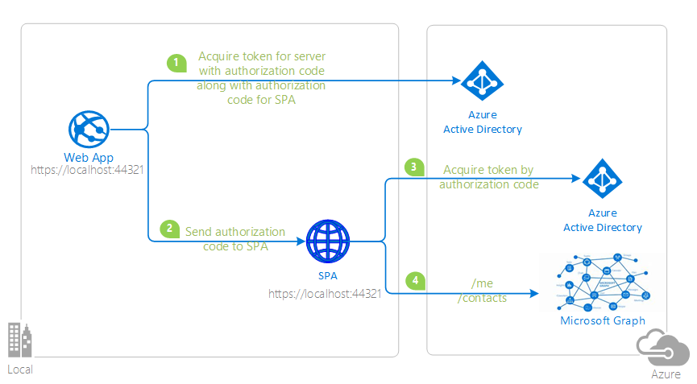

# active-directory-aspnetcore-webapp-openidconnect-v2

[](https://identitydivision.visualstudio.com/IDDP/_build/latest?definitionId=819)

Table Of Contents

* [Scenario](#Scenario)
* [Prerequisites](#Prerequisites)
* [Setup the sample](#Setup-the-sample)
* [Next Steps](#Next-Steps)
* [Contributing](#Contributing)
* [Learn More](#Learn-More)

## Scenario

 This is a ASP.NET Core single page application/web application hybrid sample that calls the Microsoft Graph API using Razor and MSAL.js.

 Use the hybrid-SPA code flow to obtain an Access token for your Web API in he backend and use it in the client SPA [without re-authenticating the user]

 1. The client ASP.NET Core Web App uses the [Microsoft.Identity.Web](https://aka.ms/microsoft-identity-web) to sign-in and obtain a JWT [Access Token](https://docs.microsoft.com/azure/active-directory/develop/access-tokens) from **Azure AD** as well as an additional [Spa Authorization Code](https://github.com/AzureAD/microsoft-authentication-library-for-dotnet/wiki/SPA-Authorization-Code) to be passed to a client-side single page application.
 1. The [Spa Authorization Code](https://github.com/AzureAD/microsoft-authentication-library-for-dotnet/wiki/SPA-Authorization-Code) is passed to the client-side application using the session configuration for the application.
 1. The [Spa Authorization Code](https://github.com/AzureAD/microsoft-authentication-library-for-dotnet/wiki/SPA-Authorization-Code) is exchanged for another [Access Token](https://docs.microsoft.com/azure/active-directory/develop/access-tokens) in the client-side application.
 1. The [Access Token](https://docs.microsoft.com/azure/active-directory/develop/access-tokens) is used by the client-side application as a bearer token to call the **Microsoft Graph API**.


## Prerequisites

* Either [Visual Studio](https://visualstudio.microsoft.com/downloads/) or [Visual Studio Code](https://code.visualstudio.com/download) and [.NET Core SDK](https://www.microsoft.com/net/learn/get-started)
* An **Azure AD** tenant. For more information, see: [How to get an Azure AD tenant](https://docs.microsoft.com/azure/active-directory/develop/test-setup-environment#get-a-test-tenant)
* A user account in your **Azure AD** tenant. This sample will not work with a **personal Microsoft account**.  If you're signed in to the [Azure portal](https://portal.azure.com) with a personal Microsoft account and have not created a user account in your directory before, you will need to create one before proceeding.
## Setup the sample

### Step 1: Clone or download this repository

From your shell or command line:

```console
    git clone https://github.com/Azure-Samples/active-directory-aspnetcore-webapp-openidconnect-v2.git
```

or download and extract the repository .zip file.

>:warning: To avoid path length limitations on Windows, we recommend cloning into a directory near the root of your drive.

### Step 2: Navigate to project folder

```console
    cd 2-WebApp-graph-user\2-5-HybridFlow
```

### Step 3: Application Registration

There are two projects in this sample. Each needs to be separately registered in your Azure AD tenant. To register these projects:

You can follow the [manual steps](#Manual-steps) to set the up the application or use the automated steps below.

### Run automation scripts

* use PowerShell scripts that:
  * **automatically** creates the Azure AD applications and related objects (passwords, permissions, dependencies) for you.
  * modify the projects' configuration files.

> **WARNING**: If you have never used **Azure AD Powershell** before, we recommend you go through the [App Creation Scripts guide](./AppCreationScripts/AppCreationScripts.md) once to ensure that your environment is prepared correctly for this step.

1. On Windows, run PowerShell as **Administrator** and navigate to the root of the cloned directory
2. In PowerShell run:

   ```PowerShell
   Set-ExecutionPolicy -ExecutionPolicy RemoteSigned -Scope Process -Force
   ```

3. Run the script to create your Azure AD application and configure the code of the sample application accordingly.
4. For interactive process - in PowerShell run:

   ```PowerShell
   cd .\AppCreationScripts\
   .\Configure.ps1 -TenantId "[Optional] - your tenant id" -Environment "[Optional] - Azure environment, defaults to 'Global'"
   ```

   > Other ways of running the scripts are described in [App Creation Scripts guide](./AppCreationScripts/AppCreationScripts.md)
   > The scripts also provide a guide to automated application registration, configuration and removal which can help in your CI/CD scenarios.

### Manual Steps

 > Note: You should skip the following steps if you've used the automation provided above.

Follow the steps below for manually register and configure your apps

  1. Sign in to the [Azure portal](https://portal.azure.com).
  1. If your account is present in more than one Azure AD tenant, select your profile at the top right corner in the menu on top of the page, and then **switch directory** to change your portal session to the desired Azure AD tenant.

#### Register the service app

  1. Navigate to the [Azure portal](https://portal.azure.com) and select the **Azure Active Directory** service.
  1. Select the **App Registrations** blade on the left, then select **New registration**.
  1. In the **Register an application page** that appears, enter your application's registration information:
     * In the **Name** section, enter a meaningful application name that will be displayed to users of the app, for example `HybridFlow-aspnetcore`.
  1. Under **Supported account types**, select **Accounts in this organizational directory only**
  1. Click **Register** to create the application.
  1. In the app's registration screen, find and note the **Application (client) ID**. You'll need to use this value in your app's configuration files.
  1. In the app's registration screen, select **Authentication** in the menu.
     * If you don't have a platform added, select **Add a platform** and select the **Web** option.
     * In the **Redirect URIs** section, enter the following redirect URIs.
        * `https://localhost:44321/signin-oidc/`
     * Click on the **Add a platform** button in the **Platform configurations** section of the page
       * Select the **Single-page application** button and enter `https://localhost:44321/` as the **Redirect URI** and click the **Configure** button
  2. Select **Save** to save your changes.
  3. In the app's registration screen, select the **Certificates & secrets** blade in the left to open the page where we can generate secrets and upload certificates.
  4. In the **Client secrets** section, select **New client secret**:
     * Type a key description (for instance `app secret`),
     * Select one of the available key durations (**6 months**, **12 months** or **Custom**) as per your security posture.
     * The generated key value will be displayed when you select the **Add** button. Copy and save the generated value for use in later steps.
     * You'll need this key later in your code's configuration files. This key value will not be displayed again, and is not retrievable by any other means, so make sure to note it from the Azure portal before navigating to any other screen or blade.
  5. In the app's registration screen, select the **API permissions** blade in the left to open the page where we add access to the APIs that your application needs.
     * Select the **Add a permission** button and then,
     * Ensure that the **Microsoft APIs** tab is selected.
     * In the *Commonly used Microsoft APIs* section, select **Microsoft Graph**
     * In the **Delegated permissions** section, select the **User.Read** in the list followed by **Contacts.Read**. Use the search box if necessary.
     * Select the **Add permissions** button at the bottom.

##### Configure the application to use your registration

  Open the project in your IDE (like Visual Studio or Visual Studio Code) to configure the code.

   > In the steps below, "ClientID" is the same as "Application ID" or "AppId".

  1. Open the `appsettings.json` file.
  1. Find the key `Domain` and replace the existing value with your Azure AD tenant name.
  1. Find the key `TenantId` and replace the existing value with your Azure AD tenant ID.
  1. Find the key `ClientId` and replace the existing value with the application ID (clientId) of `HybridFlow-aspnetcore` app copied from the Azure portal.
  1. Find the key `ClientSecret` and replace the existing value with the **client secret** of `HybridFlow-aspnetcore` app copied from the Azure portal.

##### (Optional) Create a self-signed certificate

  To complete this step, you will use the `New-SelfSignedCertificate` Powershell command. You can find more information about the New-SelfSignedCertificate command [here](https://docs.microsoft.com/powershell/module/pkiclient/new-selfsignedcertificate).
  
  1. Open PowerShell and run `New-SelfSignedCertificate` with the following parameters to create a self-signed certificate in the user certificate store on your computer:
  
      ```PowerShell
      $cert=New-SelfSignedCertificate -Subject "CN=HybridFlowCert" -CertStoreLocation "Cert:\CurrentUser\My"  -KeyExportPolicy Exportable -KeySpec Signature
      ```
  
  1. Export this certificate using the "Manage User Certificate" MMC snap-in accessible from the Windows Control Panel. You can also add other options to generate the certificate in a different
  store such as the Computer or service store (See [How to: View Certificates with the MMC Snap-in](https://docs.microsoft.com/dotnet/framework/wcf/feature-details/how-to-view-certificates-with-the-mmc-snap-in)).
  
  Alternatively you can use an existing certificate if you have one (just be sure to record its name for the next steps)
  
###### Add the certificate for the application in Azure AD
  
  In the application registration blade for your application, in the **Certificates & secrets** page, in the **Certificates** section:
  
  1. Click on **Upload certificate** and, in click the browse button on the right to select the certificate you just exported (or your existing certificate)
  1. Click **Add**
  
###### Configure the Visual Studio project
  
  To change the visual studio project to enable certificates you need to:
  
  1. Open the `appsettings.json` file
  2. Find the app key `Certificate` in the `AzureAd` section and insert the `CertificateDescription` properties of your certificate. You can see some examples below and read more about how to configure certificate descriptions [here](https://github.com/AzureAD/microsoft-identity-web/wiki/Certificates#specifying-certificates).
  
###### Get certificate from certificate store
  
  You can retrieve a certificate from your local store by adding the configuration below to the `ClientCertificates` array in the `appsettings.json` file replacing **<CERTIFICATE_STORE_PATH>** with the store path to your certificate and **<CERTIFICATE_DISTINGUISHED_NAME>** with the distinguished name of your certificate. If you used the configuration scripts to generate the application this will be done for you using a sample self-signed certificate. You can read more about certificate stores [here](https://docs.microsoft.com/windows-hardware/drivers/install/certificate-stores).
  
  ```json
  {
    // ... 
    "AzureAd": {
      // ...
        "ClientCertificates":  [{
          "SourceType":  "StoreWithDistinguishedName",
          "CertificateStorePath":  "<CERTIFICATE_STORE_PATH>",
          "CertificateDistinguishedName":  "<CERTIFICATE_DISTINGUISHED_NAME>"
        }]
    }
  }
  ```

###### Get certificate from file path
  
  It's possible to get a certificate file, such as a **pfx** file, directly from a file path on your machine and load it into the application by using the configuration as shown below. Add the configuration below to the `ClientCertificates` array of the `appsettings.json` file. Replace `<PATH_TO_YOUR_CERTIFICATE_FILE>` with the path to your certificate file and `<CERTIFICATE_PASSWORD>` with that certificates password. If you created the application with the `Configure.ps1` script found in the `AppCreationScripts-withCert` a **pfx** file called **HybridFlowCert.pfx** will be generated with the certificate that is associated with  your app and can be used as a credential. If you like, you can use configure the `Certificate` property to reference this file and use it as a credential.
  
  ```json
  {
    // ... 
    "AzureAd": {
      // ... 
      "ClientCertificates": [{
        "SourceType":  "Path",
        "CertificateDiskPath":  "<PATH_TO_YOUR_CERTIFICATE_FILE>",
        "CertificatePassword":  "<CERTIFICATE_PASSWORD>"
      }]
    } 
  }
  ```
  
###### Get certificate from Key Vault
  
  It's also possible to get certificates from an [Azure Key Vault](https://docs.microsoft.com/azure/key-vault/general/overview). Add the configuration below to the `ClientCertificates` array of the `appsettings.json` file. Replace `<YOUR_KEY_VAULT_URL>` with the URL of the Key Vault holding your certificate and `<YOUR_KEY_VAULT_CERTIFICATE_NAME>` with the name of that certificate as shown in your Key Vault. If you created the application with the `Configure.ps1` script found in the `AppCreationScripts-withCert` a **pfx** file called **HybridFlowCert.pfx** will be generated that is associated with the certificate that can be used as a credential for your app. If you like, you can load that certificate into a Key Vault and then access that Key Vault to use as a credential for your application.

  ```json
  {
    // ... 
    "AzureAd": {
      // ... 
      "ClientCertificates":  [{
        "SourceType":  "KeyVault",
        "KeyVaultUrl":  "<YOUR_KEY_VAULT_URL>",
        "KeyVaultCertificateName":  "<YOUR_KEY_VAULT_CERTIFICATE_NAME>"
      }]
    }
  }
  ```
  
  1. If you had set `ClientSecret` previously, change its value to an empty string, `""`.

### Step 4: Running the sample

 To execute this sample in the command line run:

```console
    cd 2-WebApp-graph-user\2-5-HybridFlow
    dotnet run
```


Use [Stack Overflow](http://stackoverflow.com/questions/tagged/adal) to get support from the community.
Ask your questions on Stack Overflow first and browse existing issues to see if someone has asked your question before.
Make sure that your questions or comments are tagged with [`azure-active-directory` `adal` `msal` `dotnet`].

If you find a bug in the sample, please raise the issue on [GitHub Issues](../../issues).

To provide a recommendation, visit the following [User Voice page](https://feedback.azure.com/forums/169401-azure-active-directory).

 Open your web browser and navigate to `https://localhost:44321`. You should see the application home page with a link for **Home**, **Privacy** and **Sign in**. Click the **Sign in** link and you'll be redirected to the Microsoft login page. Sign in using an user account in your tenant. After you sign in the client side `MSAL.js` client will receive an **auth** code from the server that will be exchanged for an authorization token and cached immediately in the browser.

1. Click on `Profile` tab to see the signed in user's information and contacts. This information is retrieved using the `MSAL.js` library in the browser.

Did the sample not work for you as expected? Did you encounter issues trying this sample? Then please reach out to us using the [GitHub Issues](../../../../issues) page.

[Consider taking a moment to share your experience with us.](https://forms.office.com/Pages/ResponsePage.aspx?id=v4j5cvGGr0GRqy180BHbRz0h_jLR5HNJlvkZAewyoWxUNEFCQ0FSMFlPQTJURkJZMTRZWVJRNkdRMC4u)


### Code in Asp.net core web app

The entire application is built on [ASP.NET Core](https://docs.microsoft.com/aspnet/core/introduction-to-aspnet-core) using [Razor](https://docs.microsoft.com/aspnet/web-pages/overview/getting-started/introducing-razor-syntax-c) pages. The web app is then secured using the [Microsoft Identity Web](https://docs.microsoft.com/azure/active-directory/develop/microsoft-identity-web) library.

When configuring the application in the `appsettings.json` file we'll need to set the `WithSpaAuthCode` property of the `AzureAd` object to `true`. This makes it possible for Azure to respond with not only an *access token* for users but also an *access code* for that user which can be sent to the retrieved by the SPA for an access token. This will be discussed in more detail later.

```json
{
  "AzureAd": {
    // ...
    "WithSpaAuthCode": true
  },
  // ...
}
```

Within the `Program.cs` file you will see the [WebApplicationBuilder](https://docs.microsoft.com/dotnet/api/microsoft.aspnetcore.builder.webapplicationbuilder) **builder** which injects all dependencies into your application.

The first thing that needs to be done is to configure a `Session` for your application which will contain the *authorization code* your SPA will exchange for an access token.

```CSharp
var builder = WebApplication.CreateBuilder(args);

builder.Services.AddSession(options =>
 {
   options.Cookie.IsEssential = true;
 });
```

Next, the initial scopes are extracted from the `appsettings.json` file from within the `DownstreamApi` object. These scopes will be used in the access token stored within a cache within your server and also be contained within the token which will be retrieved by the SPA after it exchanges its *access code*. The server-side token cache will be cleared out for users after they sign-out.

```CSharp
var initialScopes = builder.Configuration.GetSection("DownstreamApi:Scopes")
    .Value
    .Split(' ');

builder.Services.AddAuthentication(OpenIdConnectDefaults.AuthenticationScheme)
    .AddMicrosoftIdentityWebApp(builder.Configuration)
    .EnableTokenAcquisitionToCallDownstreamApi(initialScopes)
    .AddDistributedTokenCaches();
```

### Client-side MSAL.js Client

The single page application in this sample is run using the [MSAL.js library](https://github.com/AzureAD/microsoft-authentication-library-for-js).

The razor page generating the client will read the settings within the `appsettings.json` file and configure the application for you.

```JavaScript
const msalInstance = new msal.PublicClientApplication({
    auth: {
    @{
    var clientId = Configuration["AzureAd:ClientId"];
    var instance = Configuration["AzureAd:Instance"];
    var domain = Configuration["AzureAd:Domain"];
    var redirectUri = Configuration["SpaRedirectUri"];

    @Html.Raw($"clientId: '{clientId}',");
    @Html.Raw($"redirectUri: '{redirectUri}',");
    @Html.Raw($"authority: '{instance}{domain}',");
    @Html.Raw($"postLogoutRedirectUri: '{redirectUri}',");
}

    },
cache: {
    cacheLocation: 'sessionStorage',
        storeAuthStateInCookie: false,
    }
});
```

### Client-side Authorization Code Redemption

Because this app is configured to make a simple web application using the `AddMicrosoftIdentityWebApp` this makes it possible to associate sessions with each login instance. The authorization code intended for redemption by the client side application is automatically passed into the client side through the `SpaAuthCode` session property as the server redeems an authorization code for itself.

This **authorization code** is extracted by the `_Layout.cshtml` razor pag and exchanged for an **authentication token** using the **MSAL.js** client
which is then cached in the application and the `SpaAuthCode` value is removed from the session.

After the either a token is redeemed for the user from Azure or a token is found withing the cache of the [PublicClientApplication](https://azuread.github.io/microsoft-authentication-library-for-js/ref/classes/_azure_msal_browser.publicclientapplication.html) an event is triggered named `AUTHENTICATED` which alerts other parts of the application a token is available to make requests with.

```JavaScript
(function () {
    const scopes = 
    @{
        var apiScopes = Configuration["DownstreamApi:Scopes"].Split(' ');
        @Html.Raw("[");

        foreach(var scope in apiScopes) {
            @Html.Raw($"'{scope}',")
        }

        @Html.Raw("];");

        Context.Session.TryGetValue(Constants.SpaAuthCode, out var spaCode);

        if (spaCode is not null && !string.IsNullOrEmpty(Encoding.Default.GetString(spaCode)))
        {
            @Html.Raw($"const code = '{Encoding.Default.GetString(spaCode)}';");
            Context.Session.Remove(Constants.SpaAuthCode);
        }
        else
        {
            @Html.Raw($"const code = '';");
        }
    }

    if (!!code) {
        msalInstance
            .handleRedirectPromise()
            .then(result => {
                if (result) {
                    console.log('MSAL: Returning from login');
                    document.dispatchEvent(new Event('AUTHENTICATED'));
                    return result;
                }

                const timeLabel = "Time for acquireTokenByCode";
                console.time(timeLabel);
                console.log('MSAL: acquireTokenByCode hybrid parameters present');

                return msalInstance.acquireTokenByCode({
                    code,
                    scopes,
                })
                    .then(result => {
                        console.timeEnd(timeLabel);
                        console.log('MSAL: acquireTokenByCode completed successfully', result);
                        document.dispatchEvent(new Event('AUTHENTICATED'));
                    })
                    .catch(error => {
                        console.timeEnd(timeLabel);
                        console.error('MSAL: acquireTokenByCode failed', error);
                        if (error instanceof msal.InteractionRequiredAuthError) {
                            console.log('MSAL: acquireTokenByCode failed, redirecting');

                            @{
                                if (User.Identity is not null)
                                {
                                    @Html.Raw($"const username = '{User.Identity.Name}';");
                                }
                                else
                                {
                                    @Html.Raw($"const username = '';");
                                }
                            }

                            const account = msalInstance.getAllAccounts()
                                .find(account => account.username === username);

                            return msalInstance.acquireTokenRedirect({
                                account,
                                scopes
                            });
                        }
                    });
            })
    }
    else {
        document.dispatchEvent(new Event('AUTHENTICATED'));
    }
})();
```

### Client-side Graph API requests

In order to make a successful call to Microsoft Graph you first need to get an access token from the `PublicClientApplication` cache and then use that access token within the `Authorization` header along with the `Bearer` key word.

The function `getTokenFromCache` defined within `_Layout.cshtml` does just that.

```JavaScript
function getTokenFromCache(scopes) {
    @if (User.Identity is not null)
    {
        @Html.Raw($"const username = '{User.Identity.Name}';");
    }
    else
    {
        @Html.Raw($"const username = '';");
    }

    const account = msalInstance.getAllAccounts()
        .find(account => account.username === username);

    return msalInstance.acquireTokenSilent({
        account,
        scopes
    })
        .catch(error => {
            if (error instanceof msal.InteractionRequiredAuthError) {
                return msalInstance.acquireTokenRedirect({
                    account,
                    scopes
                });
            }
        });
};
```

Actual requests made to the Graph API are handled by the `callMSGraph` function in the `_Layout.cshtml` file.

```JavaScript
function callMSGraph(path, token) {
    @{
        var graphEndpoint = Configuration["DownstreamApi:BaseUrl"];
        if (!string.IsNullOrEmpty(graphEndpoint))
        {
            @Html.Raw($"const graphEndpoint = '{graphEndpoint}';");
        }
        else
        {
            @Html.Raw($"const graphEndpoint = '';");
        }
    }

    const headers = new Headers();
    const bearer = `Bearer ${token}`;
    headers.append("Authorization", bearer);

    const options = {
        method: "GET",
        headers
    };

    console.log('request made to Graph API at: ' + new Date().toString());

    return fetch(`${graphEndpoint}${path}`, options)
        .catch(error => console.log(error))
}
```

## Next Steps

Learn how to:

* [Change your app to sign-in users from any organization or any Microsoft accounts](https://github.com/Azure-Samples/active-directory-aspnetcore-webapp-openidconnect-v2/tree/master/1-WebApp-OIDC/1-3-AnyOrgOrPersonal)
* [Enable users from National clouds to sign-in to your application](https://github.com/Azure-Samples/active-directory-aspnetcore-webapp-openidconnect-v2/tree/master/1-WebApp-OIDC/1-4-Sovereign)
* [Enable your Web App to call a Web API on behalf of the signed-in user](https://github.com/Azure-Samples/ms-identity-dotnetcore-ca-auth-context-app)

## Contributing

If you'd like to contribute to this sample, see [CONTRIBUTING.MD](/CONTRIBUTING.md).

This project has adopted the [Microsoft Open Source Code of Conduct](https://opensource.microsoft.com/codeofconduct/). For more information, see the [Code of Conduct FAQ](https://opensource.microsoft.com/codeofconduct/faq/) or contact [opencode@microsoft.com](mailto:opencode@microsoft.com) with any additional questions or comments.

Feel free to to take part in our [sruvey](https://forms.microsoft.com/Pages/ResponsePage.aspx?id=v4j5cvGGr0GRqy180BHbR73pcsbpbxNJuZCMKN0lURpURFgxTzVOOE5BT1VCWDQ0U1hXT1hITVdCTSQlQCN0PWcu) to provide us with useful information to improve our samples in the future.


## Learn More

* [Microsoft identity platform (Azure Active Directory for developers)](https://docs.microsoft.com/azure/active-directory/develop/)
* [Overview of Microsoft Authentication Library (MSAL)](https://docs.microsoft.com/azure/active-directory/develop/msal-overview)
* [Authentication Scenarios for Azure AD](https://docs.microsoft.com/azure/active-directory/develop/authentication-flows-app-scenarios)
* [Azure AD code samples](https://docs.microsoft.com/azure/active-directory/develop/sample-v2-code)
* [Register an application with the Microsoft identity platform](https://docs.microsoft.com/azure/active-directory/develop/quickstart-register-app)
* [Building Zero Trust ready apps](https://aka.ms/ztdevsession)

* [Microsoft identity platform (Azure Active Directory for developers)](<https://docs.microsoft.com/azure/active-directory/develop/>)
* [Overview of Microsoft Authentication Library (MSAL)](<https://docs.microsoft.com/azure/active-directory/develop/msal-overview>)
* [Authentication Scenarios for Azure AD](<https://docs.microsoft.com/azure/active-directory/develop/authentication-flows-app-scenarios>)
* [Azure AD code samples](<https://docs.microsoft.com/azure/active-directory/develop/sample-v2-code>)
* [Register an application with the Microsoft identity platform](<https://docs.microsoft.com/azure/active-directory/develop/quickstart-register-app>)
* [Building Zero Trust ready apps](<https://aka.ms/ztdevsession>)
* [SPA Authorization Code](https://github.com/AzureAD/microsoft-authentication-library-for-dotnet/wiki/SPA-Authorization-Code)
* [MSAL.js Authorization Code Flow](https://github.com/AzureAD/microsoft-authentication-library-for-js/blob/dev/lib/msal-common/docs/request.md?msclkid=f140d8c9d0f111ec93acc5e285676bbe)

For more information, visit the following links:

 *To lean more about the application registration, visit:
  *[Quickstart: Register an application with the Microsoft identity platform](https://docs.microsoft.com/azure/active-directory/develop/quickstart-register-app)
  *[Quickstart: Configure a client application to access web APIs](https://docs.microsoft.com/azure/active-directory/develop/quickstart-configure-app-access-web-apis)
  *[Quickstart: Configure an application to expose web APIs](https://docs.microsoft.com/azure/active-directory/develop/quickstart-configure-app-expose-web-apis)

  *To learn more about the code, visit:
  *[Conceptual documentation for MSAL.NET](https://github.com/AzureAD/microsoft-authentication-library-for-dotnet/wiki#conceptual-documentation) and in particular:
  *[Acquiring tokens with authorization codes on web apps](https://github.com/AzureAD/microsoft-authentication-library-for-dotnet/wiki/Acquiring-tokens-with-authorization-codes-on-web-apps)
  *[Customizing Token cache serialization](https://github.com/AzureAD/microsoft-authentication-library-for-dotnet/wiki/token-cache-serialization)

  *To learn more about security in aspnetcore,
  *[Introduction to Identity on ASP.NET Core](https://docs.microsoft.com/aspnet/core/security/authentication/identity)
  *[AuthenticationBuilder](https://docs.microsoft.com/dotnet/api/microsoft.aspnetcore.authentication.authenticationbuilder)
  *[Azure Active Directory with ASP.NET Core](https://docs.microsoft.com/aspnet/core/security/authentication/azure-active-directory)


