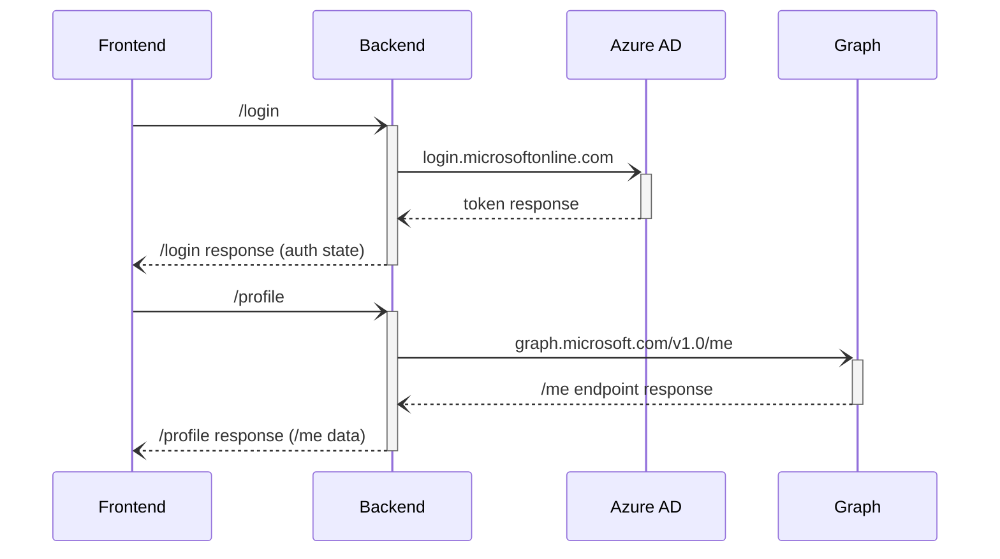

# React SPA with ASP.NET Core backend calling Microsoft Graph using the backend for frontend (BFF) proxy architecture

[](https://identitydivision.visualstudio.com/IDDP/_build/latest?definitionId=XXX)

* [Overview](#overview)
* [Scenario](#scenario)
* [Prerequisites](#prerequisites)
* [Setup the sample](#setup-the-sample)
* [Explore the sample](#explore-the-sample)
* [Troubleshooting](#troubleshooting)
* [About the code](#about-the-code)
* [Next Steps](#next-steps)
* [Contributing](#contributing)
* [Learn More](#learn-more)

## Overview

This sample demonstrates a React single-page application (SPA) with an ASP.NET Core backend that authenticates users and calls the Microsoft Graph API using the [backend for frontend (BFF) proxy architecture](https://datatracker.ietf.org/doc/html/draft-ietf-oauth-browser-based-apps-13). In this architecture, access tokens are retrieved and stored within the secure backend context, and the client side JavaScript application, which is served by the ASP.NET web app, is only indirectly involved in the authN/authZ process by routing the token and API requests to the backend. The trust between the frontend and backend is established via a secure cookie upon successful sign-in.

> :information_source: To learn how applications integrate with [Microsoft Graph](https://aka.ms/graph), consider going through the recorded session: [An introduction to Microsoft Graph for developers](https://www.youtube.com/watch?v=EBbnpFdB92A)

## Scenario

1. The client-side React SPA initiates token acquisition by calling the login endpoint of the ASP.NET core web app.
1. ASP.NET Core web app uses **Microsoft.Identity.Web** to sign-in a user and obtain a JWT [ID Token](https://aka.ms/id-tokens) and an [Access Token](https://aka.ms/access-tokens) from **Azure AD**.
1. ASP.NET Core web app uses the **access token** as a *bearer* token to authorize the user to call the Microsoft Graph API protected by **Azure AD**.
1. ASP.NET Core web app returns the Microsoft Graph `/me` endpoint response back to the React SPA.



## Prerequisites

* Either [Visual Studio](https://visualstudio.microsoft.com/downloads/) or [Visual Studio Code](https://code.visualstudio.com/download) and [.NET Core SDK](https://www.microsoft.com/net/learn/get-started)
* An **Azure AD** tenant. For more information, see: [How to get an Azure AD tenant](https://docs.microsoft.com/azure/active-directory/develop/test-setup-environment#get-a-test-tenant)
* A user account in your **Azure AD** tenant.

## Setup the sample

### Step 1: Clone or download this repository

From your shell or command line:

```console
git clone https://github.com/Azure-Samples/active-directory-aspnetcore-webapp-openidconnect-v2.git
```

or download and extract the repository *.zip* file.

> :warning: To avoid path length limitations on Windows, we recommend cloning into a directory near the root of your drive.

### Step 2: Navigate to project folder

```console
    cd 2-WebApp-graph-user/2-6-BFF-Proxy/CallGraphBFF
```

### Step 3. Trust development certificates

```console
   dotnet dev-certs https --clean
   dotnet dev-certs https --trust
```

For more information and potential issues, see: [HTTPS in .NET Core](https://docs.microsoft.com/aspnet/core/security/enforcing-ssl).

### Step 4: Register the sample application(s) in your tenant

There is one project in this sample. To register it, you can:

- follow the steps below for manually register your apps
- or use PowerShell scripts that:
  - **automatically** creates the Azure AD applications and related objects (passwords, permissions, dependencies) for you.
  - modify the projects' configuration files.

<details>
   <summary>Expand this section if you want to use this automation:</summary>

    > :warning: If you have never used **Microsoft Graph PowerShell** before, we recommend you go through the [App Creation Scripts Guide](./AppCreationScripts/AppCreationScripts.md) once to ensure that your environment is prepared correctly for this step.
  
    1. Ensure that you have PowerShell 7 or later.
    1. Set the execution policy if this is the first time you are running external scripts:
    
       ```PowerShell
       Set-ExecutionPolicy -ExecutionPolicy RemoteSigned -Scope Process -Force
       ```
    1. Run the script to create your Azure AD application and configure the code of the sample application accordingly.
    1. For interactive process -in PowerShell, run:

       ```PowerShell
       cd .\AppCreationScripts\
       .\Configure.ps1 -TenantId "[Optional] - your tenant id" -AzureEnvironmentName "[Optional] - Azure environment, defaults to 'Global'"
       ```

    Other ways of running the scripts are described in [App Creation Scripts guide](./AppCreationScripts/AppCreationScripts.md). The scripts also provide a guide to automated application registration, configuration and removal which can help in your CI/CD scenarios.
    
    > :information_source: This sample can make use of client certificates. You can use **AppCreationScripts** to register an Azure AD application with certificates. See: [How to use certificates instead of client secrets](./README-use-certificate.md)

</details>

#### Choose the Azure AD tenant where you want to create your applications

To manually register the apps, as a first step you'll need to:

1. Sign in to the [Azure portal](https://portal.azure.com).
1. If your account is present in more than one Azure AD tenant, select your profile at the top right corner in the menu on top of the page, and then **switch directory** to change your portal session to the desired Azure AD tenant.

#### Register the client app (CallGraphBFF)

1. Navigate to the [Azure portal](https://portal.azure.com) and select the **Azure Active Directory** service.
1. Select the **App Registrations** blade on the left, then select **New registration**.
1. In the **Register an application page** that appears, enter your application's registration information:
    1. In the **Name** section, enter a meaningful application name that will be displayed to users of the app, for example `CallGraphBFF`.
    1. Under **Supported account types**, select **Accounts in this organizational directory only**
    1. Select **Register** to create the application.
1. In the **Overview** blade, find and note the **Application (client) ID**. You use this value in your app's configuration file(s) later in your code.
1. In the app's registration screen, select the **Authentication** blade to the left.
1. If you don't have a platform added, select **Add a platform** and select the **Web** option.
    1. In the **Redirect URI** section enter the following redirect URI:
        1. `https://localhost:7000/api/auth/signin-oidc`
        1. `https://localhost:7000/api/auth/signout-oidc`
    1. Click **Save** to save your changes.
1. In the app's registration screen, select the **Certificates & secrets** blade in the left to open the page where you can generate secrets and upload certificates.
1. In the **Client secrets** section, select **New client secret**:
    1. Type a key description (for instance `app secret`).
    1. Select one of the available key durations (**6 months**, **12 months** or **Custom**) as per your security posture.
    1. The generated key value will be displayed when you select the **Add** button. Copy and save the generated value for use in later steps.
    1. You'll need this key later in your code's configuration files. This key value will not be displayed again, and is not retrievable by any other means, so make sure to note it from the Azure portal before navigating to any other screen or blade.
    > :warning: For enhanced security, consider using **certificates** instead of client secrets. See: [How to use certificates instead of secrets](./README-use-certificate.md).
1. Since this app signs-in users, we will now proceed to select **delegated permissions**, which is is required by apps signing-in users.
    1. In the app's registration screen, select the **API permissions** blade in the left to open the page where we add access to the APIs that your application needs:
    1. Select the **Add a permission** button and then:
    1. Ensure that the **Microsoft APIs** tab is selected.
    1. In the *Commonly used Microsoft APIs* section, select **Microsoft Graph**
    1. In the **Delegated permissions** section, select **User.Read** in the list. Use the search box if necessary.
    1. Select the **Add permissions** button at the bottom.

##### Configure Optional Claims

1. Still on the same app registration, select the **Token configuration** blade to the left.
1. Select **Add optional claim**:
    1. Select **optional claim type**, then choose **ID**.
    1. Select the optional claim **acct**.
    > Provides user's account status in tenant. If the user is a **member** of the tenant, the value is *0*. If they're a **guest**, the value is *1*.
    1. Select **Add** to save your changes.

##### Configure the client app (CallGraphBFF) to use your app registration

Open the project in your IDE (like Visual Studio or Visual Studio Code) to configure the code.

> In the steps below, "ClientID" is the same as "Application ID" or "AppId".

1. Open the `2-6-BFF-Proxy/CallGraphBFF/appsettings.json` file.
1. Find the string `Enter_the_Tenant_Id_Here` and replace it with your Azure AD tenant/directory ID.
1. Find the string `Enter_the_Application_Id_Here` and replace it with the application ID (clientId) of `CallGraphBFF` app copied from the Azure portal.
1. Find the string `Enter_the_Client_Secret_Here` and replace it with the generated secret that you saved during the creation of `CallGraphBFF` copied from the Azure portal.

### Step 5: Running the sample

From your shell or command line, execute the following commands:

```console
    cd 2-WebApp-graph-user/2-6-BFF-Proxy/CallGraphBFF
    dotnet run
```

## Explore the sample

1. Open your browser and navigate to `https://localhost:7000`.
1. Select the **Login** button on the navigation bar to sign-in.
1. Select the **Profile** button on the navigation bar to call Microsoft Graph.


> :information_source: Did the sample not work for you as expected? Then please reach out to us using the [GitHub Issues](../../../../issues) page.

## We'd love your feedback!

Were we successful in addressing your learning objective? Consider taking a moment to [share your experience with us](https://forms.office.com/Pages/ResponsePage.aspx?id=v4j5cvGGr0GRqy180BHbR73pcsbpbxNJuZCMKN0lURpUNEFCQ0FSMFlPQTJURkJZMTRZWVJRNkdRMCQlQCN0PWcu).

## Troubleshooting

<details>
	<summary>Expand for troubleshooting info</summary>

> * Use [Stack Overflow](http://stackoverflow.com/questions/tagged/msal) to get support from the community. Ask your questions on Stack Overflow first and browse existing issues to see if someone has asked your question before.
Ask your questions on Stack Overflow first and browse existing issues to see if someone has asked your question before.
Make sure that your questions or comments are tagged with [`microsoft-identity-web` `ms-identity` `adal` `msal-net` `msal`].

To provide feedback on or suggest features for Azure Active Directory, visit [User Voice page](https://feedback.azure.com/d365community/forum/79b1327d-d925-ec11-b6e6-000d3a4f06a4).
</details>

## About the code

### Login and logout

In [Program.cs](./CallGraphBFF/Program.cs), **Microsoft Identity Web** service is configured to obtain tokens to call downstream web APIs (here, Microsoft Graph):

```csharp
// Add Microsoft.Identity.Web services to the container.
builder.Services.AddMicrosoftIdentityWebAppAuthentication(builder.Configuration)
    .EnableTokenAcquisitionToCallDownstreamApi(builder.Configuration.GetSection("DownstreamApi:Scopes").Value.Split(' '))
    .AddMicrosoftGraph(builder.Configuration.GetValue<string>("DownstreamApi:BaseUrl"), builder.Configuration.GetValue<string>("DownstreamApi:Scopes"))
    .AddInMemoryTokenCaches();
```

On the frontend side, the React SPA uses the [AuthProvider HOC](./CallGraphBFF/ClientApp/src/AuthProvider.js), which makes a GET call to the `/api/auth/login` endpoint of the ASP.NET Core web app.

```javascript
login = (postLoginRedirectUri) => {
    let url = "api/auth/login";

    const searchParams = new URLSearchParams({});

    if (postLoginRedirectUri) {
        searchParams.append('postLoginRedirectUri', encodeURIComponent(postLoginRedirectUri));
    }

    url = `${url}?${searchParams.toString()}`;

    window.location.replace(url);
}
```

The controller in [AuthController.cs](./CallGraphBFF/Controllers/AuthController.cs) processes the request and initiates a token request against Azure AD via the `Challenge()` method:

```csharp
[HttpGet("login")]
public ActionResult Login(string? postLoginRedirectUri)
{
    string redirectUri = !string.IsNullOrEmpty(postLoginRedirectUri) ? HttpUtility
        .UrlDecode(postLoginRedirectUri) : "/";

    var props = new AuthenticationProperties { RedirectUri = redirectUri };
    
    return Challenge(props);
}
```

Once the authentication is successful, the authentication state can be shared with the frontend. The claims in the user's ID token is sent back to the frontend to update the UI via the `/api/auth/account` endpoint.

### Cookie policies

The sample makes use of HTTP only, strict cookies to secure the calls between the frontend and the backend. The default ASP.NET Core authentication cookie behavior will attempt to redirect unauthenticated requests to the identity provider (in this case, Azure AD). As this is not the desired behavior in BFF proxy architecture, custom cookie authenticated events is used to modify the default behavior (see [CustomCookieAuthenticationEvents.cs](./CallGraphBFF/Utils/CustomCookieAuthenticationEvents.cs)).

```csharp
// Configure cookie properties for ASP.NET Core cookie authentication.
builder.Services.Configure<CookieAuthenticationOptions>(CookieAuthenticationDefaults.AuthenticationScheme, options => {
    options.Cookie.SameSite = SameSiteMode.Strict;
    options.Cookie.SecurePolicy = CookieSecurePolicy.Always;
    options.Cookie.HttpOnly = true;
    options.Cookie.IsEssential = true;
    options.Events = new CustomCookieAuthenticationEvents();
});
```

### Handle Continuous Access Evaluation (CAE) challenge from Microsoft Graph

Continuous access evaluation (CAE) enables applications to do just-in time token validation, for instance enforcing user session revocation in the case of password change/reset but there are other benefits. For details, see [Continuous access evaluation](https://docs.microsoft.com/azure/active-directory/conditional-access/concept-continuous-access-evaluation).

Microsoft Graph is now CAE-enabled in Preview. This means that it can ask its client apps for more claims when conditional access policies require it. Your can enable your application to be ready to consume CAE-enabled APIs by:

1. Declaring that the client app is capable of handling claims challenges.
2. Processing these challenges when they are thrown by the web API

#### Declare the CAE capability in the configuration

This sample app declares that it's CAE-capable by adding the `ClientCapabilities` field to the configuration in [appsettings.json](./CallGraphBFF/appsettings.json):

```json
{
  "AzureAd": {
    "Instance": "https://login.microsoftonline.com/",
    "TenantId": "[Enter 'common', or 'organizations' or the Tenant Id obtained from the Azure portal]",
    "ClientId": "[Enter the Client Id aka Application ID obtained from the Azure portal]",
    "ClientSecret": "[Copy the client secret added to the app from the Azure portal]",
    "ClientCapabilities": [ "CP1" ],
    "CallbackPath": "/api/auth/signin-oidc",
    "SignedOutCallbackPath": "/api/auth/signout-oidc"
  },
}
```

#### Processing the CAE challenge from Microsoft Graph

When a CAE event occurs, the Graph service will throw an exception. You can catch this exception and retrieve the claims challenge inside. Here, we set the challenge as a session variable, and a 401 status is sent to the frontend afterwards, indicating that another login request must be made:

```csharp
catch (ServiceException svcex) when (svcex.Message.Contains("Continuous access evaluation"))
{
    string claimsChallenge = WwwAuthenticateParameters
        .GetClaimChallengeFromResponseHeaders(svcex.ResponseHeaders);

    // Set the claims challenge string to session, which will be used during the next login request
    HttpContext.Session.SetString("claimsChallenge", claimsChallenge);

    return Unauthorized("Continuous access evaluation resulted in claims challenge\n" + svcex.Message);
}
```

Next time when a login request is made to the backend, the claims challenge is retrieved from the session, and is used to present the user with a prompt for satisfying the challenge via Azure AD authorization endpoint.

```csharp
[HttpGet("login")]
public ActionResult Login(string? postLoginRedirectUri)
{
    string redirectUri = !string.IsNullOrEmpty(postLoginRedirectUri) ? HttpUtility
        .UrlDecode(postLoginRedirectUri) : "/";

    string claims = HttpContext.Session.GetString("claimsChallenge") ?? "";

    var props = new AuthenticationProperties { RedirectUri = redirectUri };

    if (!string.IsNullOrEmpty(claims))
    {
        props.Items["claims"] = claims;
        HttpContext.Session.Remove("claimsChallenge"); // discard the challenge
    }

    return Challenge(props);
}
```

### Access token validation

Client apps should treat access tokens as opaque strings, as the contents of the token are intended for the **resource only** (such as a web API or Microsoft Graph). For validation and debugging purposes, developers can decode **JWT**s (*JSON Web Tokens*) using a site like [jwt.ms](https://jwt.ms).

For more details on what's inside the access token, clients should use the token response data that's returned with the access token to your client. When your client requests an access token, the Microsoft identity platform also returns some metadata about the access token for your app's consumption. This information includes the expiry time of the access token and the scopes for which it's valid. For more details about access tokens, please see [Microsoft identity platform access tokens](https://docs.microsoft.com/azure/active-directory/develop/access-tokens)

### Calling Microsoft Graph

To make bearer token calls to the Microsoft Graph API, **Microsoft.Identity.Web** makes use of the Microsoft Graph SDK internally. This is shown in [Program.cs](./CallGraphBFF/Program.cs):

```csharp
// Add services to the container.
builder.Services.AddMicrosoftIdentityWebAppAuthentication(builder.Configuration)
    .EnableTokenAcquisitionToCallDownstreamApi(builder.Configuration.GetSection("DownstreamApi:Scopes").Value.Split(' '))
    .AddMicrosoftGraph(builder.Configuration.GetValue<string>("DownstreamApi:BaseUrl"), builder.Configuration.GetValue<string>("DownstreamApi:Scopes"))
    .AddInMemoryTokenCaches();
```

The service can then be injected into controllers to make Graph calls afterwards. See [ProfileController.cs](./CallGraphBFF/Controllers/ProfileController.cs) for more.

### Deploying Web app to Azure App Service

There is one web app in this sample. To deploy it to **Azure App Services**, you'll need to:

- create an **Azure App Service**
- publish the projects to the **App Services**, and
- update its client(s) to call the website instead of the local environment.

#### Publish your files (CallGraphBFF)

##### Publish using Visual Studio

Follow the link to [Publish with Visual Studio](https://docs.microsoft.com/visualstudio/deployment/quickstart-deploy-to-azure).

##### Publish using Visual Studio Code

1. Install the Visual Studio Code extension [Azure App Service](https://marketplace.visualstudio.com/items?itemName=ms-azuretools.vscode-azureappservice).
1. Follow the link to [Publish with Visual Studio Code](https://docs.microsoft.com/aspnet/core/tutorials/publish-to-azure-webapp-using-vscode)

#### Update the Azure AD app registration (CallGraphBFF)

1. Navigate back to to the [Azure portal](https://portal.azure.com).
In the left-hand navigation pane, select the **Azure Active Directory** service, and then select **App registrations**.
1. In the resulting screen, select the `CallGraphBFF` application.
1. In the app's registration screen, select **Authentication** in the menu.
    1. In the **Redirect URIs** section, update the reply URLs to match the site URL of your Azure deployment. For example:
        1. `https://callgraphbff.azurewebsites.net/api/auth/signin-oidc`
        1. `https://callgraphbff.azurewebsites.net/api/auth/signout-oidc`

> :warning: If your app is using an *in-memory* storage, **Azure App Services** will spin down your web site if it is inactive, and any records that your app was keeping will be empty. In addition, if you increase the instance count of your website, requests will be distributed among the instances. Your app's records, therefore, will not be the same on each instance.
</details>

## Next Steps

Learn how to:

* [Change your app to sign-in users from any organization or Microsoft accounts](https://github.com/Azure-Samples/active-directory-aspnetcore-webapp-openidconnect-v2/tree/master/1-WebApp-OIDC/1-3-AnyOrgOrPersonal)
* [Enable users from National clouds to sign-in to your application](https://github.com/Azure-Samples/active-directory-aspnetcore-webapp-openidconnect-v2/tree/master/1-WebApp-OIDC/1-4-Sovereign)
* [Enable your web app to call a web API on behalf of the signed-in user](https://github.com/Azure-Samples/ms-identity-dotnetcore-ca-auth-context-app)

## Contributing

If you'd like to contribute to this sample, see [CONTRIBUTING.MD](/CONTRIBUTING.md).

This project has adopted the [Microsoft Open Source Code of Conduct](https://opensource.microsoft.com/codeofconduct/). For more information, see the [Code of Conduct FAQ](https://opensource.microsoft.com/codeofconduct/faq/) or contact [opencode@microsoft.com](mailto:opencode@microsoft.com) with any additional questions or comments.

## Learn More

* [Microsoft identity platform (Azure Active Directory for developers)](https://docs.microsoft.com/azure/active-directory/develop/)
* [Azure AD code samples](https://docs.microsoft.com/azure/active-directory/develop/sample-v2-code)
* [Overview of Microsoft Authentication Library (MSAL)](https://docs.microsoft.com/azure/active-directory/develop/msal-overview)
* [Register an application with the Microsoft identity platform](https://docs.microsoft.com/azure/active-directory/develop/quickstart-register-app)
* [Configure a client application to access web APIs](https://docs.microsoft.com/azure/active-directory/develop/quickstart-configure-app-access-web-apis)
* [Understanding Azure AD application consent experiences](https://docs.microsoft.com/azure/active-directory/develop/application-consent-experience)
* [Understand user and admin consent](https://docs.microsoft.com/azure/active-directory/develop/howto-convert-app-to-be-multi-tenant#understand-user-and-admin-consent)
* [Application and service principal objects in Azure Active Directory](https://docs.microsoft.com/azure/active-directory/develop/app-objects-and-service-principals)
* [Authentication Scenarios for Azure AD](https://docs.microsoft.com/azure/active-directory/develop/authentication-flows-app-scenarios)
* [Building Zero Trust ready apps](https://aka.ms/ztdevsession)
* [National Clouds](https://docs.microsoft.com/azure/active-directory/develop/authentication-national-cloud#app-registration-endpoints)
* [Microsoft.Identity.Web](https://aka.ms/microsoft-identity-web)
