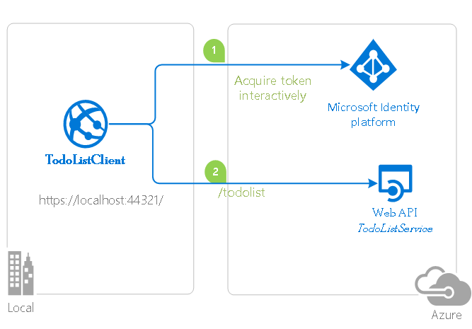

# An ASP.NET Core Web app calls an ASP.NET Core Web API secured with Azure AD V2


> The sample in this folder is part of a multi-phase tutorial. This folder is about the second phase named **Web API now calls Microsoft Graph**.
> The first phase is available from [1. Desktop app calls Web API](../1.%20Desktop%20app%20calls%20Web%20API).
>
> This article (README.md) contains the full instructions on how to configure the sample. If you have gone through Phase 1 and have already configured your Web API rather switch to the instructions for an incremental configuration in [README-incremental-instructions.md](README-incremental-instructions.md)

> At that time, the Azure AD v2.0 endpoint does not yet completely support the on-behalf-of flow for users signing-in with a Microsoft Personal account. Limitations are called out in the [Current limitations](#Current-limitations) section

## About this sample

### Table of content

- [About this sample](#About-this-sample)
  - [Scenario](#Scenario)
  - [Overview](#Overview)
  - [User experience when using this sample](#User-experience-when-using-this-sample)
- [How to run this sample](#How-to-run-this-sample)
  - [Step 1:  Clone or download this repository](#step-1--clone-or-download-this-repository)
  - [Step 2:  Register the sample with your Azure Active Directory tenant](#step-2--register-the-sample-with-your-azure-active-directory-tenant)
  - [Step 3:  Configure the sample to use your Azure AD tenant](#step-3--configure-the-sample-to-use-your-azure-ad-tenant)
  - [Step 4:  Run the sample](#step-4-run-the-sample)
  - [Troubleshooting](#Troubleshooting)
  - [Current limitations](#Current-limitations)
- [How was the code created](#How-was-the-code-created)
- [Community Help and Support](#Community-Help-and-Support)
- [Contributing](#Contributing)
- [More information](#More-information)

### Scenario

You expose a Web API and you want to protect it so that only authenticated user can access it. You want to enable authenticated users with both work and school accounts
or Microsoft personal accounts (formerly live account) to use your Web API. Your API calls a downstream API (Microsoft Graph) to provide added value to its client apps.

### Overview

This sample presents a Web API running on ASP.NET Core 2.2, protected by Azure AD OAuth Bearer Authentication. The Web API calls the Microsoft Graph, and is exercised by a .NET Desktop WPF application.
Both applications use the Active Directory Authentication Library [MSAL.NET](https://github.com/AzureAD/microsoft-authentication-library-for-dotnet) to obtain a JWT access token through the [OAuth 2.0](https://docs.microsoft.com/en-us/azure/active-directory/develop/active-directory-protocols-oauth-code) protocol. The desktop application:

1. acquires an access token for the Web API
2. Calls the ASP.NET Core Web API adding the access token as a bearer token in the authentication header of the Http request. the Web API  authenticates the user using the ASP.NET JWT Bearer Authentication middleware.
3. When the client calls the Web API, the Web API acquires another token to call the Microsoft Graph (3)
4. then the Web API calls the graph



### User experience when using this sample

The Web API (TodoListService) maintains an in-memory collection of to-do items per authenticated user. Several applications signed-in under the same identities share the same to-do list.

The WPF application (TodoListClient) enables a user to:

- Sign in. The first time a user signs in, a consent screen is presented. This consent screen lets the user consent for the application to access the TodoList Service.
- When the user has signed-in, the user sees the list of to-do items exposed by Web API for the signed-in identity
- The user can add more to-do items by clicking on *Add item* button. As they add items, they see that these items appear with their user name between parenthesis

Next time a user runs the application, the user is signed-in with the same identity as the application maintains a cache on disk. Users can clear the cache (which will also have the effect of signing them out)


## How to run this sample

### Pre-requisites

- Install .NET Core for Windows by following the instructions at [dot.net/core](https://dot.net/core), which will include [Visual Studio 2017](https://aka.ms/vsdownload).
- An Internet connection
- An Azure Active Directory (Azure AD) tenant. For more information on how to get an Azure AD tenant, see [How to get an Azure AD tenant](https://azure.microsoft.com/en-us/documentation/articles/active-directory-howto-tenant/)
- A user account in your Azure AD tenant, or a Microsoft personal account

### Step 1:  Clone or download this repository

From your shell or command line:

```Shell
git clone https://github.com/Azure-Samples/active-directory-dotnet-native-aspnetcore-v2.git aspnetcore-webapi
cd "aspnetcore-webapi\2. Web API now calls Microsoft Graph"
```

or download and exact the repository .zip file.

> Given that the name of the sample is pretty long, and so are the name of the referenced NuGet packages, you might want to clone it in a folder close to the root of your hard drive, to avoid file size limitations on Windows.

### Step 2:  Register the sample application with your Azure Active Directory tenant

There are two projects in this sample. Each needs to be separately registered in your Azure AD tenant. To register these projects, you can:

- either follow the steps [Step 2: Register the sample with your Azure Active Directory tenant](#step-2-register-the-sample-with-your-azure-active-directory-tenant) and [Step 3:  Configure the sample to use your Azure AD tenant](#choose-the-azure-ad-tenant-where-you-want-to-create-your-applications)
- or use PowerShell scripts that:
  - **automatically** creates the Azure AD applications and related objects (passwords, permissions, dependencies) for you
  - modify the Visual Studio projects' configuration files.

If you want to use this automation:
1. On Windows run PowerShell and navigate to the root of the cloned directory
1. In PowerShell run:
   ```PowerShell
   Set-ExecutionPolicy -ExecutionPolicy RemoteSigned -Scope Process -Force
   ```
1. Run the script to create your Azure AD application and configure the code of the sample application accordinly. 
   ```PowerShell
   .\AppCreationScripts\Configure.ps1
   ```
   > Other ways of running the scripts are described in [App Creation Scripts](./AppCreationScripts/AppCreationScripts.md)

1. In the list of pages for the application registration of the `TodoListService-v2` application, select **Manifest**
      - in the manifest, search for **"accessTokenAcceptedVersion"**, and replace **null** by **2**. This property lets Azure AD know that the Web API accepts v2.0 tokens
      - Select **Save**


   > Tip: Get directly to the app registration portal page for a give app, you can navigate to the links provided in the [AppCreationScripts\createdApps.html](AppCreationScripts\createdApps.html). This file is generated by the scripts during the app registration and configuration.

1. Open the Visual Studio solution and click start

If you don't want to use this automation, follow the steps below

#### Choose the Azure AD tenant where you want to create your applications


If you want to register your apps manually, as a first step you'll need to:

1. Sign in to the [Azure portal](https://portal.azure.com) using either a work or school account or a personal Microsoft account.
1. If your account is present in more than one Azure AD tenant, select your profile at the top right corner in the menu on top of the page, and then **switch directory**.
   Change your portal session to the desired Azure AD tenant.

#### Register the service app (TodoListService)


1. Navigate to the Microsoft identity platform for developers [App registrations](https://go.microsoft.com/fwlink/?linkid=2083908) page.
1. Select **New registration**.
1. When the **Register an application page** appears, enter your application's registration information:
   - In the **Name** section, enter a meaningful application name that will be displayed to users of the app, for example `TodoListService-v2`.
   - Change **Supported account types** to **Accounts in any organizational directory and personal Microsoft accounts (e.g. Skype, Xbox, Outlook.com)**.
   - In the Redirect URI (optional) section, select **Web** in the combo-box.
   - For the *Redirect URI*, enter the base URL for the sample. By default, this sample uses `https://localhost:44351/`.
   - Select **Register** to create the application.
1. On the app **Overview** page, find the **Application (client) ID** value and record it for later. You'll need it to configure the Visual Studio configuration file for this project.
1. From the **Certificates & secrets** page, in the **Client secrets** section, choose **New client secret**:
   - Type a key description (of instance `app secret`),
   - Select a key duration of either **In 1 year**, **In 2 years**, or **Never Expires**.
   - When you press the **Add** button, the key value will be displayed, copy, and save the value in a safe location.
   - You'll need this key later to configure the project in Visual Studio. This key value will not be displayed again, nor retrievable by any other means,
     so record it as soon as it is visible from the Azure portal.
1. Select the **API permissions** section
   - Click the **Add a permission** button and then,
   - Ensure that the **Microsoft APIs** tab is selected
   - In the *Commonly used Microsoft APIs* section, click on **Microsoft Graph**
   - In the **Delegated permissions** section, ensure that the right permissions are checked: **User.Read**. Use the search box if necessary.
   - Select the **Add permissions** button
   - [Optional] if you are a tenant admin, and agree to grant the admin consent to the web api, select **Grant admin consent for {your tenant domain}**. If you don't do
    it, users will be presented a consent screen enabling them to consent to using the web api.
1. Select the **Expose an API** section, and:
   - Select **Add a scope**
   - accept the proposed Application ID URI (api://{clientId}) by selecting **Save and Continue**
   - Enter the following parameters
     - for **Scope name** use `access_as_user`
     - Keep **Admins and users** for **Who can consent**
     - in **Admin consent display name** type `Access TodoListService as a user`
     - in **Admin consent description** type `Accesses the TodoListService Web API as a user`
     - in **User consent display name** type `Access TodoListService as a user`
     - in **User consent description** type `Accesses the TodoListService Web API as a user`
     - Keep **State** as **Enabled**
     - Select **Add scope**
1. [Optional] Select the **Manifest** section and:
   - in the manifest, search for **"accessTokenAcceptedVersion"**, and see that its value is **2**. This property lets Azure AD know that the Web API accepts v2.0 tokens
   - Select **Save**

> Important: it's up to the Web API to decide which version of token (v1.0 or v2.0) it accepts. Then when clients request a token for your Web API using the v2.0 endpoint, they'll get a token which version is accepted by the Web API. The code validating the tokens in this sample was written to accept both versions.

#### Register the client app (TodoListClient)

1. Navigate to the Microsoft identity platform for developers [App registrations](https://go.microsoft.com/fwlink/?linkid=2083908) page.
1. Select **New registration**.
1. When the **Register an application page** appears, enter your application's registration information:
   - In the **Name** section, enter a meaningful application name that will be displayed to users of the app, for example `TodoListClient-v2`.
   - Change **Supported account types** to **Accounts in any organizational directory and personal Microsoft accounts (e.g. Skype, Xbox, Outlook.com)**.
   - Select **Register** to create the application.
1. On the app **Overview** page, find the **Application (client) ID** value and record it for later. You'll need it to configure the Visual Studio configuration file for this project (`ida:ClientId` in `TodoListClient\App.Config`).
1. From the app's Overview page, select the **Authentication** section.
   1. In the **Redirect URIs** list, select for **TYPE** Public client (mobile & desktop). Then paste this value **urn:ietf:wg:oauth:2.0:oob** in the **REDIRECT URI** column. 
   1. Select **Save**.
1. Select the **API permissions** section
   - Click the **Add a permission** button and then,
   - Ensure that the **My APIs** tab is selected
   - In the list of APIs, select the API `TodoListService-v2`.
   - In the **Delegated permissions** section, ensure that the right permissions are checked: **access_as_user**. Use the search box if necessary.
   - Select the **Add permissions** button

> Important. Even if you declared the permission in the application registration to be (middletier)/**access_as_user**, in the code, you will need to acquire a token for (middletier)/**.default** in order to let the user consent to the downstream API (Graph) as well as the TodoListService. See [Configure the TodoListClient C# project](https://github.com/Azure-Samples/active-directory-dotnet-native-aspnetcore-v2/blob/master/2.%20Web%20API%20now%20calls%20Microsoft%20Graph/README.md#configure-the-todolistclient-c-project) below

#### Register the client app as an authorized client application for the Web API

In order for the user to be able to consent to the Web API and its downstream API, we need to register the client (TodolistClient) as an authorized
application for the service. Here is how to do:

1. Back in the application registration for the Web API (TodoListService):
- In the list of pages for the app, select **Expose an API**
- Select **Add a client application**
- in the **ClientID** field, type the ClientID of the client app (TodoListClient)
- In the authorized scope section, check the API permision you created for the service
- Select **Add application**

### Step 3:  Configure the sample to use your Azure AD tenant

#### Choose which users account to sign in

By default the sample is configured to enable users to sign in with any work and school accounts (AAD) accounts.
This constraint is ensured by `ida:Tenant` in `TodoListClient\App.Config` having the value `organizations`.

##### Important note

`common` is **not** a proper tenant. It's just a **convention** to express that the accepted tenants are any Work and School organizations, or Personal Microsoft account (consumer accounts).
Accepted tenants can have the following values:

Value | Meaning
----- | --------
`common` | users can sign in with any Work and School account, or Microsoft Personal account. *Don't use it for the moment. See [Current Limitations](#Current-limitations)*
`organizations` |  users can sign in with any Work and School account
`consumers` |  users can sign in with a Microsoft Personal account. *Don't use it for the moment (same as common)*
a GUID or domain name | users can only sign in with an account for a specific organization described by its tenant ID (GUID) or domain name

#### Configure the TodoListService C# project

Note: if you used the setup scripts, the changes below will have been applied for you

1. Open the solution in Visual Studio.
1. In the *TodoListService-v2* project, open the `appsettings.json` file.
1. Find the `ClientId` property and replace the value with the Application ID (Client ID) property of the *TodoListService-v2* application, that you registered earlier.
1. Find the `ClientSecret` property and replace the existing value with the key you saved during the creation of the `TodoListService-v2` app, in the Azure portal.
1. [Optional] if you want to limit sign-in to users in your organization, also update the following properties:
- `Domain`, replacing the existing value with your AAD tenant domain, for example, contoso.onmicrosoft.com.
- `TenantId`, replacing the existing value with the Tenant ID.

#### Configure the TodoListClient C# project

Note: if you used the setup scripts, the changes below will have been applied for you

1. In the TodoListClient project, open `App.config`.
1. Find the app key `ida:ClientId` and replace the value with the ApplicationID (Client ID) for the *TodoListClient-v2* app copied from the app registration page.
1. Find the app key `todo:TodoListScope` and replace the value with the scope of the TodoListService-v2 application copied from the app registration in the **Expose an API** tab, but replace the scope by `.default` (of the form ``api://<Application ID of service>/.default`` if you followed the instructions above)
1. [Optional] If you want your application to work only in your organization (only in your tenant) you'll also need to Find the app key `ida:Tenant` and replace the value with your AAD Tenant ID (GUID). Alternatively you can also use your AAD tenant Name (for example, contoso.onmicrosoft.com)
1. [Optional] If you changed the default URL for your service application, find the app key `todo:TodoListBaseAddress` and replace the value with the base address of the TodoListService project.

### Step 4: Run the sample

Clean the solution, rebuild the solution, and run it.  You might want to go into the solution properties and set both projects as startup projects, with the service project starting first.

When you start the Web API from Visual Studio, depending on the browser you use, you'll get:

- an empty web page (case with Microsoft Edge)
- or an error HTTP 401 (case with Chrome)

This behavior is expected as you are not authenticated. The WPF application will be authenticated, so it will be able to access the Web API.

Explore the sample by signing in into the TodoList client, adding items to the To Do list, removing the user account (clearing the cache), and starting again.  As explained, if you stop the application without removing the user account, the next time you run the application, you won't be prompted to sign in again. That is because the sample implements a persistent cache for MSAL, and remembers the tokens from the previous run.

NOTE: Remember, the To-Do list is stored in memory in this `TodoListService-v2` sample. Each time you run the TodoListService API, your To-Do list will get emptied.

### Current limitations

The on-behalf-of flow works for Microsoft Personal accounts, but the consent is not yet rolled-up in the client for the user to consent to the Web API calling the downstream API (here Microsoft Graph). To make this work, the suggestion is:

- either to use the same client ID in the Client and the Service. This way the consent for the service will appear in the client.
- or to provide a protected page on the Web API (which therefore also becomes a Web app) so that the user can have an interaction

## How was the code created

For details about the way the code to protect the Web API was created, see [How was the code created](../1.%20Desktop%20app%20calls%20Web%20API/README.md#How-was-the-code-created) section, of the README.md file located in the sibling folder named **1. Desktop app calls Web API**.

This section, here, is only about the additional code added to let the Web API call the Microsoft Graph

### Reference MSAL.NET

Calling a downstream API involves getting a token for this Web API. Acquiring a token is achieved by using MSAL.NET.

Reference the `Microsoft.Identity.Client` NuGet package from the TodoListService project.

Add a reference to the `Microsoft.Identity.Web` library. It contains reusable code that you can use in your Web APIs (and web apps)

### Modify the startup.cs file to add a token received by the Web API to the MSAL.NET cache

Update `Startup.cs` file:

- Add a using for `Microsoft.Identity.Client`

- In the `ConfigureServices` method, replace:

  ```CSharp
  services.AddAuthentication(AzureADDefaults.BearerAuthenticationScheme)
          .AddAzureADBearer(options => Configuration.Bind("AzureAd", options));
   ```

  by

  ```csharp
  services.AddProtectWebApiWithMicrosoftIdentityPlatformV2(Configuration)
          .AddProtectedApiCallsWebApis(Configuration, new string[] { "user.read" })
          .AddInMemoryTokenCaches();
  ```

  `AddProtectWebApiWithMicrosoftIdentityPlatformV2` does the following:
  - add the **Jwt**BearerAuthenticationScheme (Note the replacement of BearerAuthenticationScheme by **Jwt**BearerAuthenticationScheme)
  - set the authority to be the Microsoft identity platform v2.0 identity
  - sets the audiences to validate
  - register an issuer validator that accepts issuers to be in the Microsoft identity platform clouds.
  - 

  Here is an idea of the code: 

  ```csharp
  services.AddAuthentication(AzureADDefaults.JwtBearerAuthenticationScheme)
          .AddAzureADBearer(options => configuration.Bind("AzureAd", options));

  services.AddSession();

  // Added
  services.Configure<JwtBearerOptions>(AzureADDefaults.JwtBearerAuthenticationScheme, options =>
  {
    // This is an Azure AD v2.0 Web API
    options.Authority += "/v2.0";

    // The valid audiences are both the Client ID (options.Audience) and api://{ClientID}
    options.TokenValidationParameters.ValidAudiences = new string[]
    {
     options.Audience,
      $"api://{options.Audience}" 
    };

    // Instead of using the default validation (validating against a single tenant
    // as we do in line of business apps),
    // we inject our own multi-tenant issuer validation logic
    // (which even accepts both V1 and V2 tokens)
    options.TokenValidationParameters.IssuerValidator = AadIssuerValidator.ForAadInstance(options.Authority).ValidateAadIssuer;
  });
  ```

  The services that are added are:

  - a token acquisition service leveraging MSAL.NET
  - an in memory token cache

  The implementations of these classes are in the Microsoft.Identity.Web library (and folder), and they are designed to be reusable in your applications (Web apps and Web apis)

  `AddProtectedApiCallsWebApis` subscribes to the `OnTokenValidated` JwtBearerAuthentication event, and, in this event, adds the user account into MSAL.NET's user token cache by using the AcquireTokenOnBehalfOfUser method. This is done by the `AddAccountToCacheFromJwt` method of the `ITokenAcquisition` micro-service, which wraps MSAL.NET

  ```CSharp
  services.Configure<JwtBearerOptions>(AzureADDefaults.JwtBearerAuthenticationScheme, options =>
  {
    // When an access token for our own Web API is validated, we add it to MSAL.NET's cache
    // so that it can be used from the controllers.
    options.Events = new JwtBearerEvents();

    // Subscribing to OnTokenValidated to add the token to the cache using the OnBehalfOf flow
    options.Events.OnTokenValidated = async context =>
    {
     var tokenAcquisition = context.HttpContext.RequestServices.GetRequiredService<ITokenAcquisition>();
     var scopes = new string[] { "user.read" };
     context.Success();

     // Adds the token to the cache, and also handles the incremental consent and claim challenges
     tokenAcquisition.AddAccountToCacheFromJwt(context, scopes);
     await Task.FromResult(0);
    };
  });
  ```

- At the beginning of the `Configure` method, insert `app.UseSession()`. This code ensures that the session exists for the session-based token cache to work properly.

  ```CSharp
  public void Configure(IApplicationBuilder app, IHostingEnvironment env)
  {
    app.UseSession();
    ...
  ```

### Modify the TodoListController.cs file to add information to the todo item about its owner

In the `TodoListController.cs` file, the Post() action was modified

```CSharp
todoStore.Add(new TodoItem { Owner = owner, Title = Todo.Title });
```

is replaced by:

```CSharp
ownerName = await CallGraphAPIOnBehalfOfUser();
string title = string.IsNullOrWhiteSpace(ownerName) ? Todo.Title : $"{Todo.Title} ({ownerName})";
todoStore.Add(new TodoItem { Owner = owner, Title = title });
```

The work of calling the Microsoft Graph to get the owner name is done in `CallGraphAPIOnBehalfOfUser()`.

This method is the following. It:

- gets a token for the Microsoft Graph on behalf of the user (leveraging the token, which was added in the cache on the `TokenValidated` event in `startup.cs`)
- Calls the graph and retrieves the name of the user.

    ```CSharp
    public async Task<string> CallGraphAPIOnBehalfOfUser()
    {
        string[] scopes = new string[] { "user.read" };

        // we use MSAL.NET to get a token to call the API On Behalf Of the current user
        try
        {
            string accessToken = await tokenAcquisition.GetAccessTokenOnBehalfOfUser(HttpContext, scopes);
            dynamic me = await CallGraphApiOnBehalfOfUser(accessToken);
            return me.userPrincipalName;
        }
        catch (MsalUiRequiredException ex)
        {
            tokenAcquisition.ReplyForbiddenWithWwwAuthenticateHeader(HttpContext, scopes, ex);
            return string.Empty;
        }
    }
    ```

### Handling required interactions with the user (dynamic consent, MFA, etc ...)

#### On the Web API side

An interesting piece is how `MsalUiRequiredException` are handled. These exceptions are typically sent by Azure AD when there is a need for a user interaction. This can be the case when the user needs to re-sign-in, or needs to grant some additional consent, or to obtain additional claims. For instance, the user might need to do multi-factor authentication required specifically by a specific downstream API. When these exceptions happen, given that the Web API does not have any UI, it needs to challenge the client passing all the information enabling this client to handle the interaction with the user.

This sample uses the `ReplyForbiddenWithWwwAuthenticateHeader` method of the `TokenAcquisition` service. This method uses the HttpResponse to:

- Send an HTTP 404 (Forbidden) to the client
- Set information in the www-Authenticate header of the HttpResponse with information that would enable a client to get more consent from the user that is:
  - the client ID of our Web API
  - the scopes to request
  - the claims (for conditional access, MFA etc ...)

The code for this method is available in [Microsoft.Identity.Web\Client\TokenAcquisition.cs L394-L427](https://github.com/Azure-Samples/active-directory-dotnet-native-aspnetcore-v2/blob/2e5d34aedabbf20b583580a661433ad4b00bb035/Microsoft.Identity.Web/Client/TokenAcquisition.cs#L394-L427)

#### On the client side

On the client side, when it calls the Web API and receives a 403 with a www-Authenticate header, the client will call the `HandleChallengeFromWebApi` method, which will

- extract from the www-Authenticate header
  - the client ID
  - the scopes
  - the claims
- Create a new `PublicClientApplication` (as the client is here a desktop app), and call `AcquireTokenAsync` method to ask the user to consent.

The code for `HandleChallengeFromWebApi` method is available from [TodoListClient\MainWindow.xaml.cs L180-L206](https://github.com/Azure-Samples/active-directory-dotnet-native-aspnetcore-v2/blob/9be6d8b3705ada352caa9a47be0a5add8389b6f6/2.%20Web%20API%20now%20calls%20Microsoft%20Graph/TodoListClient/MainWindow.xaml.cs#L180-L206)

## How to deploy this sample to Azure

See section [How to deploy this sample to Azure](../1.%20Desktop%20app%20calls%20Web%20API/README.md#How-to-deploy-this-sample-to-Azure) in the first part of this tutorial, as the deployment is exactly the same.

## Community Help and Support

Use [Stack Overflow](http://stackoverflow.com/questions/tagged/msal) to get support from the community.
Ask your questions on Stack Overflow first and browse existing issues to see if someone has asked your question before.
Make sure that your questions or comments are tagged with [`msal` `dotnet`].

If you find a bug in the sample, please raise the issue on [GitHub Issues](../../../issues).

To provide a recommendation, visit the following [User Voice page](https://feedback.azure.com/forums/169401-azure-active-directory).

## Contributing

If you'd like to contribute to this sample, see [CONTRIBUTING.MD](../CONTRIBUTING.md).

This project has adopted the [Microsoft Open Source Code of Conduct](https://opensource.microsoft.com/codeofconduct/). For more information, see the [Code of Conduct FAQ](https://opensource.microsoft.com/codeofconduct/faq/) or contact [opencode@microsoft.com](mailto:opencode@microsoft.com) with any additional questions or comments.

## More information

For more information, visit the following links:

- To lean more about the application registration, visit:

  - [Quickstart: Register an application with the Microsoft identity platform (Preview)](https://docs.microsoft.com/en-us/azure/active-directory/develop/quickstart-register-app)
  - [Quickstart: Configure a client application to access web APIs (Preview)](https://docs.microsoft.com/en-us/azure/active-directory/develop/quickstart-configure-app-access-web-apis)
  - [Quickstart: Quickstart: Configure an application to expose web APIs (Preview)](https://docs.microsoft.com/en-us/azure/active-directory/develop/quickstart-configure-app-expose-web-apis)

- To learn more about the code, visit [Conceptual documentation for MSAL.NET](https://github.com/AzureAD/microsoft-authentication-library-for-dotnet/wiki#conceptual-documentation) and in particular:
  - [Acquiring tokens with authorization codes on web apps](https://github.com/AzureAD/microsoft-authentication-library-for-dotnet/wiki/Acquiring-tokens-with-authorization-codes-on-web-apps)
  - [Customizing Token cache serialization](https://github.com/AzureAD/microsoft-authentication-library-for-dotnet/wiki/token-cache-serialization)

- Articles about the Azure AD V2 endpoint [http://aka.ms/aaddevv2](http://aka.ms/aaddevv2), with a focus on:
  - [Azure Active Directory v2.0 and OAuth 2.0 On-Behalf-Of flow](https://docs.microsoft.com/en-us/azure/active-directory/develop/active-directory-v2-protocols-oauth-on-behalf-of)

- [Introduction to Identity on ASP.NET Core](https://docs.microsoft.com/en-us/aspnet/core/security/authentication/identity?view=aspnetcore-2.1&tabs=visual-studio%2Caspnetcore2x)
  - [AuthenticationBuilder](https://docs.microsoft.com/en-us/dotnet/api/microsoft.aspnetcore.authentication.authenticationbuilder?view=aspnetcore-2.0)
  - [Azure Active Directory with ASP.NET Core](https://docs.microsoft.com/en-us/aspnet/core/security/authentication/azure-active-directory/?view=aspnetcore-2.1)
