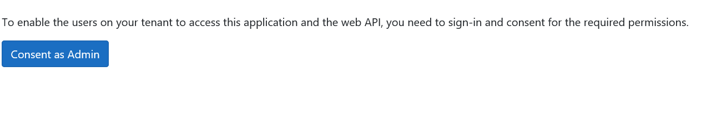
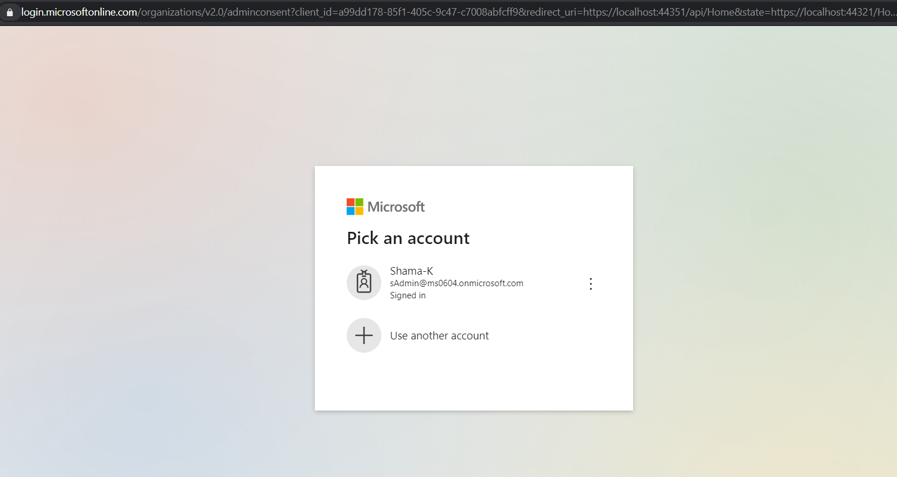
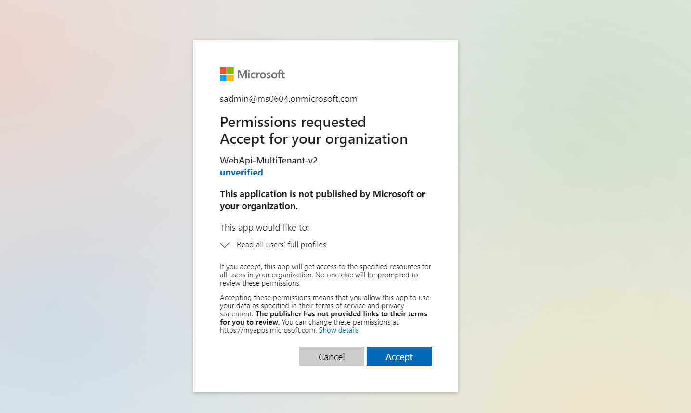
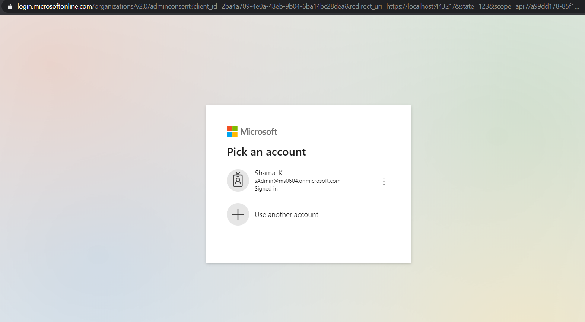
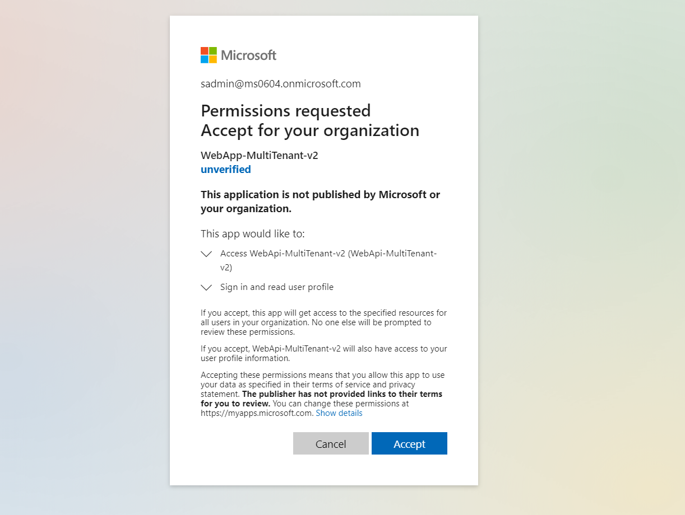
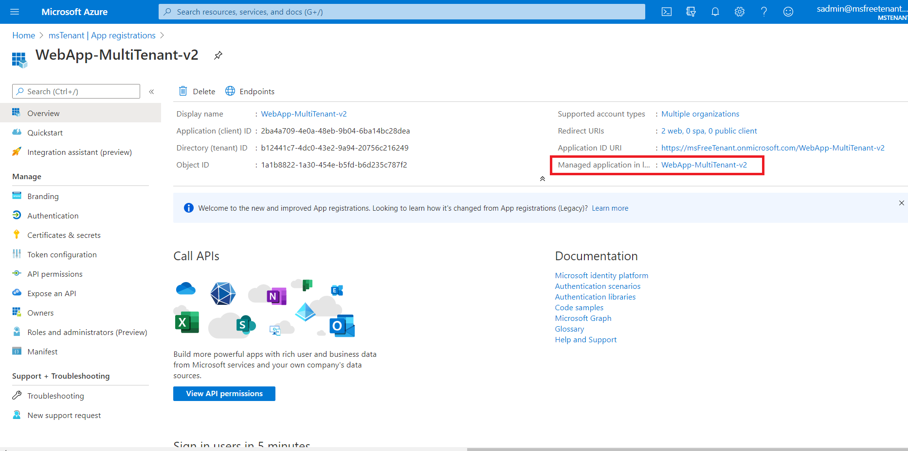
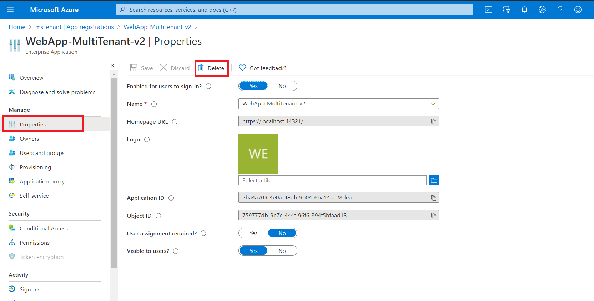

# Protect a multi-tenant SaaS web application and a Web API which calls Microsoft Graph on-behalf of the user with the Microsoft Identity Platform

> This sample is for Azure AD, not Azure AD B2C.

[](https://identitydivision.visualstudio.com/IDDP/_build/latest?definitionId=819)

- [Protect a multi-tenant SaaS web application and a Web API which calls Microsoft Graph on-behalf of the user with the Microsoft Identity Platform](#protect-a-multi-tenant-saas-web-application-and-a-web-api-which-calls-microsoft-graph-on-behalf-of-the-user-with-the-microsoft-identity-platform)
  - [About this sample](#about-this-sample)
  - [Scenario](#scenario)
  - [Overview](#overview)
  - [Pre-requisites](#pre-requisites)
  - [Setup](#setup)
    - [Step 1:  Clone or download this repository](#step-1-clone-or-download-this-repository)
    - [Step 2:  Register the sample applications with your Azure Active Directory tenant](#step-2-register-the-sample-applications-with-your-azure-active-directory-tenant)
      - [Choose the Azure AD tenant where you want to create your applications](#choose-the-azure-ad-tenant-where-you-want-to-create-your-applications)
      - [Register the service app (WebApi-MultiTenant-ToDoListService-v2)](#register-the-service-app-webapi-multitenant-todolistservice-v2)
      - [Configure the service app (WebApi-MultiTenant-ToDoListService-v2) to use your app registration](#configure-the-service-app-webapi-multitenant-todolistservice-v2-to-use-your-app-registration)
      - [Register the client app (WebApp-MultiTenant-ToDoListClient-v2)](#register-the-client-app-webapp-multitenant-todolistclient-v2)
      - [Configure the client app (WebApp-MultiTenant-ToDoListClient-v2) to use your app registration](#configure-the-client-app-webapp-multitenant-todolistclient-v2-to-use-your-app-registration)
    - [Step 4: Run the sample](#step-4-run-the-sample)
      - [Run the sample using Visual Studio](#run-the-sample-using-visual-studio)
      - [Run the sample using a command line interface such as VS Code integrated terminal](#run-the-sample-using-a-command-line-interface-such-as-vs-code-integrated-terminal)
        - [Step 1. Install .NET Core dependencies](#step-1-install-net-core-dependencies)
        - [Step 2. Trust development certificates](#step-2-trust-development-certificates)
        - [Step 3. Run the applications](#step-3-run-the-applications)
    - [Testing the Application](#testing-the-application)
    - [The different ways of obtaining admin consent](#the-different-ways-of-obtaining-admin-consent)
      - [Consent using the `/adminconsent` endpoint](#consent-using-the-adminconsent-endpoint)
      - [Consent using PowerShell](#consent-using-powershell)
    - [Explore the sample](#explore-the-sample)
  - [About the code](#about-the-code)
    - [Provisioning your Multi-tenant Apps in another Azure AD Tenant programmatically](#provisioning-your-multi-tenant-apps-in-another-azure-ad-tenant-programmatically)
    - [Code for the Web App (TodoListClient)](#code-for-the-web-app-todolistclient)
    - [Admin Consent Endpoint](#admin-consent-endpoint)
    - [Handle the **MsalUiRequiredException** from Web API](#handle-the-msaluirequiredexception-from-web-api)
    - [Code for the Web API (ToDoListService)](#code-for-the-web-api-todolistservice)
      - [Admin consent Client Redirect](#admin-consent-client-redirect)
      - [Choosing which scopes to expose](#choosing-which-scopes-to-expose)
      - [Custom Token Validation Allowing only Registered Tenants](#custom-token-validation-allowing-only-registered-tenants)
  - [Community Help and Support](#community-help-and-support)
  - [Contributing](#contributing)
  - [More information](#more-information)

## About this sample

This sample demonstrates how to secure a **multi-tenant** ASP.NET Core MVC web application (TodoListClient) which calls another protected **multi-tenant** ASP.NET Core Web API (ToDoListService) with the Microsoft Identity Platform. This sample builds on the concepts introduced in the [Build a multi-tenant SaaS web application that calls Microsoft Graph using Azure AD & OpenID Connect](../../../2-WebApp-graph-user\2-3-Multi-Tenant/README.md) sample. We advise you go through that sample once before trying this sample.  
  
## Scenario

In this sample, we would protect an ASP.Net Core Web API using the Microsoft Identity Platform. The Web API will be protected using Azure Active Directory OAuth 2.0 Bearer Authorization. The API will support authenticated users with Work and School accounts. Further on the API will also call a downstream API (Microsoft Graph) on-behalf of the signed-in user to provide additional value to its client apps.

The Web API is marked as a [multi-tenant](https://docs.microsoft.com/azure/active-directory/develop/single-and-multi-tenant-apps) app, so that it can be [provisioned](#provisioning-your-multi-tenant-apps-in-another-azure-ad-tenant) into Azure AD tenants where the registered client applications in that tenant can then obtain [Access Tokens](https://docs.microsoft.com/azure/active-directory/develop/access-tokens) for this web API and make calls to it.

> Note that the client applications that want to call this web API do not need to be multi-tenant themselves to be able to do so.

## Overview

This sample presents a client Web application that signs-in users and obtains an Access Token for this protected Web API.

Both applications use the Microsoft Authentication Library [MSAL.NET](https://github.com/AzureAD/microsoft-authentication-library-for-dotnet) to sign-in user and obtain a JWT access token through the [OAuth 2.0](https://docs.microsoft.com/azure/active-directory/develop/active-directory-protocols-oauth-code) protocol.

The client Web App:

1. Signs-in users using the [MSAL.NET](https://github.com/AzureAD/microsoft-authentication-library-for-dotnet) and [Microsoft.Identity.Web](https://github.com/AzureAD/microsoft-identity-web) libraries.
1. Acquires an [Access Token](https://docs.microsoft.com/azure/active-directory/develop/access-tokens) for the Web API.
1. Calls the ASP.NET Core Web API by using the access token as a bearer token in the authentication header of the Http request.

The Web API:

1. Authorizes the caller (user) using the [Microsoft.Identity.Web](https://github.com/AzureAD/microsoft-identity-web).
1. Acquires another access token on-behalf-of the signed-in user using the [on-behalf of flow](https://docs.microsoft.com/azure/active-directory/develop/v2-oauth2-on-behalf-of-flow).
1. The Web API then uses this new Access token to call Microsoft Graph.

> A recording of a Microsoft Identity Platform developer session that covered this topic of developing a multi-tenant app with Azure Active Directory is available at [Develop multi-tenant applications with Microsoft identity platform](https://www.youtube.com/watch?v=B416AxHoMJ4).


## Pre-requisites

- [Visual Studio](https://visualstudio.microsoft.com/downloads/)
- An Azure Active Directory (Azure AD) tenant. For more information on how to get an Azure AD tenant, see [How to get an Azure AD tenant](https://azure.microsoft.com/documentation/articles/active-directory-howto-tenant/)
- A user account in your Azure AD tenant. This sample will not work with a **personal Microsoft account**. Therefore, if you signed in to the [Azure portal](https://portal.azure.com) with a personal account and have never created a user account in your directory before, you need to do that now.

## Setup

### Step 1:  Clone or download this repository

From your shell or command line:

```Shell
git clone https://github.com/Azure-Samples/active-directory-aspnetcore-webapp-openidconnect-v2.git
cd "4-WebApp-your-API\4-3-AnyOrg"
```

or download and extract the repository .zip file.

> :warning: Given that the name of the sample is quite long, and so are the names of the referenced packages, you might want to clone it in a folder close to the root of your hard drive, to avoid file size limitations on Windows.

### Step 2:  Register the sample applications with your Azure Active Directory tenant

There are two projects in this sample. Each needs to be separately registered in your Azure AD tenant. To register these projects, you can:

- either follow the steps below for manually register your apps
- or use PowerShell scripts that:
  - **automatically** creates the Azure AD applications and related objects (passwords, permissions, dependencies) for you.
  - modify the projects' configuration files.

<details>
  <summary>Expand this section if you want to use this automation:</summary>

1. On Windows, run PowerShell and navigate to the root of the cloned directory
1. In PowerShell run:

   ```PowerShell
   Set-ExecutionPolicy -ExecutionPolicy RemoteSigned -Scope Process -Force
   ```

1. Run the script to create your Azure AD application and configure the code of the sample application accordingly.
1. In PowerShell run:

   ```PowerShell
   cd .\AppCreationScripts\
   .\Configure.ps1
   ```

   > Other ways of running the scripts are described in [App Creation Scripts](./AppCreationScripts/AppCreationScripts.md)
   > The scripts also provide a guide to automated application registration, configuration and removal which can help in your CI/CD scenarios.

</details>

Follow the steps below to manually walk through the steps to register and configure the applications in the Azure portal.

#### Choose the Azure AD tenant where you want to create your applications

As a first step you'll need to:

1. Sign in to the [Azure portal](https://portal.azure.com).
2. If your account is present in more than one Azure AD tenant, select your profile at the top right corner in the menu on top of the page, and then **switch directory** to change your portal session to the desired Azure AD tenant..

#### Register the service app (WebApi-MultiTenant-ToDoListService-v2)

1. Navigate to the Microsoft identity platform for developers [App registrations](https://go.microsoft.com/fwlink/?linkid=2083908) page.
1. Select **New registration**.
1. In the **Register an application page** that appears, enter your application's registration information:
   - In the **Name** section, enter a meaningful application name that will be displayed to users of the app, for example `WebApi-MultiTenant-ToDoListService-v2`.
   - Under **Supported account types**, select **Accounts in any organizational directory**.
   - In the **Redirect URI (optional)** section, select **Web** in the combo-box and enter the following redirect URI: `https://localhost:44351/api/Home`.
1. Select **Register** to create the application.
1. In the app's registration screen, find and note the **Application (client) ID**. You use this value in your app's configuration file(s) later in your code.
1. Select **Save** to save your changes.
1. In the app's registration screen, click on the **Certificates & secrets** blade in the left to open the page where we can generate secrets and upload certificates.
1. In the **Client secrets** section, click on **New client secret**:
   - Type a key description (for instance `app secret`),
   - Select one of the available key durations (**In 1 year**, **In 2 years**, or **Never Expires**) as per your security posture.
   - The generated key value will be displayed when you click the **Add** button. Copy the generated value for use in the steps later.
   - You'll need this key later in your code's configuration files. This key value will not be displayed again, and is not retrievable by any other means, so make sure to note it from the Azure portal before navigating to any other screen or blade.
1. In the app's registration screen, click on the **API permissions** blade in the left to open the page where we add access to the APIs that your application needs.
   - Click the **Add a permission** button and then,
   - Ensure that the **Microsoft APIs** tab is selected.
   - In the *Commonly used Microsoft APIs* section, click on **Microsoft Graph**
   - In the **Delegated permissions** section, select the **User.Read.All** in the list. Use the search box if necessary.
   - Click on the **Add permissions** button at the bottom.
1. In the app's registration screen, select the **Expose an API** blade to the left to open the page where you can declare the parameters to expose this app as an Api for which client applications can obtain [access tokens](https://docs.microsoft.com/azure/active-directory/develop/access-tokens) for.
The first thing that we need to do is to declare the unique [resource](https://docs.microsoft.com/azure/active-directory/develop/v2-oauth2-auth-code-flow) URI that the clients will be using to obtain access tokens for this Api. To declare an resource URI, follow the following steps:
   - Click `Set` next to the **Application ID URI** to generate a URI that is unique for this app.
   - For this sample, accept the proposed Application ID URI (api://{clientId}) by selecting **Save**.
1. All Apis have to publish a minimum of one [scope](https://docs.microsoft.com/azure/active-directory/develop/v2-oauth2-auth-code-flow#request-an-authorization-code) for the client's to obtain an access token successfully. To publish a scope, follow the following steps:
   - Select **Add a scope** button open the **Add a scope** screen and Enter the values as indicated below:
        - For **Scope name**, use `access_as_user`.
        - Select **Admins and users** options for **Who can consent?**
        - For **Admin consent display name** type `Access WebApi-MultiTenant-ToDoListService-v2`
        - For **Admin consent description** type `Allows the app to access WebApi-MultiTenant-ToDoListService-v2 as the signed-in user.`
        - For **User consent display name** type `Access WebApi-MultiTenant-ToDoListService-v2`
        - For **User consent description** type `Allow the application to access WebApi-MultiTenant-ToDoListService-v2 on your behalf.`
        - Keep **State** as **Enabled**
        - Click on the **Add scope** button on the bottom to save this scope.

#### Configure the service app (WebApi-MultiTenant-ToDoListService-v2) to use your app registration

Open the project in your IDE (like Visual Studio or Visual Studio Code) to configure the code.

>In the steps below, "ClientID" is the same as "Application ID" or "AppId".

1. Open the `ToDoListService\appsettings.json` file
1. Find the app key `Domain` and replace the existing value with your Azure AD tenant name.
1. Find the app key `TenantId` and replace the existing value with 'common'.
1. Find the app key `ClientId` and replace the existing value with the application ID (clientId) of the `WebApi-MultiTenant-ToDoListService-v2` application copied from the Azure portal.
1. Find the app key `ClientSecret` and replace the existing value with the key you saved during the creation of the `WebApi-MultiTenant-ToDoListService-v2` app, in the Azure portal.

#### Register the client app (WebApp-MultiTenant-ToDoListClient-v2)

1. Navigate to the Microsoft identity platform for developers [App registrations](https://go.microsoft.com/fwlink/?linkid=2083908) page.
1. Select **New registration**.
1. In the **Register an application page** that appears, enter your application's registration information:
   - In the **Name** section, enter a meaningful application name that will be displayed to users of the app, for example `WebApp-MultiTenant-ToDoListClient-v2`.
   - Under **Supported account types**, select **Accounts in any organizational directory**.
   - In the **Redirect URI (optional)** section, select **Web** in the combo-box and enter the following redirect URI: `https://localhost:44321/`.
     > Note that there are more than one redirect URIs used in this sample. You'll need to add them from the **Authentication** tab later after the app has been created successfully.
1. Select **Register** to create the application.
1. In the app's registration screen, find and note the **Application (client) ID**. You use this value in your app's configuration file(s) later in your code.
1. In the app's registration screen, select **Authentication** in the menu.
   - If you don't have a platform added, select **Add a platform** and select the **Web** option.
   - In the **Redirect URIs** section, enter the following redirect URIs.
      - `https://localhost:44321/signin-oidc`
   - In the **Logout URL** section, set it to `https://localhost:44321/signout-oidc`.
1. Select **Save** to save your changes.
1. In the app's registration screen, click on the **Certificates & secrets** blade in the left to open the page where we can generate secrets and upload certificates.
1. In the **Client secrets** section, click on **New client secret**:
   - Type a key description (for instance `app secret`),
   - Select one of the available key durations (**In 1 year**, **In 2 years**, or **Never Expires**) as per your security posture.
   - The generated key value will be displayed when you click the **Add** button. Copy the generated value for use in the steps later.
   - You'll need this key later in your code's configuration files. This key value will not be displayed again, and is not retrievable by any other means, so make sure to note it from the Azure portal before navigating to any other screen or blade.
1. In the app's registration screen, click on the **API permissions** blade in the left to open the page where we add access to the APIs that your application needs.
   - Click the **Add a permission** button and then,
   - Ensure that the **My APIs** tab is selected.
   - In the list of APIs, select the API `WebApi-MultiTenant-ToDoListService-v2`.
   - In the **Delegated permissions** section, select the **Access 'WebApi-MultiTenant-ToDoListService-v2'** in the list. Use the search box if necessary.
   - Click on the **Add permissions** button at the bottom.

#### Configure the client app (WebApp-MultiTenant-ToDoListClient-v2) to use your app registration

Open the project in your IDE (like Visual Studio or Visual Studio Code) to configure the code.

>In the steps below, "ClientID" is the same as "Application ID" or "AppId".

1. Open the `ToDoListClient\appsettings.json` file
1. Find the app key `ClientId` and replace the existing value with the application ID (clientId) of the `WebApp-MultiTenant-ToDoListClient-v2` application copied from the Azure portal.
1. Find the app key `TenantId` and replace the existing value with 'common'.
1. Find the app key `Domain` and replace the existing value with your Azure AD tenant name.
1. Find the app key `ClientSecret` and replace the existing value with the key you saved during the creation of the `WebApp-MultiTenant-ToDoListClient-v2` app, in the Azure portal.
1. Find the app key `RedirectUri` and replace the existing value with the base address of the WebApp-MultiTenant-ToDoListClient-v2 project (by default `https://localhost:44321/`).
1. Find the app key `TodoListScope` and replace the existing value with ScopeDefault.
1. Find the app key `TodoListAppId` and replace the existing value with the application ID (clientId) of the `WebApi-MultiTenant-ToDoListService-v2` application copied from the Azure portal.
1. Find the app key `TodoListBaseAddress` and replace the existing value with the base address of the WebApi-MultiTenant-ToDoListService-v2 project (by default `https://localhost:44351/`).
1. Find the app key `AdminConsentRedirectApi` and replace the existing value with "https://localhost:44351/api/Home"

### Step 4: Run the sample

You can run the sample by using either Visual Studio or command line interface as shown below:

#### Run the sample using Visual Studio

Clean the solution, rebuild the solution, and run it. You might want to go into the solution properties and set both projects as startup projects, with the service project starting first.

When you start the Web API from Visual Studio, depending on the browser you use, you'll get:

- an empty web page (with Microsoft Edge)
- or an error HTTP 401 (with Chrome)

This behavior is expected as the browser is not authenticated. The Web application will be authenticated, so it will be able to access the Web API.

#### Run the sample using a command line interface such as VS Code integrated terminal

##### Step 1. Install .NET Core dependencies

```console
   cd ToDoListService
   dotnet restore
```

Then:  
In a separate console window, execute the following commands

```console
   cd ../
   cd ToDoListClient
   dotnet restore
```

##### Step 2. Trust development certificates

```console
   dotnet dev-certs https --clean
   dotnet dev-certs https --trust
```

Learn more about [HTTPS in .NET Core](https://docs.microsoft.com/aspnet/core/security/enforcing-ssl).

##### Step 3. Run the applications

In both the console windows execute the below command:

```console
    dotnet run
```

Open your browser and navigate to `https://localhost:44321`.

> NOTE: Remember, the To-Do list is stored in memory in this `ToDoListService` app. Each time you run the projects, your To-Do list will get emptied.

### Testing the Application

To properly test this application, you need *at least* **two** tenants, and on each tenant, *at least* **one** administrator and **one** non-administrator account.

### The different ways of obtaining admin consent

A service principal of your multi-tenant app and API is provisioned after the tenant admin manually or programmatically consents. The consent can be obtained from a tenant admin by using one of the following methods:

   1. By using the [/adminconsent](https://docs.microsoft.com/azure/active-directory/develop/v2-admin-consent) endpoint.
   2. By Using the PowerShell command[New-AzADServicePrincipal](https://docs.microsoft.com/powershell/module/Az.Resources/New-AzADServicePrincipal).

#### Consent using the `/adminconsent` endpoint

You can try the /adminconsent endpoint on the home page of the sample by clicking on the `Consent as Admin` link. Web API is provisioned first because the Web App is dependent on the Web API. The admin consent endpoint allows developers to programmatically build links to obtain consent.


> The `.default` scope
>
> Did you notice the scope here is set to `.default`, as opposed to `User.Read.All` for Microsoft Graph and `access_as_user` for Web API? This is a built-in scope for every application that refers to the static list of permissions configured on the application registration. Basically, it *bundles* all the permissions in one scope. The `/.default` scope can be used in any OAuth 2.0 flow, but is necessary when using the v2 admin consent endpoint to request application permissions. Read about `scopes` usage at [Scopes and permissions in the Microsoft Identity Platform](https://docs.microsoft.com/azure/active-directory/develop/v2-permissions-and-consent#the-default-scope).  
  
Since both the web app and API needs to be consented by the tenant admin, the admin will need to consent twice.

1. First, the tenant admin will consent for the Web API. The Web API is consented first as the client Web app depends on the Web API and not the other way around.
2. Then, the code will redirect the tenant admin to consent for the client web app.

When redirected to the `/adminconsent` endpoint, the tenant admin will see the sign-in or the coose account screen:



After you choose an admin account, it will lead to the following prompt to consent for the **Web API** :



When you click `Accept`, it will redirects to `/adminconsent` endpoint again to obtain consent for the **Web App**:



After you choose an admin account, it will lead to the Web App consent as below:



Once it finishes, your applications service principals will be provisioned in the tenant admin's tenant.

#### Consent using PowerShell

The tenant administrators of a tenant can provision service principals for the applications in their tenant using the AAD PowerShell Module. After installing the AAD PowerShell Module v2, you can run the following cmdlet:

```console
Connect-AzureAD -TenantId "[The tenant Id]"
New-AzureADServicePrincipal -AppId '<client/app id>'
```

If you get errors during admin consent, consider deleting the  **service principal** of your apps in the tenant(s) you are about to test, in order to remove any previously granted consent and to be able to run the **provisioning process** from the beginning.

> How to delete Service Principals of your apps in a tenant
>
> Steps for deleting a service principal differs with respect to whether the principal is in the **home tenant** of the application or in another tenant. If it is in the **home tenant**, you will find the entry for the application under the **App Registrations** blade. If it is another tenant, you will find the entry under the **Enterprise Applications** blade. Read more about these blades in the [How and why applications are added to Azure AD](https://docs.microsoft.com/azure/active-directory/develop/active-directory-how-applications-are-added).The screenshot below shows how to access the service principal from a **home tenant**:
>
> 
>
> The rest of the process is the same for both cases. In the next screen, click on **Properties** and then the **Delete** button on the upper side.
>
> 
>
> You have now deleted the service principal of Web App for that tenant. Similarly, you can delete the service principal for Web API. Next time, admin needs to provision service principal for both the applications in the tenant from which *that* admin belongs.

### Explore the sample

1. Open your browser and navigate to `https://localhost:44321` and sign-in using the link on top-right.
1. Click on `To-Do List`, you can click on `Create New` link. It will redirect to create task screen where you can add a new task and assign it to any user from the list.
1. The `To-Do List` screen also displays tasks that are assigned to and created by signed-in user. The user can edit and delete the created tasks but can only view the assigned tasks.

> Did the sample not work for you as expected? Did you encounter issues trying this sample? Then please reach out to us using the [GitHub Issues](../../../../issues) page.

> [Consider taking a moment to share your experience with us.](https://forms.office.com/Pages/ResponsePage.aspx?id=v4j5cvGGr0GRqy180BHbRz0h_jLR5HNJlvkZAewyoWxUNEFCQ0FSMFlPQTJURkJZMTRZWVJRNkdRMC4u)

## About the code

### Provisioning your Multi-tenant Apps in another Azure AD Tenant programmatically

Often the user-based consent will be disabled in an Azure AD tenant or your application will be requesting permissions that requires a tenant-admin consent. In these scenarios, your application will need to utilize the `/adminconsent` endpoint to provision both the **ToDoListClient** and the **ToDoListService** before the users from that tenant are able to sign-in to your app.

When provisioning, you have to take care of the dependency in the topology where the **ToDoListClient** is dependent on **ToDoListService**. So in such a case, you would provision the **ToDoListService** before the **ToDoListClient**.

### Code for the Web App (TodoListClient)

In `Startup.cs`, below lines of code enables Microsoft identity platform endpoint. This endpoint is capable of signing-in users both with their Work and School Accounts.

```csharp
services.AddMicrosoftWebAppAuthentication(Configuration)
    .AddMicrosoftWebAppCallsWebApi(Configuration, new string[] { Configuration["TodoList:TodoListScope"] })
   .AddInMemoryTokenCaches();
```

 1. AddMicrosoftWebAppAuthentication : This enables your application to use the Microsoft identity platform endpoint. This endpoint is capable of signing-in users both with their Work and School and Microsoft Personal accounts.
 1. AddMicrosoftWebAppCallsWebApi : Enables the web app to call the protected API ToDoList Api.
 1. AddInMemoryTokenCaches: Adds an in memory token cache provider, which will cache the Access Tokens acquired for the Web API.

The following code enables to add client service to use the HttpClient by dependency injection.

```CSharp
services.AddTodoListService(Configuration);
```

### Admin Consent Endpoint

In `HomeController.cs`, the method `AdminConsentApi` has the code to redirect the user to the admin consent endpoint for the admin to consent for the **Web API**. The state parameter in the URI contains a link for `AdminConsentClient` method.

```csharp
public IActionResult AdminConsentApi()
{
    string adminConsent1 = "https://login.microsoftonline.com/organizations/v2.0/adminconsent?client_id="+ _ApiClientId 
        + "&redirect_uri=" + _ApiRedirectUri
        + "&state=" + _RedirectUri + "Home/AdminConsentClient" + "&scope=" + _ApiScope;

    return Redirect(adminConsent1);
}
```

The method `AdminConsentClient` has the code to redirect the user to the admin consent endpoint for the admin to consent for the **Web App**.

```csharp
public IActionResult AdminConsentClient()
{
    string adminConsent2 = "https://login.microsoftonline.com/organizations/v2.0/adminconsent?client_id=" + _ClientId
        + "&redirect_uri=" + _RedirectUri
        + "&state=123&scope=" + _TodoListScope;

    return Redirect(adminConsent2);
}
```

### Handle the **MsalUiRequiredException** from Web API

If signed-in user does not have consent for a permission on the Web API, for instance "user.read.all" in this sample, then Web API will throw `MsalUiRequiredException`. The response contains the details about consent Uri and proposed action.

The Web App contains a method `HandleChallengeFromWebApi` in `ToDoListService.cs` that handles the exception thrown by API. It creates a consent URI and throws a custom exception i.e., `WebApiMsalUiRequiredException`.

```csharp
private void HandleChallengeFromWebApi(HttpResponseMessage response)
{
    //proposedAction="consent"
    List<string> result = new List<string>();
    AuthenticationHeaderValue bearer = response.Headers.WwwAuthenticate.First(v => v.Scheme == "Bearer");
    IEnumerable<string> parameters = bearer.Parameter.Split(',').Select(v => v.Trim()).ToList();
    string proposedAction = GetParameter(parameters, "proposedAction");

    if (proposedAction == "consent")
    {
        string consentUri = GetParameter(parameters, "consentUri");

        var uri = new Uri(consentUri);

        var queryString = System.Web.HttpUtility.ParseQueryString(uri.Query);
        queryString.Set("redirect_uri", _ApiRedirectUri);
        queryString.Add("prompt", "consent");
        queryString.Add("state", _RedirectUri);

        var uriBuilder = new UriBuilder(uri);
        uriBuilder.Query = queryString.ToString();
        var updateConsentUri = uriBuilder.Uri.ToString();
        result.Add("consentUri");
        result.Add(updateConsentUri);

        throw new WebApiMsalUiRequiredException(updateConsentUri);
    }
}
```

The following code in `ToDoListController.cs` catches the `WebApiMsalUiRequiredException` exception thrown by `HandleChallengeFromWebApi` method as explained above. Further it Redirects to `consentUri` that is retrieved from exception message. Admin needs to consent as `user.read.all` permission requires admin approval.

```csharp
public async Task<IActionResult> Create()
{
    ToDoItem todo = new ToDoItem();
    try
    {
        ...
    }
    catch (WebApiMsalUiRequiredException ex)
    {
        return Redirect(ex.Message);
    }
}
```

### Code for the Web API (ToDoListService)

#### Admin consent Client Redirect

In HomeController.cs, the method `AdminConsent` redirects to the URI passed in the state parameter by Web App. If admin consent is cancelled from API consent screen then it redirects to base address of Web App.

```csharp
public IActionResult AdminConsent()
{
    var decodeUrl = System.Web.HttpUtility.UrlDecode(HttpContext.Request.QueryString.ToString());
    var queryString = System.Web.HttpUtility.ParseQueryString(decodeUrl);
    var clientRedirect = queryString["state"];
    if (!string.IsNullOrEmpty(clientRedirect))
    {
        if (queryString["error"] == "access_denied" && queryString["error_subcode"] == "cancel")
        {
            var clientRedirectUri = new Uri(clientRedirect);
            return Redirect(clientRedirectUri.GetLeftPart(System.UriPartial.Authority));
        }
        else
        {
            return Redirect(clientRedirect);
        }
    }
    else
    {
        return RedirectToAction("GetTodoItems", "TodoList");
    }
}
```

#### Choosing which scopes to expose

This sample exposes a delegated permission (access_as_user) that will be presented in the access token claim. The method `AddMicrosoftWebApi` does not validate the scope, but Microsoft.Identity.Web has a HttpContext extension method, `VerifyUserHasAnyAcceptedScope`, where you can validate the scope as below:

```csharp
HttpContext.VerifyUserHasAnyAcceptedScope(scopeRequiredByApi);
```

 For delegated permissions how to access scopes

If a token has delegated permission scopes, they will be in the `scp` or `http://schemas.microsoft.com/identity/claims/scope` claim.

#### Custom Token Validation Allowing only Registered Tenants

By marking your application as multi-tenant, your application will be able to sign-in users from any Azure AD tenant out there. Now you would want to restrict the tenants you want to work with. For this, we will now extend token validation to only those Azure AD tenants registered in the application database. Below, the event handler `OnTokenValidated` was configured to grab the `tenantId` from the token claims and check if it has an entry on the records. If it doesn't, an exception is thrown, canceling the authentication.

```csharp
services.AddAuthentication(JwtBearerDefaults.AuthenticationScheme)
  .AddMicrosoftWebApi(options =>
{
    Configuration.Bind("AzureAd", options);
    options.Events = new JwtBearerEvents();
    options.Events.OnTokenValidated = async context =>
    {
        string[] allowedTenants = {/* list of tenant IDs */ };
        string tenantId = context.Principal.Claims.FirstOrDefault(x => x.Type == "tid" || x.Type == "http://schemas.microsoft.com/identity/claims/tenantid")?.Value;

        if (!allowedTenants.Contains(tenantId))
        {
            throw new Exception("This tenant is not authorized");
        }
    };
}, options => { Configuration.Bind("AzureAd", options); })
  .AddMicrosoftWebApiCallsWebApi(Configuration)
  .AddInMemoryTokenCaches();
```

## Community Help and Support

Use [Stack Overflow](http://stackoverflow.com/questions/tagged/msal) to get support from the community.
Ask your questions on Stack Overflow first and browse existing issues to see if someone has asked your question before.
Make sure that your questions or comments are tagged with [`azure-active-directory` `msal` `dotnet`].

If you find a bug in the sample, please raise the issue on [GitHub Issues](../../issues).

To provide a recommendation, visit the following [User Voice page](https://feedback.azure.com/forums/169401-azure-active-directory).

## Contributing

If you'd like to contribute to this sample, see [CONTRIBUTING.MD](/CONTRIBUTING.md).

This project has adopted the [Microsoft Open Source Code of Conduct](https://opensource.microsoft.com/codeofconduct/). For more information, see the [Code of Conduct FAQ](https://opensource.microsoft.com/codeofconduct/faq/) or contact [opencode@microsoft.com](mailto:opencode@microsoft.com) with any additional questions or comments.

## More information

To learn more about single and multi-tenant apps, see:

- [Develop multi-tenant applications with Microsoft identity platform](https://www.youtube.com/watch?v=B416AxHoMJ4)
- [National Clouds](https://docs.microsoft.com/azure/active-directory/develop/authentication-national-cloud)
- [Endpoints](https://docs.microsoft.com/azure/active-directory/develop/active-directory-v2-protocols#endpoints)
- [How and why applications are added to Azure AD](https://docs.microsoft.com/azure/active-directory/develop/active-directory-how-applications-are-added)
- [Scopes and permissions in the Microsoft Identity Platform](https://docs.microsoft.com/azure/active-directory/develop/v2-permissions-and-consent#scopes-and-permissions)

To learn more about admin consent experiences, see:

- [Understanding Azure AD application consent experiences](https://docs.microsoft.com/azure/active-directory/develop/application-consent-experience)
- [Understand user and admin consent](https://docs.microsoft.com/azure/active-directory/develop/howto-convert-app-to-be-multi-tenant#understand-user-and-admin-consent)
