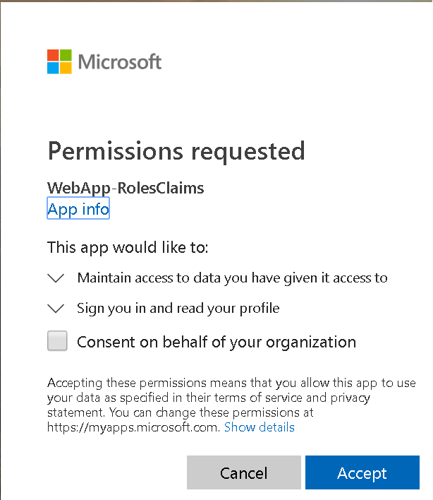

# Add authorization using **app roles** & **roles** claims to an ASP.NET Core web app thats signs-in users with the Microsoft identity platform

[](https://identitydivision.visualstudio.com/IDDP/_build/latest?definitionId=819)

## About this sample

### Overview

This sample shows how a .NET Core MVC Web app that uses [OpenID Connect](https://docs.microsoft.com/azure/active-directory/develop/v1-protocols-openid-connect-code) to sign in users and use Azure AD App roles (app roles) for authorization. App roles, along with Security groups are popular means to implement authorization.

This application implements RBAC using Azure AD's App roles & Role Claims feature. Another approach is to use Azure AD Groups and Group Claims, as shown in [WebApp-GroupClaims](../../5-WebApp-AuthZ/5-2-Groups/Readme.md). Azure AD Groups and App roles are by no means mutually exclusive; they can be used in tandem to provide even finer grained access control.

Using RBAC with App roles and Role Claims, developers can securely enforce authorization policies with minimal effort on their part.

- A Microsoft Identity Platform Office Hours session covered Azure AD App roles and security groups, featuring this scenario and this sample. A recording of the session is is provided in this video [Using Security Groups and App roles in your apps](https://www.youtube.com/watch?v=LRoc-na27l0)

For more information about how the protocols work in this scenario and other scenarios, see [Authentication Scenarios for Azure AD](http://go.microsoft.com/fwlink/?LinkId=394414).

## Scenario

This sample first leverages the ASP.NET Core OpenID Connect middleware to sign in the user. On the home page it displays the various `claims` that the user's [ID Token](https://docs.microsoft.com/azure/active-directory/develop/id-tokens) contained. The ID token is used by the asp.net security middleware to build the [ClaimsPrincipal](https://docs.microsoft.com/dotnet/api/system.security.claims.claimsprincipal), accessible via **HttpContext.User** in the code. The sample also shows how to use the [Policy-based authorization in ASP.NET Core](https://docs.microsoft.com/aspnet/core/security/authorization/policies).

This web application allows users to list all users in their tenant or a list of all the app roles and groups the signed in user is assigned to depending on the app role they have been assigned to. The idea is to provide an example of how, within an application, access to certain functionality is restricted to subsets of users depending on which role they belong to.

This kind of authorization is implemented using role-based access control (RBAC). When using RBAC, an administrator grants permissions to roles, not to individual users or groups. The administrator can then assign roles to different users and groups to control who has then access to certain content and functionality.  

This sample application defines the following two *App roles*:

- `DirectoryViewers`: Have the ability to view any directory user's roles and security group assignments.
- `UserReaders`: Have the ability to view a list of users in the directory.

These App roles are defined in the [Azure portal](https://portal.azure.com) in the application's registration manifest.  When a user signs into the application, Azure AD emits a `roles` claim for each role that the user has been granted individually to the user in the from of role membership.  Assignment of users and groups to roles can be done through the portal's UI, or programmatically using the [Microsoft Graph](https://graph.microsoft.com) and [Azure AD PowerShell](https://docs.microsoft.com/powershell/module/azuread/?view=azureadps-2.0).  In this sample, application role management is done through the Azure portal or using PowerShell.

NOTE: Role claims will not be present for guest users in a tenant if the `https://login.microsoftonline.com/common/` endpoint is used as the authority to sign in users.


> This is the sixth chapter of a set of tutorials. In the chapter before this one, you learned how to receive the group memberships in a user's claims. In this one you will learn about how to use the App roles in an app using the Microsoft Identity Platform to authenticate users.

## How to run this sample

To run this sample:

> Pre-requisites:
>
> go through the previous phase of the tutorial showing how the [Using the Microsoft identity platform to call the Microsoft Graph API from an An ASP.NET Core 2.x Web App](../../2-WebApp-graph-user/2-1-Call-MSGraph). This page shows the incremental change needed to set up App roles and retrieve them in your app when a user signs in.

To run this sample, you'll need:

- [Visual Studio](https://aka.ms/vsdownload) or just the [.NET Core SDK](https://www.microsoft.com/net/learn/get-started)
- An Internet connection
- A Windows machine (necessary if you want to run the app on Windows)
- An OS X machine (necessary if you want to run the app on Mac)
- A Linux machine (necessary if you want to run the app on Linux)
- An Azure Active Directory (Azure AD) tenant. For more information on how to get an Azure AD tenant, see [How to get an Azure AD tenant](https://azure.microsoft.com/documentation/articles/active-directory-howto-tenant/)
- A user account in your Azure AD tenant. This sample will not work with a Microsoft account (formerly Windows Live account). Therefore, if you signed in to the [Azure portal](https://portal.azure.com) with a Microsoft account and have never created a user account in your directory before, you need to do that now.

### Step 1:  Clone or download this repository

From your shell or command line:

```Shell
git clone https://github.com/Azure-Samples/microsoft-identity-platform-aspnetcore-webapp-tutorial.git
```

or download and extract the repository .zip file.

> Given that the name of the sample is quiet long, and so are the names of the referenced NuGet packages, you might want to clone it in a folder close to the root of your hard drive, to avoid file size limitations on Windows.

Navigate to the `"5-WebApp-AuthZ/5-1-Roles"` folder

### Step 2: Define your App Roles

 1. Still on the same app registration, select the **App roles** blade to the left.
    1. Select **Create app role**:
       - For **Display name**, enter a suitable name, for instance **UserReaders**.
       - For **Allowed member types**, choose **User**.
       - For **Value**, enter **UserReaders**.
       - For **Description**, enter **User readers can read basic profiles of all users in the directory.**.
    1. Select **Create app role**:
       - For **Display name**, enter a suitable name, for instance **DirectoryViewers**.
       - For **Allowed member types**, choose **User**.
       - For **Value**, enter **DirectoryViewers**.
       - For **Description**, enter **Directory viewers can view objects in the whole directory.**.
    1. Select **Apply** to save your changes.

   To add users to this app role, follow the guidelines here: [Assign users and groups to roles](https://docs.microsoft.com/azure/active-directory/develop/howto-add-app-roles-in-azure-ad-apps#assign-users-and-groups-to-roles).


### Step 3: Run the sample

1. Clean the solution, rebuild the solution, and run it.

1. Open your web browser and make a request to the app. The app immediately attempts to authenticate you via the Microsoft identity platform endpoint. Sign in using a user account of that tenant.



1. On the home page, the app lists the various claims it obtained from your [ID token](https://docs.microsoft.com/azure/active-directory/develop/id-tokens). You'd notice a claim named `roles`. There will be one `roles` claim for each app role the signed-in use is assigned to.

1. There also are two links provided on the home page under the **Try one of the following Azure App Role driven operations** heading. These links will result in an access denied error if the signed-in user is not present in the expected role. Sign-out and sign-in with a user account with the correct role assignment to view the contents of these pages.

When you click on the page that fetches the signed-in user's roles and group assignments, the sample will attempt to obtain consent from you for the **User.Read** permission using [incremental consent](https://docs.microsoft.com/azure/active-directory/develop/azure-ad-endpoint-comparison#incremental-and-dynamic-consent).

> Did the sample not work for you as expected? Did you encounter issues trying this sample? Then please reach out to us using the [GitHub Issues](../../../../issues) page.

> [Consider taking a moment to share your experience with us.](https://forms.office.com/Pages/ResponsePage.aspx?id=v4j5cvGGr0GRqy180BHbRz0h_jLR5HNJlvkZAewyoWxUNEFCQ0FSMFlPQTJURkJZMTRZWVJRNkdRMC4u)

### Support in ASP.NET Core middleware libraries

The ASP.NET middleware supports roles populated from claims by specifying the claim in the `RoleClaimType` property of `TokenValidationParameters`.

```CSharp

// Startup.cs
public void ConfigureServices(IServiceCollection services)
{
            // [removed for brevity]

            // This is required to be instantiated before the OpenIdConnectOptions starts getting configured.
            // By default, the claims mapping will map claim names in the old format to accommodate older SAML applications.
            // 'http://schemas.microsoft.com/ws/2008/06/identity/claims/role' instead of 'roles'
            // This flag ensures that the ClaimsIdentity claims collection will be built from the claims in the token
            JwtSecurityTokenHandler.DefaultMapInboundClaims = false;

            // The following lines code instruct the asp.net core middleware to use the data in the "groups" claim in the Authorize attribute and User.IsInrole()
            // See https://docs.microsoft.com/aspnet/core/security/authorization/roles?view=aspnetcore-2.2 for more info.
            services.Configure<OpenIdConnectOptions>(OpenIdConnectDefaults.AuthenticationScheme, options =>
            {
                // Use the groups claim for populating roles
                options.TokenValidationParameters.RoleClaimType = "roles";
            });

            // Adding authorization policies that enforce authorization using Azure AD roles.
            services.AddAuthorization(options => 
            {
                options.AddPolicy(AuthorizationPolicies.AssignmentToUserReaderRoleRequired, policy => policy.RequireRole(AppRole.UserReaders));
                options.AddPolicy(AuthorizationPolicies.AssignmentToDirectoryViewerRoleRequired, policy => policy.RequireRole(AppRole.DirectoryViewers));
            });

            // [removed for brevity]
}

// In code..(Controllers & elsewhere)
[Authorize(Roles = DirectoryViewers")] // In controllers
// or
User.IsInRole("UserReaders"); // In methods
```

## About the code

The following files have the code that would be of interest to you.

1. HomeController.cs
    1. Passes the **HttpContext.User** (the signed-in user) to the view.
1. Services\GraphServiceClientFactory.cs
    1. Uses the [Microsoft Graph SDK](https://github.com/microsoftgraph/msgraph-sdk-dotnet) to carry out various operations with [Microsoft Graph](https://graph.microsoft.com).
1. Home\Index.cshtml
    1. This has some code to print the current user's claims

1. In the `ConfigureServices` method of `Startup.cs', add the following lines:

    ```CSharp
    //This enables your application to use the Microsoft identity platform endpoint. This endpoint is capable of signing-in users both with their Work and School and Microsoft Personal accounts.
    services.AddMicrosoftIdentityWebAppAuthentication(Configuration)
                    .EnableTokenAcquisitionToCallDownstreamApi(new string[] { Constants.ScopeUserRead })
                    .AddInMemoryTokenCaches(); // Adds aspnetcore MemoryCache as Token cache provider for MSAL.
    
    services.AddMSGraphService(Configuration);    // Adds the IMSGraphService as an available service for this app.
    
    // This is required to be instantiated before the OpenIdConnectOptions starts getting configured.
    // By default, the claims mapping will map claim names in the old format to accommodate older SAML applications.
    // 'http://schemas.microsoft.com/ws/2008/06/identity/claims/role' instead of 'roles'
    // This flag ensures that the ClaimsIdentity claims collection will be built from the claims in the token
    JwtSecurityTokenHandler.DefaultMapInboundClaims = false;
    ```

1. In the `ConfigureServices` method of `Startup.cs', the following lines instruct the ASP.NET security middleware to use the **roles** claim to fetch roles for authorization:

     ```CSharp
    // Add this configuration after the call to `AddMicrosoftIdentityWebAppAuthentication`.
    services.Configure<OpenIdConnectOptions>(OpenIdConnectDefaults.AuthenticationScheme, options =>
    {
        // The claim in the JWT token where App roles are available.
        options.TokenValidationParameters.RoleClaimType = "roles";
    });

     // Adding authorization policies that enforce authorization using Azure AD roles.
    services.AddAuthorization(options => 
    {
        options.AddPolicy(AuthorizationPolicies.AssignmentToUserReaderRoleRequired, policy => policy.RequireRole(AppRole.UserReaders));
        options.AddPolicy(AuthorizationPolicies.AssignmentToDirectoryViewerRoleRequired, policy => policy.RequireRole(AppRole.DirectoryViewers));
    });
     ```

1. In the `HomeController.cs`, the following method is added with the `Authorize` attribute with the name of the app role **UserReaders**, that permits listing of users in the tenant.

    ```CSharp
    [Authorize(Policy = AuthorizationPolicies.AssignmentToDirectoryViewerRoleRequired)]
    public async Task<IActionResult> Users()
    {
     ```

1. A new class called `AccountController.cs` is introduced. This contains the code to intercept the default AccessDenied error's route and present the user with an option to sign-out and sign-back in with a different account that has access to the required role.

    ```CSharp
    [AllowAnonymous]
    public IActionResult AccessDenied()
    {
     ```

1. The following method is also added with the `Authorize` attribute with the name of the app role **DirectoryViewers**, that permits listing of roles and groups the signed-in user is assigned to.

    ```CSharp
    [Authorize(Policy = AuthorizationPolicies.AssignmentToUserReaderRoleRequired)]
    public async Task<IActionResult> Groups()
    {
     ```

1. The views, `Users.cshtml` and `Groups.cshtml` have the code to display the users in a tenant and roles and groups the signed-in user is assigned to respectively.

## Next steps

- Learn how to use app groups. [Add authorization using security groups & groups claims to a Web app thats signs-in users with the Microsoft identity platform](../../5-WebApp-AuthZ/5-2-Groups/README-incremental-instructions.md).

## Learn more

- Learn how [Microsoft.Identity.Web](https://github.com/AzureAD/microsoft-identity-web/wiki) works, in particular hooks-up to the ASP.NET Core OIDC events

## Community Help and Support

Use [Stack Overflow](http://stackoverflow.com/questions/tagged/msal) to get support from the community.
Ask your questions on Stack Overflow first and browse existing issues to see if someone has asked your question before.
Make sure that your questions or comments are tagged with [`azure-active-directory` `adal` `msal` `dotnet`].

If you find a bug in the sample, please raise the issue on [GitHub Issues](../../issues).

To provide a recommendation, visit the following [User Voice page](https://feedback.azure.com/forums/169401-azure-active-directory).

## More information

To understand more about app registration, see:

- [Quickstart: Register an application with the Microsoft identity platform (Preview)](https://docs.microsoft.com/azure/active-directory/develop/quickstart-register-app)
- [Quickstart: Configure a client application to access web APIs (Preview)](https://docs.microsoft.com/azure/active-directory/develop/quickstart-configure-app-access-web-apis)

To understand more about groups roles and the various claims in tokens, see:

- [Policy-based authorization in ASP.NET Core](https://docs.microsoft.com/aspnet/core/security/authorization/policies)
- [Azure Active Directory app manifest](https://docs.microsoft.com/azure/active-directory/develop/reference-app-manifest)
- [ID tokens](https://docs.microsoft.com/azure/active-directory/develop/id-tokens)
- [Azure Active Directory access tokens](https://docs.microsoft.com/azure/active-directory/develop/access-tokens)
- [Microsoft Graph permissions reference](https://docs.microsoft.com/graph/permissions-reference)
- [user: getMemberObjects function](https://docs.microsoft.com/graph/api/user-getmemberobjects)
- [App roles](https://docs.microsoft.com/azure/architecture/multitenant-identity/app-roles)
- [Token validation](https://github.com/AzureAD/azure-activedirectory-identitymodel-extensions-for-dotnet/wiki/ValidatingTokens)

## Contributing

If you'd like to contribute to this sample, see [CONTRIBUTING.MD](/CONTRIBUTING.md).

This project has adopted the [Microsoft Open Source Code of Conduct](https://opensource.microsoft.com/codeofconduct/). For more information, see the [Code of Conduct FAQ](https://opensource.microsoft.com/codeofconduct/faq/) or contact [opencode@microsoft.com](mailto:opencode@microsoft.com) with any additional questions or comments.
