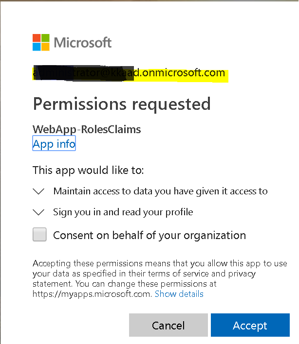

# Add authorization using **app roles** & **roles** claims to an ASP.NET Core web app thats signs-in users with the Microsoft identity platform

[](https://identitydivision.visualstudio.com/IDDP/_build/latest?definitionId=819)

## About this sample

### Overview

This sample shows how a .NET Core MVC Web app that uses [OpenID Connect](https://docs.microsoft.com/azure/active-directory/develop/v1-protocols-openid-connect-code) to sign in users and use Azure AD Application Roles (app roles) for authorization. App roles, along with Security groups are popular means to implement authorization.

This application implements RBAC using Azure AD's Application Roles & Role Claims feature. Another approach is to use Azure AD Groups and Group Claims, as shown in [WebApp-GroupClaims](../../5-WebApp-AuthZ/5-2-Groups/Readme.md). Azure AD Groups and Application Roles are by no means mutually exclusive; they can be used in tandem to provide even finer grained access control.

Using RBAC with Application Roles and Role Claims, developers can securely enforce authorization policies with minimal effort on their part.

- A Microsoft Identity Platform Office Hours session covered Azure AD App roles and security groups, featuring this scenario and this sample. A recording of the session is is provided in this video [Using Security Groups and Application Roles in your apps](https://www.youtube.com/watch?v=LRoc-na27l0)

For more information about how the protocols work in this scenario and other scenarios, see [Authentication Scenarios for Azure AD](http://go.microsoft.com/fwlink/?LinkId=394414).

## Scenario

This sample first leverages the ASP.NET Core OpenID Connect middleware to sign in the user. On the home page it displays the various `claims` that the user's [ID Token](https://docs.microsoft.com/azure/active-directory/develop/id-tokens) contained. The ID token is used by the asp.net security middleware to build the [ClaimsPrincipal](https://docs.microsoft.com/dotnet/api/system.security.claims.claimsprincipal), accessible via **HttpContext.User** in the code.

This web application allows users to list all users in their tenant or a list of all the app roles and groups the signed in user is assigned to depending on the app role they have been assigned to. The idea is to provide an example of how, within an application, access to certain functionality is restricted to subsets of users depending on which role they belong to. The sample also shows how to use the [Policy-based authorization in ASP.NET Core](https://docs.microsoft.com/aspnet/core/security/authorization/policies).

This kind of authorization is implemented using role-based access control (RBAC). When using RBAC, an administrator grants permissions to roles, not to individual users or groups. The administrator can then assign roles to different users and groups to control who has then access to certain content and functionality.  

This sample application defines the following two *Application Roles*:

- `DirectoryViewers`: Have the ability to view any directory user's roles and security group assignments.
- `UserReaders`: Have the ability to view a list of users in the directory.

These application roles are defined in the [Azure portal](https://portal.azure.com) in the application's registration manifest.  When a user signs into the application, Azure AD emits a `roles` claim for each role that the user has been granted individually to the user in the from of role membership.  Assignment of users and groups to roles can be done through the portal's UI, or programmatically using the [Microsoft Graph](https://graph.microsoft.com) and [Azure AD PowerShell](https://docs.microsoft.com/powershell/module/azuread/?view=azureadps-2.0).  In this sample, application role management is done through the Azure portal or using PowerShell.

NOTE: Role claims will not be present for guest users in a tenant if the `https://login.microsoftonline.com/common/` endpoint is used as the authority to sign in users.


## How to run this sample

To run this sample, you'll need:

- [Visual Studio 2017](https://aka.ms/vsdownload) or just the [.NET Core SDK](https://www.microsoft.com/net/learn/get-started)
- An Internet connection
- A Windows machine (necessary if you want to run the app on Windows)
- An OS X machine (necessary if you want to run the app on Mac)
- A Linux machine (necessary if you want to run the app on Linux)
- An Azure Active Directory (Azure AD) tenant. For more information on how to get an Azure AD tenant, see [How to get an Azure AD tenant](https://azure.microsoft.com/documentation/articles/active-directory-howto-tenant/)
- A user account in your Azure AD tenant. This sample will not work with a Microsoft account (formerly Windows Live account). Therefore, if you signed in to the [Azure portal](https://portal.azure.com) with a Microsoft account and have never created a user account in your directory before, you need to do that now.

### Step 1:  Clone or download this repository

From your shell or command line:

```Shell
git clone https://github.com/Azure-Samples/microsoft-identity-platform-aspnetcore-webapp-tutorial.git
```

or download and extract the repository .zip file.

> Given that the name of the sample is quiet long, and so are the names of the referenced NuGet packages, you might want to clone it in a folder close to the root of your hard drive, to avoid file size limitations on Windows.

### Step 2:  Register the sample application with your Azure Active Directory tenant

There is one project in this sample. To register it, you can:

- either follow the steps [Step 2: Register the sample with your Azure Active Directory tenant](#step-2-register-the-sample-with-your-azure-active-directory-tenant) and [Step 3:  Configure the sample to use your Azure AD tenant](#choose-the-azure-ad-tenant-where-you-want-to-create-your-applications)
- or use PowerShell scripts that:
  - **automatically** creates the Azure AD applications and related objects (passwords, permissions, dependencies) for you. Note that this works for Visual Studio only.
  - modify the Visual Studio projects' configuration files.

<details>
  <summary>Expand this section if you want to use this automation:</summary>

1. On Windows, run PowerShell and navigate to the root of the cloned directory
1. In PowerShell run:

   ```PowerShell
   Set-ExecutionPolicy -ExecutionPolicy RemoteSigned -Scope Process -Force
   ```

1. Run the script to create your Azure AD application and configure the code of the sample application accordingly.
1. In PowerShell run:

   ```PowerShell
   cd .\AppCreationScripts\
   .\Configure.ps1
   ```

   > Other ways of running the scripts are described in [App Creation Scripts](./AppCreationScripts/AppCreationScripts.md)
   > The scripts also provide a guide to automated application registration, configuration and removal which can help in your CI/CD scenarios.

1. Open the Visual Studio solution and click start to run the code.

</details>

Follow the steps below to manually walk through the steps to register and configure the applications.

#### Choose the Azure AD tenant where you want to create your applications

As a first step you'll need to:

1. Sign in to the [Azure portal](https://portal.azure.com) using either a work or school account or a personal Microsoft account.
1. If your account is present in more than one Azure AD tenant, select your profile at the top right corner in the menu on top of the page, and then **switch directory**.
   Change your portal session to the desired Azure AD tenant.
1. In the portal menu click on **All services** and choose **Azure Active Directory**.

#### Register the webApp app (WebApp-RolesClaims)

1. Navigate to the Microsoft identity platform for developers [App registrations](https://go.microsoft.com/fwlink/?linkid=2083908) page.
1. Click **New registration** on top.
1. In the **Register an application page** that appears, enter your application's registration information:
   - In the **Name** section, enter a meaningful application name that will be displayed to users of the app, for example `WebApp-RolesClaims`.
   - Leave **Supported account types** on the default setting of **Accounts in this organizational directory only**.
     > Note that there are more than one redirect URIs used in this sample. You'll need to add them from the **Authentication** tab later after the app has been created successfully.
1. Click on the **Register** button in bottom to create the application.
1. In the app's registration screen, find the **Application (client) ID** value and record it for use later. You'll need it to configure the configuration file(s) later in your code.
1. In the app's registration screen, click on the **Authentication** blade in the left.
   - In the Redirect URIs section, select **Web** in the drop down and enter the following redirect URIs.
       - `https://localhost:44321/`
       - `https://localhost:44321/signin-oidc`
   - In the **Advanced settings** section, set **Logout URL** to `https://localhost:44321/signout-oidc`.
   - In the **Advanced settings** | **Implicit grant** section, check **ID tokens** as this sample requires
     the [ID Token](https://docs.microsoft.com/azure/active-directory/develop/id-tokens) to be enabled to
     sign-in the user, and call an API.

1. Click the **Save** button on top to save the changes.
1. In the app's registration screen, click on the **Certificates & secrets** blade in the left to open the page where we can generate secrets and upload certificates.
1. In the **Client secrets** section, click on **New client secret**:
   - Type a key description (for instance `app secret`),
   - Select one of the available key durations (**In 1 year**, **In 2 years**, or **Never Expires**) as per your security concerns.
   - The generated key value will be displayed when you click the **Add** button. Copy the generated value for use in the steps later.
   - You'll need this key later in your code's configuration files. This key value will not be displayed again, and is not retrievable by any other means, so make sure to note it from the Azure portal before navigating to any other screen or blade.
1. In the app's registration screen, click on the **API permissions** blade in the left to open the page where we add access to the Apis that your application needs.
   - Click the **Add a permission** button and then,
   - Ensure that the **Microsoft APIs** tab is selected.
   - In the *Commonly used Microsoft APIs* section, click on **Microsoft Graph**
   - In the **Delegated permissions** section, select the **User.Read**, **User.ReadBasic.All**, **Directory.Read.All** in the list. Use the search box if necessary.
   - Click on the **Add permissions** button at the bottom.

##### Define your Application Roles

1. In the blade for your  application in Azure Portal, click **Manifest**.
1. Edit the manifest by locating the `appRoles` setting and adding the two Application Roles.  The role definitions are provided in the JSON code block below.  Leave the `allowedMemberTypes` to **User** only.  Each role definition in this manifest must have a different valid **Guid** for the "id" property. Note that the `"value"` property of each role is set to the exact strings **DirectoryViewers** and **UserReaders** (as these strings are used in the code in the application).
1. Save the manifest.

The content of `appRoles` should be the following (the `id` should be a unique Guid)

```JSon
{
  ...
    "appRoles": [
        {
            "allowedMemberTypes": [
                "User"
            ],
            "description": "User readers can read basic profiles of all users in the directory",
            "displayName": "UserReaders",
            "id": "a816142a-2e8e-46c4-9997-f984faccb625",
            "isEnabled": true,
            "lang": null,
            "origin": "Application",
            "value": "UserReaders"
        },
        {
            "allowedMemberTypes": [
                "User"
            ],
            "description": "Directory viewers can view objects in the whole directory.",
            "displayName": "DirectoryViewers",
            "id": "72ff9f52-8011-49e0-a4f4-cc1bb26206fa",
            "isEnabled": true,
            "lang": null,
            "origin": "Application",
            "value": "DirectoryViewers"
        }
    ],
 ...
}
```

> Note:  To receive the `roles` claim with the name of the app roles this user is assigned to, make sure that the user accounts you plan to sign-in to this app is assigned to the app roles of this app. The guide, [Assign a user or group to an enterprise app in Azure Active Directory](https://docs.microsoft.com/azure/active-directory/manage-apps/assign-user-or-group-access-portal#assign-a-user-to-an-app---portal) provides step by step instructions.

##### Configure the  webApp app (WebApp-RolesClaims) to use your app registration

Open the project in your IDE (like Visual Studio) to configure the code.
>In the steps below, "ClientID" is the same as "Application ID" or "AppId".

1. Open the `appsettings.json` file
1. Find the app key `ClientId` and replace the existing value with the application ID (clientId) of the `WebApp-RolesClaims` application copied from the Azure portal.
1. Find the app key `TenantId` and replace the existing value with your Azure AD tenant ID.
1. Find the app key `Domain` and replace the existing value with your Azure AD tenant name.
1. Find the app key `ClientSecret` and replace the existing value with the key you saved during the creation of the `WebApp-RolesClaims` app, in the Azure portal.

### Step 4: Run the sample

1. Clean the solution, rebuild the solution, and run it.

1. Open your web browser and make a request to the app. The app immediately attempts to authenticate you via the Microsoft identity platform endpoint. Sign in using a user account of that tenant.



1. On the home page, the app lists the various claims it obtained from your [ID token](https://docs.microsoft.com/azure/active-directory/develop/id-tokens). You'd notice a claim named `roles`. There will be one `roles` claim for each app role the signed-in use is assigned to.

1. There also are two links provided on the home page under the **Try one of the following Azure App Role driven operations** heading. These links will result in an access denied error if the signed-in user is not present in the expected role. Sign-out and sign-in with a user account with the correct role assignment to view the contents of these pages.

> Note: You need to be a tenant admin to view the page that lists all the groups and roles the signed-in user is assigned to. It requires the **Directory.Read.All** permission to work. If you run into the **AADSTS65001: The user or administrator has not consented to use the application** error, provide [admin consent](https://docs.microsoft.com/azure/active-directory/manage-apps/configure-user-consent#grant-admin-consent-when-registering-an-app-in-the-azure-portal) to your app in the portal. Sign-out and sign-in again to make the page work as expected.

When you click on the page that fetches the signed-in user's roles and group assignments, the sample will attempt to obtain consent from you for the **Directory.Read.All** permission using [incremental consent](https://docs.microsoft.com/azure/active-directory/develop/azure-ad-endpoint-comparison#incremental-and-dynamic-consent).

> Did the sample not work for you as expected? Did you encounter issues trying this sample? Then please reach out to us using the [GitHub Issues](../../../../issues) page.

> [Consider taking a moment to share your experience with us.](https://forms.office.com/Pages/ResponsePage.aspx?id=v4j5cvGGr0GRqy180BHbRz0h_jLR5HNJlvkZAewyoWxUNEFCQ0FSMFlPQTJURkJZMTRZWVJRNkdRMC4u)

### Support in ASP.NET Core middleware libraries

The ASP.NET middleware supports roles populated from claims by specifying the claim in the `RoleClaimType` property of `TokenValidationParameters`.

```CSharp

// Startup.cs
public void ConfigureServices(IServiceCollection services)
{
            // [removed for] brevity

            // This is required to be instantiated before the OpenIdConnectOptions starts getting configured.
            // By default, the claims mapping will map claim names in the old format to accommodate older SAML applications.
            // 'http://schemas.microsoft.com/ws/2008/06/identity/claims/role' instead of 'roles'
            // This flag ensures that the ClaimsIdentity claims collection will be built from the claims in the token
            JwtSecurityTokenHandler.DefaultMapInboundClaims = false;

            // The following lines code instruct the asp.net core middleware to use the data in the "groups" claim in the Authorize attribute and User.IsInrole()
            // See https://docs.microsoft.com/aspnet/core/security/authorization/roles?view=aspnetcore-2.2 for more info.
            services.Configure<OpenIdConnectOptions>(OpenIdConnectDefaults.AuthenticationScheme, options =>
            {
                // Use the groups claim for populating roles
                options.TokenValidationParameters.RoleClaimType = "roles";
            });

            // Adding authorization policies that enforce authorization using Azure AD roles.
            services.AddAuthorization(options => 
            {
                options.AddPolicy(AuthorizationPolicies.AssignmentToUserReaderRoleRequired, policy => policy.RequireRole(AppRole.UserReaders));
                options.AddPolicy(AuthorizationPolicies.AssignmentToDirectoryViewerRoleRequired, policy => policy.RequireRole(AppRole.DirectoryViewers));
            });

            // [removed for] brevity
}

// In code..(Controllers & elsewhere)
[Authorize(Policy = AuthorizationPolicies.AssignmentToDirectoryViewerRoleRequired)]
// or
User.IsInRole("UserReaders"); // In methods
```

## About the code

### Create the sample from the command line

This project was created using the following command.

1. Run the following command to create a sample from the command line using the `SingleOrg` template:

    ```Sh
    dotnet new mvc --auth SingleOrg --client-id <Enter_the_Application_Id_here> --tenant-id <yourTenantId>
    ```

    > Note: Replace *`Enter_the_Application_Id_here`* with the *Application Id* from the application Id you just registered in the Application Registration Portal and *`<yourTenantId>`* with the *Directory (tenant) ID* where you created your application.

1. Open the generated project (.csproj) in Visual Studio, and save the solution.
1. Add the `Microsoft.Identity.Web.csproj` project which is located at the root of this sample repo, to your solution (**Add Existing Project ...**). It's used to simplify signing-in and, in the next tutorial phases, to get a token
1. Add a reference from your newly generated project to `Microsoft.Identity.Web` (right click on the **Dependencies** node under your new project, and choose **Add Reference ...**, and then in the projects tab find the `Microsoft.Identity.Web` project)
1. Open the **Startup.cs** file and:

   - in the `ConfigureServices` method, the following lines:

     ```CSharp
      services.AddAuthentication(AzureADDefaults.AuthenticationScheme)
              .AddAzureAD(options => Configuration.Bind("AzureAd", options));
     ```
      have been replaced by these lines:
     ```CSharp
     //This enables your application to use the Microsoft identity platform endpoint. This endpoint is capable of signing-in users both with their Work and School and Microsoft Personal accounts.
            services.AddMicrosoftIdentityWebAppAuthentication(Configuration)
                    .EnableTokenAcquisitionToCallDownstreamApi(new string[] { Constants.ScopeUserRead })
                    .AddInMemoryTokenCaches(); // Adds aspnetcore MemoryCache as Token cache provider for MSAL.

        services.AddGraphService(Configuration);    // Adds the IMSGraphService as an available service for this app.
     ```

1. In the `ConfigureServices` method of `Startup.cs', add the following lines:

     ```CSharp
            // This is required to be instantiated before the OpenIdConnectOptions starts getting configured.
            // By default, the claims mapping will map claim names in the old format to accommodate older SAML applications.
            // 'http://schemas.microsoft.com/ws/2008/06/identity/claims/role' instead of 'roles'
            // This flag ensures that the ClaimsIdentity claims collection will be built from the claims in the token
            JwtSecurityTokenHandler.DefaultMapInboundClaims = false;

            // Adding authorization policies that enforce authorization using Azure AD roles.
            services.AddAuthorization(options => 
            {
                options.AddPolicy(AuthorizationPolicies.AssignmentToUserReaderRoleRequired, policy => policy.RequireRole(AppRole.UserReaders));
                options.AddPolicy(AuthorizationPolicies.AssignmentToDirectoryViewerRoleRequired, policy => policy.RequireRole(AppRole.DirectoryViewers));
            });
     ```

1. In the `ConfigureServices` method of `Startup.cs', the following lines instruct the ASP.NET security middleware to use the **roles** claim to fetch roles for authorization.

     ```CSharp
    // Add this configuration after the call to `AddMicrosoftWebAppAuthentication`.
    services.Configure<OpenIdConnectOptions>(OpenIdConnectDefaults.AuthenticationScheme, options =>
    {
        // The claim in the JWT token where App roles are available.
        options.TokenValidationParameters.RoleClaimType = "roles";
    });
     ```

1. In the `HomeController.cs`, the following method is added with the `Authorize` attribute with the name of the policy that enforces that the signed-in user is present in the app role **UserReaders**, that permits listing of users in the tenant.

    ```CSharp
        [Authorize(Policy = AuthorizationPolicies.AssignmentToUserReaderRoleRequired)]
        public async Task<IActionResult> Users()
        {
     ```

1. A new class called `AccountController.cs` is introduced. This contains the code to intercept the default AccessDenied error's route and present the user with an option to sign-out and sign-back in with a different account that has access to the required role.

    ```CSharp
        [AllowAnonymous]
        public IActionResult AccessDenied()
        {
     ```

1. The following method is also added with the `Authorize` attribute with the name of the policy that enforces that the signed-in user is present in the app role **DirectoryViewers**, that permits listing of roles and groups the signed-in user is assigned to.

    ```CSharp
        [Authorize(Policy = AuthorizationPolicies.AssignmentToDirectoryViewerRoleRequired)]
        public async Task<IActionResult> Groups()
        {
     ```

1. The views, `Users.cshtml` and `Groups.cshtml` have the code to display the users in a tenant and roles and groups the signed-in user is assigned to respectively.

## How to deploy this sample to Azure

This project has one WebApp project. To deploy it to Azure Web Sites, you'll need, :

- create an Azure Web Site
- publish the Web App to the web site, and
- update its client(s) to call the web site instead of IIS Express.

### Create and publish the `WebApp-RolesClaims` to an Azure Web Site

1. Sign in to the [Azure portal](https://portal.azure.com).
1. Click `Create a resource` in the top left-hand corner, select **Web** --> **Web App**, and give your web site a name, for example, `WebApp-RolesClaims-contoso.azurewebsites.net`.
1. Thereafter select the `Subscription`, `Resource Group`, `App service plan and Location`. `OS` will be **Windows** and `Publish` will be **Code**.
1. Click `Create` and wait for the App Service to be created.
1. Once you get the `Deployment succeeded` notification, then click on `Go to resource` to navigate to the newly created App service.
1. Once the web site is created, locate it in the **Dashboard** and click it to open **App Services** **Overview** screen.
1. From the **Overview** tab of the App Service, download the publish profile by clicking the **Get publish profile** link and save it.  Other deployment mechanisms, such as from source control, can also be used.
1. Switch to Visual Studio and go to the WebApp-RolesClaims project.  Right click on the project in the Solution Explorer and select **Publish**.  Click **Import Profile** on the bottom bar, and import the publish profile that you downloaded earlier.
1. Click on **Configure** and in the `Connection tab`, update the Destination URL so that it is a `https` in the home page url, for example [https://WebApp-RolesClaims-contoso.azurewebsites.net](https://WebApp-RolesClaims-contoso.azurewebsites.net). Click **Next**.
1. On the Settings tab, make sure `Enable Organizational Authentication` is NOT selected.  Click **Save**. Click on **Publish** on the main screen.
1. Visual Studio will publish the project and automatically open a browser to the URL of the project.  If you see the default web page of the project, the publication was successful.

### Update the Active Directory tenant application registration for `WebApp-RolesClaims`

1. Navigate back to to the [Azure portal](https://portal.azure.com).
In the left-hand navigation pane, select the **Azure Active Directory** service, and then select **App registrations (Preview)**.
1. In the resultant screen, select the `WebApp-RolesClaims` application.
1. In the **Authentication** | page for your application, update the Logout URL fields with the address of your service, for example [https://WebApp-RolesClaims-contoso.azurewebsites.net](https://WebApp-RolesClaims-contoso.azurewebsites.net)
1. From the *Branding* menu, update the **Home page URL**, to the address of your service, for example [https://WebApp-RolesClaims-contoso.azurewebsites.net](https://WebApp-RolesClaims-contoso.azurewebsites.net). Save the configuration.
1. Add the same URL in the list of values of the *Authentication -> Redirect URIs* menu. If you have multiple redirect urls, make sure that there a new entry using the App service's Uri for each redirect url.

## Next steps

- Learn how to use app groups. [Add authorization using security groups & groups claims to a Web app thats signs-in users with the Microsoft identity platform](../../5-WebApp-AuthZ/5-2-Groups/README.md).

## Learn more

- Learn how [Microsoft.Identity.Web](https://github.com/AzureAD/microsoft-identity-web/wiki) works, in particular hooks-up to the ASP.NET Core OIDC events

## Community Help and Support

Use [Stack Overflow](http://stackoverflow.com/questions/tagged/msal) to get support from the community.
Ask your questions on Stack Overflow first and browse existing issues to see if someone has asked your question before.
Make sure that your questions or comments are tagged with [`azure-active-directory` `adal` `msal` `dotnet`].

If you find a bug in the sample, please raise the issue on [GitHub Issues](../../issues).

To provide a recommendation, visit the following [User Voice page](https://feedback.azure.com/forums/169401-azure-active-directory).

## More information

To understand more about app registration, see:

- [Quickstart: Register an application with the Microsoft identity platform (Preview)](https://docs.microsoft.com/azure/active-directory/develop/quickstart-register-app)
- [Quickstart: Configure a client application to access web APIs (Preview)](https://docs.microsoft.com/azure/active-directory/develop/quickstart-configure-app-access-web-apis)

To understand more about groups roles and the various claims in tokens, see:

- [Policy-based authorization in ASP.NET Core](https://docs.microsoft.com/aspnet/core/security/authorization/policies)
- [Azure Active Directory app manifest](https://docs.microsoft.com/azure/active-directory/develop/reference-app-manifest)
- [ID tokens](https://docs.microsoft.com/azure/active-directory/develop/id-tokens)
- [Azure Active Directory access tokens](https://docs.microsoft.com/azure/active-directory/develop/access-tokens)
- [Microsoft Graph permissions reference](https://docs.microsoft.com/graph/permissions-reference)
- [user: getMemberObjects function](https://docs.microsoft.com/graph/api/user-getmemberobjects)
- [Application roles](https://docs.microsoft.com/azure/architecture/multitenant-identity/app-roles)
- [Token validation](https://github.com/AzureAD/azure-activedirectory-identitymodel-extensions-for-dotnet/wiki/ValidatingTokens)

## Contributing

If you'd like to contribute to this sample, see [CONTRIBUTING.MD](/CONTRIBUTING.md).

This project has adopted the [Microsoft Open Source Code of Conduct](https://opensource.microsoft.com/codeofconduct/). For more information, see the [Code of Conduct FAQ](https://opensource.microsoft.com/codeofconduct/faq/) or contact [opencode@microsoft.com](mailto:opencode@microsoft.com) with any additional questions or comments.
