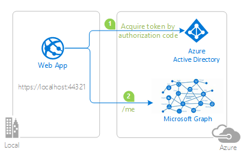

# Add authorization using groups & group claims to an ASP.NET Core Web app that signs-in users with the Microsoft identity platform

[](https://identitydivision.visualstudio.com/IDDP/_build/latest?definitionId=XXX)

* [Overview](#overview)
* [Scenario](#scenario)
* [Prerequisites](#prerequisites)
* [Setup the sample](#setup-the-sample)
* [About the code](#about-the-code)
* [Optional - Handle Continuous Access Evaluation (CAE) challenge from Microsoft Graph](#optional---handle-continuous-access-evaluation-cae-challenge-from-microsoft-graph)
* [Troubleshooting](#troubleshooting)
* [Next Steps](#next-steps)
* [Contributing](#contributing)
* [Learn More](#learn-more)

## Overview

This sample demonstrates a ASP.NET Core Web App calling Microsoft Graph.

> :information_source: To learn how applications integrate with [Microsoft Graph](https://aka.ms/graph), consider going through the recorded session:: [An introduction to Microsoft Graph for developers](https://www.youtube.com/watch?v=EBbnpFdB92A)
In doing so, it implements **Role-based Access Control** (RBAC) by using Azure AD **[Security Groups](https://learn.microsoft.com/azure/active-directory/fundamentals/how-to-manage-groups)**

Role based access control in Azure AD can be done with **Delegated** and **App** permissions and **App Roles** as well. We will cover RBAC using App Roles in the [next tutorial](<ADDD LINK>). **Delegated** and **App** permissions, **Security Groups** and **App Roles** in Azure AD are by no means mutually exclusive - they can be used in tandem to provide even finer grained access control.

> :information_source: To learn more on using **security groups** and **app roles** in your app AD,consider going through the recorded session: [Implement authorization in your applications with App roles and Security Groups with the Microsoft identity platform](https://www.youtube.com/watch?v=LRoc-na27l0)

## Scenario

This sample demonstrates a ASP.NET Core Web App calling Microsoft Graph.

1. The client ASP.NET Core Web App uses the [Microsoft.Identity.Web](https://aka.ms/microsoft-identity-web) to sign-in a user and obtain a JWT [ID Token](https://aka.ms/id-tokens) and an [Access Token](https://aka.ms/access-tokens) from **Azure AD**.
1. The **access token** is used as a *bearer* token to authorize the user to call the Microsoft Graph protected by **Azure AD**.



## Prerequisites

* Either [Visual Studio](https://visualstudio.microsoft.com/downloads/) or [Visual Studio Code](https://code.visualstudio.com/download) and [.NET Core SDK](https://www.microsoft.com/net/learn/get-started)
* An **Azure AD** tenant. For more information, see: [How to get an Azure AD tenant](https://docs.microsoft.com/azure/active-directory/develop/test-setup-environment#get-a-test-tenant)
* A user account in your **Azure AD** tenant.
>This sample will not work with a **personal Microsoft account**. If you're signed in to the [Azure portal](https://portal.azure.com) with a personal Microsoft account and have not created a user account in your directory before, you will need to create one before proceeding.

## Setup the sample

### Step 1: Clone or download this repository

From your shell or command line:

```console
git clone https://github.com/Azure-Samples/microsoft-identity-platform-aspnetcore-webapp-tutorial.git
```

or download and extract the repository *.zip* file.

> :warning: To avoid path length limitations on Windows, we recommend cloning into a directory near the root of your drive.

### Step 2: Navigate to project folder

```console
cd 5-WebApp-AuthZ\5-2-Groups
```

### Step 3: Register the sample application(s) in your tenant

There is one project in this sample. To register it, you can:

- follow the steps below for manually register your apps
- or use PowerShell scripts that:
  - **automatically** creates the Azure AD applications and related objects (passwords, permissions, dependencies) for you.
  - modify the projects' configuration files.

  <details>
   <summary>Expand this section if you want to use this automation:</summary>

    > :warning: If you have never used **Microsoft Graph PowerShell** before, we recommend you go through the [App Creation Scripts Guide](./AppCreationScripts/AppCreationScripts.md) once to ensure that your environment is prepared correctly for this step.
  
    1. On Windows, run PowerShell as **Administrator** and navigate to the root of the cloned directory
    1. In PowerShell run:

       ```PowerShell
       Set-ExecutionPolicy -ExecutionPolicy RemoteSigned -Scope Process -Force
       ```

    1. Run the script to create your Azure AD application and configure the code of the sample application accordingly.
    1. For interactive process -in PowerShell, run:

       ```PowerShell
       cd .\AppCreationScripts\
       .\Configure.ps1 -TenantId "[Optional] - your tenant id" -AzureEnvironmentName "[Optional] - Azure environment, defaults to 'Global'"
       ```

    > Other ways of running the scripts are described in [App Creation Scripts guide](./AppCreationScripts/AppCreationScripts.md). The scripts also provide a guide to automated application registration, configuration and removal which can help in your CI/CD scenarios.

  </details>

#### Choose the Azure AD tenant where you want to create your applications

To manually register the apps, as a first step you'll need to:

1. Sign in to the [Azure portal](https://portal.azure.com).
1. If your account is present in more than one Azure AD tenant, select your profile at the top right corner in the menu on top of the page, and then **switch directory** to change your portal session to the desired Azure AD tenant.

#### Register the webApp app (WebApp-GroupClaims)

1. Navigate to the [Azure portal](https://portal.azure.com) and select the **Azure Active Directory** service.
1. Select the **App Registrations** blade on the left, then select **New registration**.
1. In the **Register an application page** that appears, enter your application's registration information:
    1. In the **Name** section, enter a meaningful application name that will be displayed to users of the app, for example `WebApp-GroupClaims`.
    1. Under **Supported account types**, select **Accounts in this organizational directory only**
    1. Select **Register** to create the application.
1. In the **Overview** blade, find and note the **Application (client) ID**. You use this value in your app's configuration file(s) later in your code.
1. In the app's registration screen, select the **Authentication** blade to the left.
1. If you don't have a platform added, select **Add a platform** and select the **Web** option.
    1. In the **Redirect URI** section enter the following redirect URIs:
        1. `https://localhost:44321/`
        1. `https://localhost:44321/signin-oidc`
    1. In the **Front-channel logout URL** section, set it to `https://localhost:44321/signout-oidc`.
    1. In the **Implicit grant** section, check the **ID tokens** option as this sample requires the [Implicit grant flow](https://docs.microsoft.com/azure/active-directory/develop/v2-oauth2-implicit-grant-flow) to be enabled to sign-in the user and call an API.
    1. Select **ID tokens (used for implicit and hybrid flows)** checkbox.
    1. Click **Save** to save your changes.
1. In the app's registration screen, select the **Certificates & secrets** blade in the left to open the page where you can generate secrets and upload certificates.
1. In the **Client secrets** section, select **New client secret**:
    1. Type a key description (for instance `app secret`).
    1. Select one of the available key durations (**6 months**, **12 months** or **Custom**) as per your security posture.
    1. The generated key value will be displayed when you select the **Add** button. Copy and save the generated value for use in later steps.
    1. You'll need this key later in your code's configuration files. This key value will not be displayed again, and is not retrievable by any other means, so make sure to note it from the Azure portal before navigating to any other screen or blade.
    > :bulb: For enhanced security, instead of using client secrets, consider [using certificates](./README-use-certificate.md) and [Azure KeyVault](https://azure.microsoft.com/services/key-vault/#product-overview).
    1. Since this app signs-in users, we will now proceed to select **delegated permissions**, which is is required by apps signing-in users.
    1. In the app's registration screen, select the **API permissions** blade in the left to open the page where we add access to the APIs that your application needs:
    1. Select the **Add a permission** button and then:
    1. Ensure that the **Microsoft APIs** tab is selected.
    1. In the *Commonly used Microsoft APIs* section, select **Microsoft Graph**
      * Since this app signs-in users, we will now proceed to select **delegated permissions**, which is requested by apps that signs-in users.
      * In the **Delegated permissions** section, select **User.Read**, **GroupMember.Read.All** in the list. Use the search box if necessary.
    1. Select the **Add permissions** button at the bottom.
   > :warning: To handle the groups overage scenario, please grant [admin consent](https://learn.microsoft.com/azure/active-directory/manage-apps/grant-admin-consent?source=recommendations#grant-admin-consent-in-app-registrations) to the Microsoft Graph **GroupMember.Read.All** [permission](https://learn.microsoft.com/graph/permissions-reference). See the section on how to [create the overage scenario for testing](#create-the-overage-scenario-for-testing) below for more.

##### Configure Optional Claims

1. Still on the same app registration, select the **Token configuration** blade to the left.
1. Select **Add optional claim**:
    1. Select **optional claim type**, then choose **ID**.
    1. Select the optional claim **acct**.
    > Provides user's account status in tenant. If the user is a **member** of the tenant, the value is *0*. If they're a **guest**, the value is *1*.
    1. Select **Add** to save your changes.

### Create Security Groups

> :warning: You may already have security groups with the names defined below in your tenant and/or you may not have permissions to create new security groups. In that case, skip the steps below and update the configuration files in your project(s) with the desired names/IDs of existing groups in your tenant.

1. Navigate to the [Azure portal](https://portal.azure.com) and select the **Azure Active Directory** service.
1. Select **Groups** blade on the left.
1. In the **Groups** blade, select **New Group**.
    1. For **Group Type**, select **Security**
    1. For **Group Name**, enter **GroupAdmin**
    1. For **Group Description**, enter **Admin Security Group**
    1. Add **Group Owners** and **Group Members** as you see fit.
    1. Select **Create**.
1. In the **Groups** blade, select **New Group**.
    1. For **Group Type**, select **Security**
    1. For **Group Name**, enter **GroupMember**
    1. For **Group Description**, enter **User Security Group**
    1. Add **Group Owners** and **Group Members** as you see fit.
    1. Select **Create**.
1. Assign the user accounts that you plan to work with to these security groups.

For more information, visit: [Create a basic group and add members using Azure AD](https://docs.microsoft.com/azure/active-directory/fundamentals/active-directory-groups-create-azure-portal)

### Configure Security Groups

You have two different options available to you on how you can further configure your application to receive the `groups` claim.

1. [Receive **all the groups** that the signed-in user is assigned to in an Azure AD tenant, included nested groups](#configure-your-application-to-receive-all-the-groups-the-signed-in-user-is-assigned-to-including-nested-groups).
2. [Receive the **groups** claim values from a **filtered set of groups** that your application is programmed to work with](#configure-your-application-to-receive-the-groups-claim-values-from-a-filtered-set-of-groups-a-user-may-be-assigned-to) (Not available in the [Azure AD Free edition](https://azure.microsoft.com/pricing/details/active-directory/)).

> To get the on-premise group's `samAccountName` or `On Premises Group Security Identifier` instead of Group ID, please refer to the document [Configure group claims for applications with Azure Active Directory](https://docs.microsoft.com/azure/active-directory/hybrid/how-to-connect-fed-group-claims#prerequisites-for-using-group-attributes-synchronized-from-active-directory).

#### Configure your application to receive **all the groups** the signed-in user is assigned to, including nested groups

1. In the app's registration screen, select the **Token Configuration** blade in the left to open the page where you can configure the claims provided tokens issued to your application.
1. Select the **Add groups claim** button on top to open the **Edit Groups Claim** screen.
1. Select `Security groups` **or** the `All groups (includes distribution lists but not groups assigned to the application)` option. Choosing both negates the effect of `Security Groups` option.
1. Under the **ID** section, select `Group ID`. This will result in Azure AD sending the [object id](https://docs.microsoft.com/graph/api/resources/group?view=graph-rest-1.0) of the groups the user is assigned to in the **groups** claim of the [ID Token](https://docs.microsoft.com/azure/active-directory/develop/id-tokens) that your app receives after signing-in a user.

#### Configure your application to receive the `groups` claim values from a **filtered set of groups** a user may be assigned to

##### Prerequisites, benefits and limitations of using this option

1. This option is useful when your application is interested in a selected set of groups that a signing-in user may be assigned to and not every security group this user is assigned to in the tenant.  This option also saves your application from running into the [overage](#the-groups-overage-claim) issue.
1. This feature is not available in the [Azure AD Free edition](https://azure.microsoft.com/pricing/details/active-directory/).
1. **Nested group assignments** are not available when this option is utilized.

##### Steps to enable this option in your app

1. In the app's registration screen, select the **Token Configuration** blade in the left to open the page where you can configure the claims provided tokens issued to your application.
1. Select the **Add groups claim** button on top to open the **Edit Groups Claim** screen.
1. Select `Groups assigned to the application`.
    1. Choosing additional options like `Security Groups` or `All groups (includes distribution lists but not groups assigned to the application)` will negate the benefits your app derives from choosing to use this option.
1. Under the **ID** section, select `Group ID`. This will result in Azure AD sending the object [id](https://docs.microsoft.com/graph/api/resources/group?view=graph-rest-1.0) of the groups the user is assigned to in the `groups` claim of the [ID Token](https://docs.microsoft.com/azure/active-directory/develop/id-tokens) that your app receives after signing-in a user.
1. If you wish to have 'groups' claims available to *Access Tokens* issued to your Web API, then you can also choose the `Group ID` option under the **Access** section. This will result in Azure AD sending the [Object ID](https://docs.microsoft.com/graph/api/resources/group?view=graph-rest-1.0) of the groups the user is assigned to in the `groups` claim of the [Access Token](https://aka.ms/access-tokens) issued to the client applications of your API.
1. In the app's registration screen, select on the **Overview** blade in the left to open the Application overview screen. Select the hyperlink with the name of your application in **Managed application in local directory** (note this field title can be truncated for instance `Managed application in ...`). When you select this link you will navigate to the **Enterprise Application Overview** page associated with the service principal for your application in the tenant where you created it. You can navigate back to the app registration page by using the *back* button of your browser.
1. Select the **Users and groups** blade in the left to open the page where you can assign users and groups to your application.
    1. Select the **Add user** button on the top row.
    1. Select **User and Groups** from the resultant screen.
    1. Choose the groups that you want to assign to this application.
    1. Click **Select** in the bottom to finish selecting the groups.
    1. Select **Assign** to finish the group assignment process.  
    1. Your application will now receive these selected groups in the `groups` claim when a user signing in to your app is a member of  one or more these **assigned** groups.
1. Select the **Properties** blade in the left to open the page that lists the basic properties of your application.Set the **User assignment required?** flag to **Yes**.

> :bulb: **Important security tip**
>
> When you set **User assignment required?** to **Yes**, Azure AD will check that only users assigned to your application in the **Users and groups** blade are able to sign-in to your app.To enable this, follow the instructions [here](https://docs.microsoft.com/azure/active-directory/manage-apps/assign-user-or-group-access-portal#configure-an-application-to-require-user-assignment). You can assign users directly or by assigning security groups they belong to.

##### Configure the webApp app (WebApp-GroupClaims) to use your app registration

Open the project in your IDE (like Visual Studio or Visual Studio Code) to configure the code.

> In the steps below, "ClientID" is the same as "Application ID" or "AppId".

1. Open the `appsettings.json` file.
1. Find the key `ClientId` and replace the existing value with the application ID (clientId) of `WebApp-GroupClaims` app copied from the Azure portal.
1. Find the key `TenantId` and replace the existing value with your Azure AD tenant/directory ID.
1. Find the key `Domain` and replace the existing value with your Azure AD tenant domain, ex. `contoso.onmicrosoft.com`.
1. Find the key `ClientSecret` and replace the existing value with the generated secret that you saved during the creation of `WebApp-GroupClaims` copied from the Azure portal.
1. Find the key `Enter the objectID for GroupAdmin group copied from Azure Portal` and replace the existing value with the `GroupAdmin` object id from Azure.
1. Find the key `Enter the objectID for GroupMember group copied from Azure Portal` and replace the existing value with the `GroupAdmin` object id from Azure.

#### Configure the app to recognize Group IDs

> :warning: During **Token Configuration**, if you have chosen any other option except **groupID** (e.g. like **DNSDomain\sAMAccountName**) you should enter the **group name** (for example `contoso.com\Test Group`) instead of the **object ID** below:

1. Open the `"\..\appsettings.json"` file.
    1. Find the keys for the security Group and replace the existing value with the **object ID** of the group copied from the Azure portal.

### Step 4: Running the sample

#### Run the sample using Visual Studio

> For Visual Studio Users
>
> Clean the solution, rebuild the solution, and run it.

#### Run the sample using a command line interface such as VS Code integrated terminal

##### Step 1. Install .NET Core dependencies

```console
   dotnet restore
```

##### Step 2. Trust development certificates

```console
   dotnet dev-certs https --clean
   dotnet dev-certs https --trust
```

Learn more about [HTTPS in .NET Core](https://docs.microsoft.com/aspnet/core/security/enforcing-ssl).

##### Step 3. Run the applications

In the console window execute the below command:

```console
    dotnet run
```

## Explore the sample

1. Open your web browser and make a request to the app. The app immediately attempts to authenticate you to the Microsoft identity platform. You can sign-in with a *work or school account* from the tenant where you created this app. If admin consent to `GroupMember.Read.All` permission from portal is not done then sign-in with admin for the first time and consent for the permission.
1. If the **Overage** scenario occurs for the signed-in user then all the groups are retrieved from Microsoft Graph and added in a list. The [overage](#groups-overage-claim) scenario is discussed later in this article.
1. On the home page, the app lists the various claims it obtained from your ID token. You'd notice one more claims named `groups`.
1. On the top menu, click on the signed-in user's name **user@domain.com**, you should now see all kind of information about yourself including their picture.
1. the *Admin* link leads to an empty page that can only be accessed if the signed-in user is a part of the *GroupAdmin* security group. 

> Did the sample not work for you as expected? Did you encounter issues trying this sample? Then please reach out to us using the [GitHub Issues](../../../../issues) page.

## Troubleshooting

<details>
	<summary>Expand for troubleshooting info</summary>

ASP.NET core applications create session cookies that represent the identity of the caller. Some Safari users using iOS 12 had issues which are described in ASP.NET Core #4467 and the Web kit bugs database Bug 188165 - iOS 12 Safari breaks ASP.NET Core 2.1 OIDC authentication.

If your web site needs to be accessed from users using iOS 12, you probably want to disable the SameSite protection, but also ensure that state changes are protected with CSRF anti-forgery mechanism. See the how to fix section of Microsoft Security Advisory: iOS12 breaks social, WSFed and OIDC logins #4647

To provide feedback on or suggest features for Azure Active Directory, visit [User Voice page](https://feedback.azure.com/d365community/forum/79b1327d-d925-ec11-b6e6-000d3a4f06a4).
</details>

## We'd love your feedback!

Were we successful in addressing your learning objective? Consider taking a moment to [share your experience with us](https://forms.office.com/Pages/ResponsePage.aspx?id=v4j5cvGGr0GRqy180BHbR9p5WmglDttMunCjrD00y3NUOEQ1WVhQUEw4MEU4WVcwVzlWNU44U01VNS4u).

## About the code

Much of the specifics of implementing **RBAC** with **Security Groups** is the same with implementing **RBAC** with **App Roles** discussed in the [previous tutorial](../5-1-Roles/README.md). In order to avoid redundancy, here we discuss particular issues, such as **groups overage**, that might arise with using the **groups** claim.

#### .NET Core app configuration and how to handle the overage scenario

1. In [Startup.cs](./Startup.cs), `OnTokenValidated` event calls **ProcessAnyGroupsOverage** method defined in [GraphHelper.cs](./Services/GraphHelper.cs) to process groups overage claim.

```csharp
services.AddAuthentication(JwtBearerDefaults.AuthenticationScheme)
    .AddMicrosoftIdentityWebApp(options =>
        {
            // code omitted for brevity...
            options.Events.OnTokenValidated = async context =>
            {
                // code omitted for brevity...
                if (context != null)
                {
                    // Calls method to process groups overage claim (before policy checks kick-in)
                    await GraphHelper.ProcessAnyGroupsOverage(context, requiredGroupsIds);
                }
                await Task.CompletedTask;
            };
        })
    .EnableTokenAcquisitionToCallDownstreamApi(options => Configuration.Bind("AzureAd", options))
    .AddMicrosoftGraph(Configuration.GetSection("GraphAPI"))
    .AddInMemoryTokenCaches();
```

`AddMicrosoftGraph` registers the service for `GraphServiceClient`. The values for `BaseUrl` and `Scopes` defined in `GraphAPI` section of the **appsettings.json**.

1. In [GraphHelper.cs](./Services/GraphHelper.cs), **ProcessAnyGroupsOverage** method checks if incoming token contains the *Group Overage* claim. If so, it will call **ProcessUserGroupsForOverage** method to retrieve groups, which in turn calls the Microsoft Graph `/checkMemberGroups` endpoint.

```csharp
public static async Task ProcessAnyGroupsOverage(TokenValidatedContext context)
{
    // Checks if the incoming token contains a groups overage claim.
    if (HasOverageOccurred(context.Principal))
    {
        await ProcessUserGroupsForOverage(context, requiredGroupsIds);
    }
}
```

1. UserProfileController.cs
    1. Checks authorization of signed-in user for ```[Authorize(Policy = AuthorizationPolicies.AssignmentToGroupMemberGroupRequired)]```. If authorized successfully then obtain information from the [/me](https://docs.microsoft.com/graph/api/user-get?view=graph-rest-1.0) and [/me/photo](https://docs.microsoft.com/graph/api/profilephoto-get) endpoints by using `GraphServiceClient`.

2. UserProfile\Index.cshtml
    1. Has some client code that prints the signed-in user's information.
Much of the specifics of implementing **RBAC** with **Security Groups** is the same with implementing **RBAC** with **App Roles** discussed in the [previous tutorial](../5-2-Roles/README.md). In order to avoid redundancy, here we discuss particular issues, such as **groups overage**, that might arise with using the **groups** claim.

1. AdminController.cs
    1. Checks authorization of signed-in user for ```[Authorize(Policy = AuthorizationPolicies.AssignmentToGroupAdminGroupRequired)]```. If authorized successfully a simple place holder page is displayed.

2. Admin\Index.cshtml
    1. A simple place holder to show how you can store hidden content only available to members of the **GroupAdmin** group

#### Caching user group memberships in overage scenario

Since overaged tokens will not contain group membership IDs, yet these IDs are required for controlling access to pages and/or resources, applications have to call Microsoft Graph whenever a user action (e.g. accessing a page on the UI, accessing a todolist item in the web API etc.) takes place. These network calls are costly and will impact the application performance and user experience. As such the project benefits from caching the group membership IDs once they are fetched from Microsoft Graph for the first time. By default, these are cached for **1 hour** in the sample. Cached groups will miss any changes to a users group membership for this duration. If you need more fine grained control, you can configure cache duration in [appsettings.json](./API/TodoListAPI/appsettings.json). If your scenario requires capturing real-time changes to a user's group membership, consider implementing [Microsoft Graph change notifications](https://learn.microsoft.com/graph/api/resources/webhooks) instead.

##### Group authorization policy

The ASP.NET middleware supports roles populated from claims by specifying the claim in the `RoleClaimType` property of `TokenValidationParameters`. Since the `groups` claim contains the object IDs of the security groups than the actual names by default, you'd use the group IDs instead of group names. See [Role-based authorization in ASP.NET Core](https://docs.microsoft.com/aspnet/core/security/authorization/roles) for more info. See [Startup.cs](./Startup.cs) for more.

```csharp
// The following lines code instruct the asp.net core middleware to use the data in the "groups" claim in the [Authorize] attribute and for User.IsInrole()
// See https://docs.microsoft.com/aspnet/core/security/authorization/roles
services.Configure<OpenIdConnectOptions>(OpenIdConnectDefaults.AuthenticationScheme, options =>
{
    // Use the groups claim for populating roles
    options.TokenValidationParameters.RoleClaimType = "groups";
});
// Adding authorization policies that enforce authorization using Azure AD roles.
services.AddAuthorization(options =>
{
    options.AddPolicy(AuthorizationPolicies.AssignmentToGroupMemberGroupRequired, policy => policy.RequireRole(Configuration["Groups:GroupMember"], Configuration["Groups:GroupAdmin"]));
    options.AddPolicy(AuthorizationPolicies.AssignmentToGroupAdminGroupRequired, policy => policy.RequireRole(Configuration["Groups:GroupAdmin"]));
});
```

These policies can be used in controllers as shown below:

```csharp
[Authorize(Policy = AuthorizationPolicies.AssignmentToGroupMemberGroupRequired)]
[AuthorizeForScopes(Scopes = new[] { Constants.ScopeUserRead })]        
public async Task<IActionResult> Index()
{
    try
    {
        User me = await _graphServiceClient.Me.GetAsync();
        ViewData["Me"] = me;

        var photo = await _graphServiceClient.Me.Photo.GetAsync();
        ViewData["Photo"] = photo;
    }
    // See 'Optional - Handle Continuous Access Evaluation (CAE) challenge from Microsoft Graph' for more information.
    catch (ServiceException svcex) when (svcex.Message.Contains("Continuous access evaluation resulted in claims challenge"))
    {
        // Left blank for brevity.
    }
    catch (ServiceException svcex) when (svcex.Error.Code == "ImageNotFound")
    {
        //swallow
    }

    return View();
}
```

### The Groups Overage Claim

To ensure that the token size doesn’t exceed HTTP header size limits, the Microsoft Identity Platform limits the number of object Ids that it includes in the **groups** claim.

If a user is member of more groups than the overage limit (**150 for SAML tokens, 200 for JWT tokens, 6 for single-page applications using implicit flow**), then the Microsoft Identity Platform does not emit the group IDs in the `groups` claim in the token. Instead, it includes an **overage** claim in the token that indicates to the application to query the [MS Graph API](https://graph.microsoft.com) to retrieve the user’s group membership.

#### Create the Overage Scenario for testing

1. You can use the [BulkCreateGroups.ps1](./AppCreationScripts/BulkCreateGroups.ps1) provided in the [App Creation Scripts](./AppCreationScripts/) folder to create a large number of groups and assign users to them. This will help test overage scenarios during development. You'll need to enter a user's object ID when prompted by the `BulkCreateGroups.ps1` script. If you would like to delete these groups after your testing, run the [BulkRemoveGroups.ps1](./AppCreationScripts/BulkRemoveGroups.ps1).

> When attending to overage scenarios, which requires a call to [Microsoft Graph](https://graph.microsoft.com) to read the signed-in user's group memberships, your app will need to have the [User.Read](https://docs.microsoft.com/graph/permissions-reference#user-permissions) and [GroupMember.Read.All](https://docs.microsoft.com/graph/permissions-reference#group-permissions) for the [getMemberGroups](https://docs.microsoft.com/graph/api/user-getmembergroups) function to execute successfully.

> :warning: For the overage scenario, make sure you have granted **Admin Consent** for the MS Graph API's **GroupMember.Read.All** scope for both the Client and the Service apps (see the **App Registration** steps above).

##### Detecting group overage in your code by examining claims

1. When you run this sample and an overage occurred, then you'd see the `_claim_names` in the home page after the user signs-in.
1. We strongly advise you use the [group filtering feature](#configure-your-application-to-receive-the-groups-claim-values-from-a-filtered-set-of-groups-a-user-may-be-assigned-to) (if possible) to avoid running into group overages.

1. In case you cannot avoid running into group overage, we suggest you use the following logic to process groups claim in your token.  
    1. Check for the claim `_claim_names` with one of the values being `groups`. This indicates overage.
    1. If found, make a call to the endpoint specified in `_claim_sources` to fetch user’s groups.
    1. If none found, look into the `groups` claim for user’s groups.

> You can gain a good familiarity of programming for Microsoft Graph by going through the [An introduction to Microsoft Graph for developers](https://www.youtube.com/watch?v=EBbnpFdB92A) recorded session.

## Optional - Handle Continuous Access Evaluation (CAE) challenge from Microsoft Graph

Continuous access evaluation (CAE) enables web APIs to do just-in time token validation, for instance enforcing user session revocation in the case of password change/reset but there are other benefits. For details, see [Continuous access evaluation](https://docs.microsoft.com/azure/active-directory/conditional-access/concept-continuous-access-evaluation).

Microsoft Graph is now CAE-enabled in Preview. This means that it can ask its clients for more claims when conditional access policies require it. Your can enable your application to be ready to consume CAE-enabled APIs by:

1. Declaring that the client app is capable of handling claims challenges from the web API.
2. Processing these challenges when thrown.

### Declare the CAE capability in the configuration

This sample declares that it's CAE-capable by adding a `ClientCapabilities` property in the configuration, whose value is `[ "cp1" ]`.

```Json
{
  "AzureAd": {
    // ...
    // the following is required to handle Continuous Access Evaluation challenges
    "ClientCapabilities": [ "cp1" ],
    // ...
  },
  // ...
}
```

### Process the CAE challenge from Microsoft Graph

To process the CAE challenge from Microsoft Graph, the controller actions need to extract it from the `wwwAuthenticate` header. It is returned when MS Graph rejects a seemingly valid Access tokens for MS Graph. For this you need to:

1. Inject and instance of `MicrosoftIdentityConsentAndConditionalAccessHandler` in the controller constructor. The beginning of the HomeController becomes:

   ```CSharp
    private readonly GraphServiceClient _graphServiceClient;
    private readonly MicrosoftIdentityConsentAndConditionalAccessHandler _consentHandler;
    private string[] _graphScopes;

    public UserProfileController(
        IConfiguration configuration, 
        GraphServiceClient graphServiceClient,
        MicrosoftIdentityConsentAndConditionalAccessHandler consentHandler)
    {

        _consentHandler = consentHandler;
        _graphServiceClient = graphServiceClient;
        _graphScopes = configuration.GetValue<string>("GraphAPI:Scopes")?.Split(' ');
    }
    
    // more code here
    ```

1. The process to handle CAE challenges from MS Graph comprises of the following steps:
    1. Catch a Microsoft Graph SDK's `ServiceException` and extract the required `claims`. This is done by wrapping the call to Microsoft Graph into a try/catch block that processes the challenge:
    ```CSharp
    User me = await _graphServiceClient.Me.GetAsync();
    ```
    1. Then redirect the user back to Azure AD with the new requested `claims`. Azure AD will use this `claims` payload to discern what or if any additional processing is required, example being the user needs to sign-in again or do multi-factor authentication.
  ```CSharp
    try
    {
        User me = await _graphServiceClient.Me.GetAsync();
        ViewData["Me"] = me;

        var photo = await _graphServiceClient.Me.Photo.GetAsync();
        ViewData["Photo"] = photo;
    }
    // Catch CAE exception from Graph SDK
    catch (ServiceException svcex) when (svcex.Message.Contains("Continuous access evaluation resulted in claims challenge"))
    {
        try
        {
            string claimChallenge = WwwAuthenticateParameters.GetClaimChallengeFromResponseHeaders(svcex.ResponseHeaders);
            _consentHandler.ChallengeUser(_graphScopes, claimChallenge);
            return new EmptyResult();
        }
        catch (Exception ex2)
        {
            _consentHandler.HandleException(ex2);
        }
    }
    catch (ServiceException svcex) when (svcex.Error.Code == "ImageNotFound")
    {
        //swallow
    }
  ```

### Deploying Web app to Azure App Service

There is one web app in this sample. To deploy it to **Azure App Services**, you'll need to:

- create an **Azure App Service**
- publish the projects to the **App Services**, and
- update its client(s) to call the website instead of the local environment.

#### Publish your files (WebApp-GroupClaims)

##### Publish using Visual Studio

Follow the link to [Publish with Visual Studio](https://docs.microsoft.com/visualstudio/deployment/quickstart-deploy-to-azure).

##### Publish using Visual Studio Code

1. Install the Visual Studio Code extension [Azure App Service](https://marketplace.visualstudio.com/items?itemName=ms-azuretools.vscode-azureappservice).
1. Follow the link to [Publish with Visual Studio Code](https://docs.microsoft.com/aspnet/core/tutorials/publish-to-azure-webapp-using-vscode)

#### Update the Azure AD app registration (WebApp-GroupClaims)

1. Navigate back to to the [Azure portal](https://portal.azure.com).
In the left-hand navigation pane, select the **Azure Active Directory** service, and then select **App registrations (Preview)**.
1. In the resulting screen, select the `WebApp-GroupClaims` application.
1. In the app's registration screen, select **Authentication** in the menu.
    1. In the **Redirect URIs** section, update the reply URLs to match the site URL of your Azure deployment. For example:
        1. `https://WebApp-GroupClaims.azurewebsites.net/`
        1. `https://WebApp-GroupClaims.azurewebsites.net/signin-oidc`
    1. Update the **Front-channel logout URL** fields with the address of your service, for example [https://WebApp-GroupClaims.azurewebsites.net](https://WebApp-GroupClaims.azurewebsites.net)

> :warning: If your app is using an *in-memory* storage, **Azure App Services** will spin down your web site if it is inactive, and any records that your app was keeping will be empty. In addition, if you increase the instance count of your website, requests will be distributed among the instances. Your app's records, therefore, will not be the same on each instance.

## Next Steps

Learn how to:

* [Change your app to sign-in users from any organization or Microsoft accounts](https://github.com/Azure-Samples/active-directory-aspnetcore-webapp-openidconnect-v2/tree/master/1-WebApp-OIDC/1-3-AnyOrgOrPersonal)
* [Enable users from National clouds to sign-in to your application](https://github.com/Azure-Samples/active-directory-aspnetcore-webapp-openidconnect-v2/tree/master/1-WebApp-OIDC/1-4-Sovereign)
* [Enable your web app to call a web API on behalf of the signed-in user](https://github.com/Azure-Samples/ms-identity-dotnetcore-ca-auth-context-app)

## Contributing

If you'd like to contribute to this sample, see [CONTRIBUTING.MD](/CONTRIBUTING.md).

This project has adopted the [Microsoft Open Source Code of Conduct](https://opensource.microsoft.com/codeofconduct/). For more information, see the [Code of Conduct FAQ](https://opensource.microsoft.com/codeofconduct/faq/) or contact [opencode@microsoft.com](mailto:opencode@microsoft.com) with any additional questions or comments.

## Learn More

* [Microsoft identity platform (Azure Active Directory for developers)](https://docs.microsoft.com/azure/active-directory/develop/)
* [Azure AD code samples](https://docs.microsoft.com/azure/active-directory/develop/sample-v2-code)
* [Overview of Microsoft Authentication Library (MSAL)](https://docs.microsoft.com/azure/active-directory/develop/msal-overview)
* [Register an application with the Microsoft identity platform](https://docs.microsoft.com/azure/active-directory/develop/quickstart-register-app)
* [Configure a client application to access web APIs](https://docs.microsoft.com/azure/active-directory/develop/quickstart-configure-app-access-web-apis)
* [Understanding Azure AD application consent experiences](https://docs.microsoft.com/azure/active-directory/develop/application-consent-experience)
* [Understand user and admin consent](https://docs.microsoft.com/azure/active-directory/develop/howto-convert-app-to-be-multi-tenant#understand-user-and-admin-consent)
* [Application and service principal objects in Azure Active Directory](https://docs.microsoft.com/azure/active-directory/develop/app-objects-and-service-principals)
* [Authentication Scenarios for Azure AD](https://docs.microsoft.com/azure/active-directory/develop/authentication-flows-app-scenarios)
* [Building Zero Trust ready apps](https://aka.ms/ztdevsession)
* [National Clouds](https://docs.microsoft.com/azure/active-directory/develop/authentication-national-cloud#app-registration-endpoints)

* [Microsoft.Identity.Web](https://aka.ms/microsoft-identity-web)

