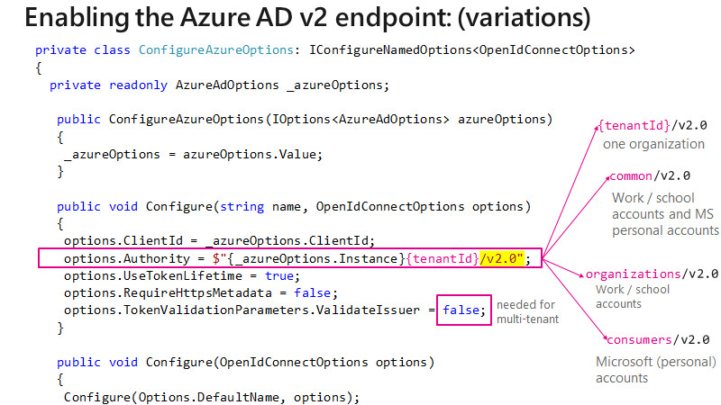

# Integrating Azure AD V2 into an ASP.NET Core web app


This sample shows how to build a .NET Core MVC Web app that uses OpenID Connect to sign in personal accounts (including outlook.com, live.com, and others) as well as work and school accounts from any company or organization that has integrated with Azure Active Directory. It leverages the ASP.NET Core OpenID Connect middleware.


## How to run this sample

To run this sample:

- Install .NET Core (for example for Windows) by following the instructions at [.NET and C# - Get Started in 10 Minutes](https://www.microsoft.com/net/core). In addition to developing on Windows, you can develop on [Linux](https://www.microsoft.com/net/core#linuxredhat), [Mac](https://www.microsoft.com/net/core#macos), or [Docker](https://www.microsoft.com/net/core#dockercmd).

### Step 1: Register the sample with your Azure AD tenant

1. Sign in to the [Application registration portal](https://apps.dev.microsoft.com/portal/register-app) either using a personal Microsoft account (live.com or hotmail.com) or work or school account.
1. Give a name to your Application, make sure that the *Guided Setup* option is **Unchecked**. Then press **Create**. The portal will assign your app a globally unique Application ID that you'll use later in your code.
1. Click **Add Platform**, and select **Web**.
1. In the Redirect URLs field, add `http://localhost:5000/` and `http://localhost:5000/signin-oidc`

> Note: The base address in the **Sign-on URL** and **Logout URL** settings is `http://localhost:5000`. This localhost address allows the sample app to run insecurely from your local system. Port 5000 is the default port for the [Kestrel server](https://docs.microsoft.com/aspnet/core/fundamentals/servers/kestrel). Update these URLs if you configure the app for production use (for example, `https://www.contoso.com/signin-oidc` and `https://www.contoso.com/signout-oidc`).

### Step 2: Download/ Clone this sample code or build the application using a template

#### Option 1: Download/ clone this sample

You can clone this sample from your shell or command line:

  ```console
  git clone https://github.com/Azure-Samples/active-directory-dotnet-webapp-openidconnect-aspnetcore.git
  ```

  In the **appsettings.json* file, provide values for the `Domain`, `TenantId`, and `ClientID` that you recorded earlier from the Azure portal.


#### 
This sample was created from the dotnet core 2.0 [dotnet new mvc](https://docs.microsoft.com/dotnet/core/tools/dotnet-new?tabs=netcore2x) template with `MultiOrg` authentication, and then tweaked to let it support tokens for the Azure AD V2 endpoint. You can create the sample from the command line or clone/download this repository:

#### Option 2: Create the sample from the command line

1. Run the following command to create a sample from the command line using the `MultiOrg` template:

  ```console
  dotnet new mvc --auth MultiOrg --client-id <Enter_the_Application_Id_here>
  ```

     > Note: Replace *`Enter_the_Application_Id_here`* with the *Application Id* from the application Id you just registered in the Application Registration Portal.

2. Open **Extensions\AzureAdAuthenticationBuilderExtensions.cs** file and replace the line containing `options.Authority` from:

    ```CSharp
    options.Authority = $"{_azureOptions.Instance}{_azureOptions.TenantId}";
    ```
    
    to:

    ```CSharp
    options.Authority = $"{_azureOptions.Instance}{_azureOptions.TenantId}/v2.0" // Azure AD V2 Endpoint
    ```
	
3. Modify `Views\Shared\_LoginPartial.cshtml` to have the following content:

    ```CSharp
    @using System.Security.Claims

    @if (User.Identity.IsAuthenticated)
    {
        var identity = User.Identity as ClaimsIdentity; // Azure AD V2 endpoint specific
        string preferred_username = identity.Claims.FirstOrDefault(c => c.Type == "preferred_username")?.Value;
        <ul class="nav navbar-nav navbar-right">
            <li class="navbar-text">Hello @preferred_username</li>
            <li><a asp-area="" asp-controller="Account" asp-action="SignOut">Sign out</a></li>
        </ul>
    }
    else
    {
        <ul class="nav navbar-nav navbar-right">
            <li><a asp-area="" asp-controller="Account" asp-action="Signin">Sign in</a></li>
        </ul>
    }
    ```

    > Note: This change is needed because certain token claims from Azure AD V1 endpoint (on which the original .NET core template is based) are different than Azure AD V2 endpoint.

### Step 3: Run the sample

Build the solution and run it.

Make a request to the app. The app immediately attempts to authenticate you via Azure AD. Sign in with the username and password of a user account that is in your Azure AD tenant or your microsoft personal account.

## Optional: Restrict sign-in access to your application

By default, when you use the dotnet core 2.0 template with `MultiOrg` authentication option and follow the instructions in this guide to configure the application to use the Azure Active Directory v2 endpoint, both personal accounts - like outlook.com, live.com, and others - as well as Work or school accounts from any organizations that are integrated with Azure AD can sign in to your application. This is typically used on SaaS Applications.

To restrict who can sign in to your application, use one of the options:

### Restrict access to a single organization (single-tenant)

You can restrict sign-in access for your application to only user accounts that are in a single Azure AD tenant - including *guest accounts* of that tenant. This scenario is a common for line-of-business applications:

1. Open **appsettings.json** and replace the line containing the `Instance` parameter with:

    ```json
    "Instance": "https://login.microsoftonline.com/",
    "TenantId": "[Enter the domain of your tenant, e.g. contoso.onmicrosoft.com or the Tenant Id]",
    ```

2. Replace the `TenantId` value with the domain of your tenant, for example, *contoso.onmicrosoft.com* or the guid for the Tenant Id.

3. In your **Extensions\AzureAdAuthenticationBuilderExtensions.cs** file, set the `ValidateIssuer` argument to **`true`**.

#### Restrict access to a list of organizations

You can restrict sign-in access to only user accounts that are in a specific list of Azure AD organizations:

1. In your **Extensions\AzureAdAuthenticationBuilderExtensions.cs** file, set the `ValidateIssuer` argument to **`true`**
2. Add a `ValidIssuers` parameter containing the list of allowed organizations.

#### Use a custom method to validate issuers

You can implement a custom method to validate issuers by using the **IssuerValidator** parameter. For more information about how to use this parameter, read about the [TokenValidationParameters class](https://msdn.microsoft.com/library/system.identitymodel.tokens.tokenvalidationparameters.aspx) on MSDN.

### Variations

You can also decide which types of user accounts can sign in to your Web App by changing the Authority. The picture below shows all the possibilities



## About The code

This sample shows how to use the OpenID Connect ASP.NET Core middleware to sign in users from a single Azure AD tenant. The middleware is initialized in the `Startup.cs` file by passing it the Client ID of the app and the URL of the Azure AD tenant where the app is registered, which is read from the `appsettings.json` file. The middleware takes care of:

- Downloading the Azure AD metadata, finding the signing keys, and finding the issuer name for the tenant.
- Processing OpenID Connect sign-in responses by validating the signature and issuer in an incoming JWT, extracting the user's claims, and putting the claims in `ClaimsPrincipal.Current`.
- Integrating with the session cookie ASP.NET Core middleware to establish a session for the user.

You can trigger the middleware to send an OpenID Connect sign-in request by decorating a class or method with the `[Authorize]` attribute or by issuing a challenge (see the `AccountController.cs` file):

```csharp
return Challenge(
    new AuthenticationProperties { RedirectUri = redirectUrl },
    OpenIdConnectDefaults.AuthenticationScheme);
```

Similarly, you can send a sign-out request:

```csharp
return SignOut(
    new AuthenticationProperties { RedirectUri = callbackUrl },
    CookieAuthenticationDefaults.AuthenticationScheme,
    OpenIdConnectDefaults.AuthenticationScheme);
```

The middleware in this project is created as a part of the open-source [ASP.NET Security](https://github.com/aspnet/Security) project.
