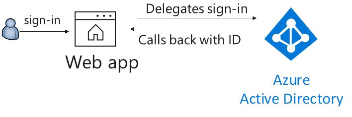

# Integrating Azure AD V2 into an ASP.NET Core web app

> This sample is for ASP.NET Core 2.1
> A previous version for ASP.NET 2.0 is available from the [aspnetcore2-1](https://github.com/Azure-Samples/active-directory-aspnetcore-webapp-openidconnect-v2/tree/aspnetcore2-1) branch

> This sample is for Azure AD, not Azure AD B2C


## Scenario

This sample shows how to build a .NET Core 2.1 MVC Web app that uses OpenID Connect to sign in users. Users can use personal accounts (including outlook.com, live.com, and others) as well as work and school accounts from any company or organization that has integrated with Azure Active Directory. It leverages the ASP.NET Core OpenID Connect middleware.



<!-- Activate when the signInAndCallMsGraph branch is ready
> This is the first of a set of tutorials. Once you understand how to sign-in users in an ASP.NET Core Web App with Open Id Connect, learn how to enable you [Web App to call a Web API in the name of the user](https://github.com/Azure-Samples/active-directory-aspnetcore-webapp-openidconnect-v2/tree/signInAndCallMsGraph)
-->

## How to run this sample

To run this sample:

> Pre-requisites: Install .NET Core 2.1 or later (for example for Windows) by following the instructions at [.NET and C# - Get Started in 10 Minutes](https://www.microsoft.com/net/core). In addition to developing on Windows, you can develop on [Linux](https://www.microsoft.com/net/core#linuxredhat), [Mac](https://www.microsoft.com/net/core#macos), or [Docker](https://www.microsoft.com/net/core#dockercmd).

### Step 1: Register the sample with your Azure AD tenant

#### Choose the Azure AD tenant where you want to create your applications

1. Sign in to the [Azure portal](https://portal.azure.com) using either a work or school account or a personal Microsoft account.
1. If your account is present in more than one Azure AD tenant, select your profile at the top right corner in the menu on top of the page, and then **switch directory**.
   Change your portal session to the desired Azure AD tenant.

#### Register the webApp (WebApp)

1. Navigate to the Microsoft identity platform for developers [App registrations](https://go.microsoft.com/fwlink/?linkid=2083908) page.
1. Select **New registration**.
1. In **App registrations (Preview)** page, select **New registration**.
1. When the **Register an application page** appears, enter your application's registration information:
   - In the **Name** section, enter a meaningful application name that will be displayed to users of the app, for example `WebApp`.
   - In the **Supported account types** section, select **Accounts in any organizational directory and personal Microsoft accounts (e.g. Skype, Xbox, Outlook.com)**.
   - In the Redirect URI (optional) section, select **Web** in the combo-box.
   - For the *Redirect URI*, enter the base URL for the sample. By default, this sample uses `https://localhost:44321/`.
   - Select **Register** to create the application.
1. On the app **Overview** page, find the **Application (client) ID** value and record it for later. You'll need it to configure the Visual Studio configuration file for this project.
1. In the list of pages for the app, select **Authentication**.
   - In the **Redirect URIs**, add a redirect URL of type Web and valued  `https://localhost:44321/signin-oidc`
   - In the **Advanced settings** section set **Logout URL** to `https://localhost:44321/signout-oidc`
   - In the **Advanced settings** | **Implicit grant** section, check **ID tokens** as this sample requires the [Implicit grant flow](https://docs.microsoft.com/azure/active-directory/develop/v2-oauth2-implicit-grant-flow) to be enabled to sign-in the user.
   - Select **Save**.

> Note that unless the Web App calls a Web API no certificate or secret is needed.

### Step 2: Download/ Clone this sample code or build the application using a template

This sample was created from the dotnet core 2.2 [dotnet new mvc](https://docs.microsoft.com/dotnet/core/tools/dotnet-new?tabs=netcore2x) template with `SingleOrg` authentication, and then tweaked to let it support tokens for the Azure AD V2 endpoint. You can clone/download this repository or create the sample from the command line:

#### Option 1: Download/ clone this sample

You can clone this sample from your shell or command line:

  ```console
  git clone https://github.com/Azure-Samples/active-directory-aspnetcore-webapp-openidconnect-v2.git
  ```

> Given that the name of the sample is pretty long, and so are the name of the referenced NuGet packages, you might want to clone it in a folder close to the root of your hard drive, to avoid file size limitations on Windows.

  In the **appsettings.json** file:
  
  - replace the `ClientID` value with the *Application ID* from the application you registered in Application Registration portal on *Step 1*.
  - replace the `TenantId` value with `common`

#### Option 2: Create the sample from the command line

1. Run the following command to create a sample from the command line using the `SingleOrg` template:
    ```console
    dotnet new mvc --auth SingleOrg --client-id <Enter_the_Application_Id_here> --tenant-id common
    ```

    > Note: Replace *`Enter_the_Application_Id_here`* with the *Application Id* from the application Id you just registered in the Application Registration Portal.

2. Open the **Startup.cs** file and in the `ConfigureServices` method, after the line containing `.AddAzureAD` insert the following code, which enables your application to sign in users with the Azure AD v2.0 endpoint, that is both Work and School and Microsoft Personal accounts.

    ```CSharp
    services.Configure<OpenIdConnectOptions>(AzureADDefaults.OpenIdScheme, options =>
    {
        options.Authority = options.Authority + "/v2.0/";
        options.TokenValidationParameters.ValidateIssuer = false;
    });
    ```
    
3. Still in **Startup.cs**, add the following `using` statements to the top of the file:

   ```CSharp
   using Microsoft.AspNetCore.Authentication.OAuth.Claims;
   using Microsoft.AspNetCore.Authentication.OpenIdConnect;
   using System.Security.Claims;
   ```

4. Modify `Views\Shared\_LoginPartial.cshtml` to have the following content:

    ```CSharp
    @using System.Security.Claims

    @if (User.Identity.IsAuthenticated)
    {
        var identity = User.Identity as ClaimsIdentity; // Azure AD V2 endpoint specific
        string preferred_username = identity.Claims.FirstOrDefault(c => c.Type == "preferred_username")?.Value;
        <ul class="nav navbar-nav navbar-right">
            <li class="navbar-text">Hello @preferred_username</li>
            <li><a asp-area="AzureAD" asp-controller="Account" asp-action="SignOut">Sign out</a></li>
        </ul>
    }
    else
    {
        <ul class="nav navbar-nav navbar-right">
            <li><a asp-area="AzureAD" asp-controller="Account" asp-action="Signin">Sign in</a></li>
        </ul>
    }
    ```

    > Note: This change is needed because certain token claims from Azure AD V1 endpoint (on which the original .NET core template is based) are different than Azure AD V2 endpoint.

### Step 3: Run the sample

1. Build the solution and run it.

2. Open your web browser and make a request to the app. Accept the IIS Express SSL certificate if needed. The app immediately attempts to authenticate you via the Azure AD v2 endpoint. Sign in with your personal account or with work or school account.

## Optional: Restrict sign-in access to your application

By default, when you use the dotnet core template with `SingleOrg` authentication option and follow the instructions in this guide to configure the application to use the Azure Active Directory v2.0 endpoint, both personal accounts - like outlook.com, live.com, and others - as well as Work or school accounts from any organizations that are integrated with Azure AD can sign in to your application. These multi-tenant apps are typically used on SaaS applications.

To restrict accounts types that can sign in to your application, use one of the options:

### Option 1: Restrict access to only Work and School accounts

Open **appsettings.json** and replace the line containing the `TenantId` value with `organizations`:

```json
"TenantId": "organizations",
```

### Option 2: Restrict access to only Microsoft personal accounts

Open **appsettings.json** and replace the line containing the `TenantId` value with `consumers`:

```json
"TenantId": "consumers",
```

### Option 3: Restrict access to a single organization (single-tenant)

You can restrict sign-in access for your application to only user accounts that are in a single Azure AD tenant - including *guest accounts* of that tenant. This scenario is a common for *line-of-business applications*:

1. Open **appsettings.json** and replace the line containing the `TenantId` value with the domain of your tenant, for example, *contoso.onmicrosoft.com* or the guid for the Tenant ID:

   ```json
   "TenantId": "[Enter the domain of your tenant, e.g. contoso.onmicrosoft.com or the Tenant Id]",
   ```

2. In your **Startup.cs** file, change the code we added in the `ConfigureServices` method to be:

    ```CSharp
    services.Configure<OpenIdConnectOptions>(AzureADDefaults.OpenIdScheme, options =>
    {
        options.Authority = options.Authority + "/v2.0/";
        options.TokenValidationParameters.ValidateIssuer = true;
    });
    ```

### Option 4: Restrict access to a list of organizations

You can restrict sign-in access to only user accounts that are in a specific list of Azure AD organizations:

1. In your **Startup.cs** file, set the `ValidateIssuer` argument to **`true`**
2. Add a `ValidIssuers` `TokenValidationParameters` parameter containing the list of allowed organizations.

### Option 5: Use a custom method to validate issuers

You can implement a custom method to validate issuers by using the **IssuerValidator** parameter. For more information about how to use this parameter, read about [Validating Tokens](https://github.com/AzureAD/azure-activedirectory-identitymodel-extensions-for-dotnet/wiki/ValidatingTokens).

## About The code

This sample shows how to use the OpenID Connect ASP.NET Core middleware to sign in users from a single Azure AD tenant. The middleware is initialized in the `Startup.cs` file by passing it the Client ID of the app, and the URL of the Azure AD tenant where the app is registered. These values are  read from the `appsettings.json` file. The middleware takes care of:

- Downloading the Azure AD metadata, finding the signing keys, and finding the issuer name for the tenant.
- Processing OpenID Connect sign-in responses by validating the signature and issuer in an incoming JWT, extracting the user's claims, and putting the claims in `ClaimsPrincipal.Current`.
- Integrating with the session cookie ASP.NET Core middleware to establish a session for the user.

You can trigger the middleware to send an OpenID Connect sign-in request by decorating a class or method with the `[Authorize]` attribute or by issuing a challenge (see the [AccountController.cs](https://github.com/aspnet/AspNetCore/blob/master/src/Azure/AzureAD/Authentication.AzureAD.UI/src/Areas/AzureAD/Controllers/AccountController.cs) file in the ASP.NET Core source tree):

```csharp
return Challenge(
    new AuthenticationProperties { RedirectUri = redirectUrl },
    OpenIdConnectDefaults.AuthenticationScheme);
```

Similarly, you can send a sign-out request:

```csharp
return SignOut(
    new AuthenticationProperties { RedirectUri = callbackUrl },
    CookieAuthenticationDefaults.AuthenticationScheme,
    OpenIdConnectDefaults.AuthenticationScheme);
```

The middleware in this project is created as a part of the open-source [ASP.NET Security](https://github.com/aspnet/Security) project.

## Learn more

### Token validation

To understand more about app registration, see:

- [Quickstart: Register an application with the Microsoft identity platform (Preview)](https://docs.microsoft.com/azure/active-directory/develop/quickstart-register-app)
- [Quickstart: Configure a client application to access web APIs (Preview)](https://docs.microsoft.com/azure/active-directory/develop/quickstart-configure-app-access-web-apis)

The token validation is performed by the classes of the [Identity Model Extensions for DotNet](https://github.com/AzureAD/azure-activedirectory-identitymodel-extensions-for-dotnet) library. Learn about customizing
token validation by reading:

- [Validating Tokens](https://github.com/AzureAD/azure-activedirectory-identitymodel-extensions-for-dotnet/wiki/ValidatingTokens) in that library's conceptual documentation
- [TokenValidationParameters](https://docs.microsoft.com/en-us/dotnet/api/microsoft.identitymodel.tokens.tokenvalidationparameters?view=azure-dotnet)'s reference documentation.

<!-- Activate when the signInAndCallMsGraph branch is ready
### Next steps - call a Web API from the Web App

Now that  you understand how to sign in users in an ASP.NET Core Web App with Open ID Connect, learn how to [enable your Web App to call a Web API in the name of the user](https://github.com/Azure-Samples/active-directory-aspnetcore-webapp-openidconnect-v2/tree/signInAndCallMsGraph)
-->
