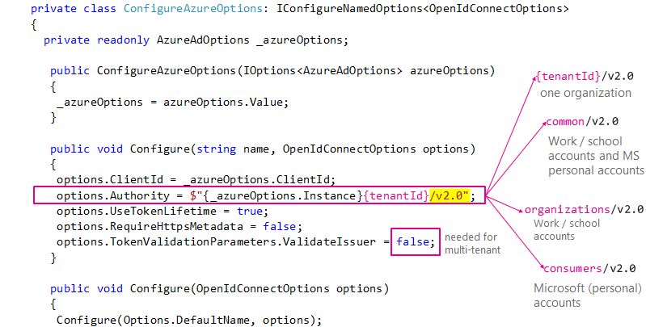

# Integrating Azure AD V2 into an ASP.NET Core web app

This sample shows how to build a .NET Core MVC Web app that uses OpenID Connect to sign in users with their Work and School or Microsoft personal account (formerly live accounts). It leverages the ASP.NET Core OpenID Connect middleware.


For more information on how the protocols work in this scenario and other scenarios, see [Authentication Scenarios for Azure AD](http://go.microsoft.com/fwlink/?LinkId=394414).

## How to run this sample

To run this sample:

- Install .NET Core (for example for Windows) by following the instructions at [.NET and C# - Get Started in 10 Minutes](https://www.microsoft.com/net/core). In addition to developing on Windows, you can develop on [Linux](https://www.microsoft.com/net/core#linuxredhat), [Mac](https://www.microsoft.com/net/core#macos), or [Docker](https://www.microsoft.com/net/core#dockercmd).
- An Azure AD tenant. For more information on how to obtain an Azure AD tenant, see [How to get an Azure AD tenant](https://azure.microsoft.com/documentation/articles/active-directory-howto-tenant/).

### Step 1: Register the sample with your Azure AD tenant

1. Sign in to the [Application registration portal](https://apps.dev.microsoft.com) either a personal or work or school Microsoft account
1. Look at your list of Microsoft apps
1. Click **Add an app**, and give it a name. Then press **Create**. The portal will assign your app a globally unique Application ID that you'll use later in your code.
1. Click on **Add Platform**, and in the dialog press the **Web** icon.
1. In the Redirect URLs field, add `http://localhost:5000/` and `http://localhost:5000/signin-oidc`

> [!NOTE]
> The base address in the **Sign-on URL** and **Logout URL** settings is `http://localhost:5000`. This localhost address allows the sample app to run insecurely from your local system. Port 5000 is the default port for the [Kestrel server](https://docs.microsoft.com/aspnet/core/fundamentals/servers/kestrel). Update these URLs if you configure the app for production use (for example, `https://www.contoso.com/signin-oidc` and `https://www.contoso.com/signout-oidc`).

### Step 2: Create the sample

This sample was created from the dotnet core 2.0 template [dotnet new mvc](https://docs.microsoft.com/dotnet/core/tools/dotnet-new?tabs=netcore2x) template with `SingleOrg` authentication, and then tweaked to let it support tokens for the Azure AD V2 endpoint. You can create the sample from the command line or clone/download this repository:

#### To create the sample from the command line

- Execute the following command:

  ```console
  dotnet new mvc --auth SingleOrg --client-id <CLIENT_ID_(APP_ID)>
  ```

  Use the value that you recorded from the Azure portal for \<CLIENT\_ID\_(APP\_ID)>.

- Then:

  - Modify the `Configure` method in `Extensions\AzureAdAuthenticationBuilderExtensions.cs` file. This method show be as follows (the changed lines are the lines containing  `Authority`, and `ValidateIssuer`)

    ```CSharp
    public void Configure(string name, OpenIdConnectOptions options)
    {
        options.ClientId = _azureOptions.ClientId;
        options.Authority = $"{_azureOptions.Instance}common/v2.0";   // V2 specific
        options.UseTokenLifetime = true;
        options.RequireHttpsMetadata = false;
        options.TokenValidationParameters.ValidateIssuer = false;     // accept any tenant
    }
    ```
  - Modify `Views\Shared\_LoginPartial.cshtml` to have the following content:

    ```CSharp
    @using System.Security.Claims

    @if (User.Identity.IsAuthenticated)
    {
        var identity = User.Identity as ClaimsIdentity; // V2 specific
        string preferred_username = identity.Claims.FirstOrDefault(c => c.Type == "preferred_username")?.Value;
        <ul class="nav navbar-nav navbar-right">
            <li class="navbar-text">Hello @preferred_username</li>
            <li><a asp-area="" asp-controller="Account" asp-action="SignOut">Sign out</a></li>
        </ul>
    }
    else
    {
        <ul class="nav navbar-nav navbar-right">
            <li><a asp-area="" asp-controller="Account" asp-action="Signin">Sign in</a></li>
        </ul>
    }
    ```

    This change is needed because the claims are different in the Azure AD V1 and Azure AD V2 tokens. Here the 'preferred_username' claim is used, which turns out to be the user's email address.

#### To clone / download the sample

- Execute the following command from your shell or command line:

  ```console
  git clone https://github.com/Azure-Samples/active-directory-dotnet-webapp-openidconnect-aspnetcore.git
  ```

  In the **appsettings.json* file, provide values for the `Domain`, `TenantId`, and `ClientID` that you recorded earlier from the Azure portal.

### Step 3: Run the sample

Build the solution and run it.

Make a request to the app. The app immediately attempts to authenticate you via Azure AD. Sign in with the username and password of a user account that is in your Azure AD tenant or your microsoft personal account.

## About The code

### ASP.NET Core middleware

This sample shows how to use the OpenID Connect ASP.NET Core middleware to sign in users from a single Azure AD tenant. The middleware is initialized in the `Startup.cs` file by passing it the Client ID of the app and the URL of the Azure AD tenant where the app is registered, which is read from the `appsettings.json` file. The middleware takes care of:

- Downloading the Azure AD metadata, finding the signing keys, and finding the issuer name for the tenant.
- Processing OpenID Connect sign-in responses by validating the signature and issuer in an incoming JWT, extracting the user's claims, and putting the claims in `ClaimsPrincipal.Current`.
- Integrating with the session cookie ASP.NET Core middleware to establish a session for the user.

You can trigger the middleware to send an OpenID Connect sign-in request by decorating a class or method with the `[Authorize]` attribute or by issuing a challenge (see the `AccountController.cs` file):

```csharp
return Challenge(
    new AuthenticationProperties { RedirectUri = redirectUrl },
    OpenIdConnectDefaults.AuthenticationScheme);
```

Similarly, you can send a sign-out request:

```csharp
return SignOut(
    new AuthenticationProperties { RedirectUri = callbackUrl },
    CookieAuthenticationDefaults.AuthenticationScheme,
    OpenIdConnectDefaults.AuthenticationScheme);
```

The middleware in this project is created as a part of the open-source [ASP.NET Security](https://github.com/aspnet/Security) project.

### What is specific to Azure AD V2?

ASP.NET Core creates Web applications for the V1 endpoint. It's easy, however to update the code to let users sign-in with both work and school accounts and Microsoft personal accounts. It's also possible to restrict the accounts used to sign-in

#### Modified code

The specific Azure AD V2 code is in `Configure(string name, OpenIdConnectOptions options)`:

```CSharp
    options.Authority = $"{_azureOptions.Instance}common/v2.0";   // V2 specific
    options.TokenValidationParameters.ValidateIssuer = false;     // accept any tenant
```

The first line tells the middleware to let sign-in users with the Azure AD V2 endpoint, that is with their work and school account or Microsoft personal account.

The second line tells the middleware to not validate the tenants. If you want to validate the tenants, you can set `ValidateIssuer` to true, and add a delegate as the `options.TokenValidationParameters.IssuerValidator` property.

#### Variations

You can decide which user accounts can sign-in to your Web App by changing the Authority. The picture below shows all the possibilities


