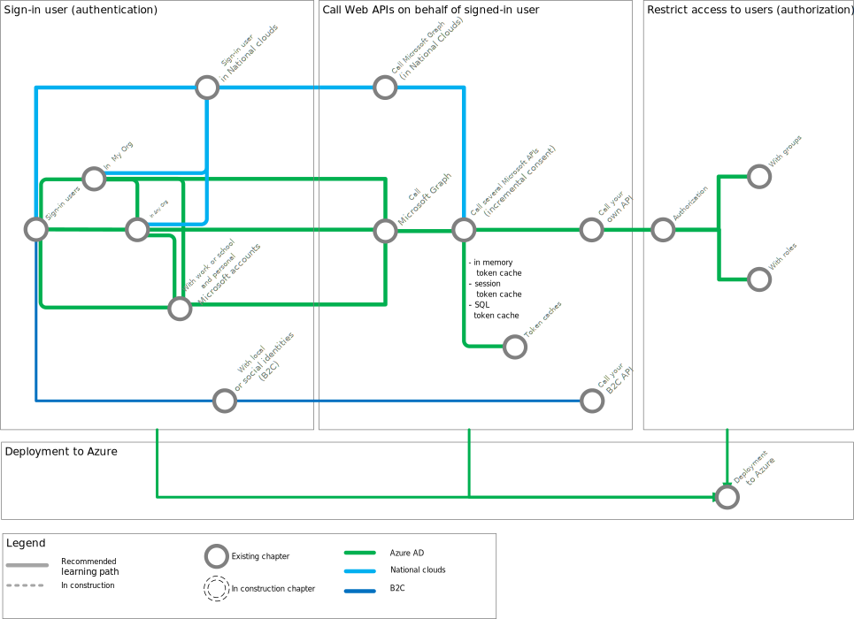

---
languages:
- csharp
- powershell
- html
page_type: sample
description: "Learn how to add sign-in users to your web app, and how to call web APIs, either from Microsoft or your own."
products:
- azure
- azure-active-directory
- dotnet
- azure-storage
- aspnet
- ms-graph
urlFragment: enable-webapp-signin
---

# Tutorial - Enable your Web Apps to sign-in users and call APIs with the Microsoft identity platform for developers

[](https://identitydivision.visualstudio.com/IDDP/_build/latest?definitionId=819)

## About this tutorial

### Scope of this tutorial

In this tutorial, you will learn, incrementally, how to add sign-in users to your Web App, and how to call Web APIs, both Microsoft APIs or your own APIs. Finally, you'll learn best practices and how to deploy your app to Azure

[](https://github.com/Azure-Samples/active-directory-aspnetcore-webapp-openidconnect-v2/raw/master/ReadmeFiles/aspnetcore-webapp-tutorial-alt.svg?sanitize=true)

> Note
>
> We recommend that you right click on the picture above and open it in a new tab, or a new window. You'll see a clickable image:
>
> - clicking on a metro/railway station will get you directly to the README.md for the corresponding part of the tutorial (some are still in progress)
> - clicking on some of the connectors between stations will get you to an incremental README.md showing how to get from one part of the tutorial to the next (that's for instance the case for the Sign-in ... stations)

### Details of the chapters

1. In the first chapter you learn how to [add signing-in users to your Web App](https://github.com/Azure-Samples/active-directory-aspnetcore-webapp-openidconnect-v2/tree/master/1-WebApp-OIDC/README.md) with the Microsoft identity platform for developers (formerly Azure AD v2.0). You'll learn how to use the [Microsoft.Identity.Web](https://aka.ms/microsoft-identity-web) to secure your Web App with the Microsoft Identity Platform.

   

   Depending on your business needs, the platform offers you flexibility in terms of what type of users ([sign in audience](https://aka.ms/signinaudience)) can sign-in to your application:
   1. If you are a Line of Business (LOB) developer, you'd probably want to only [sign-in users in your organization](https://github.com/Azure-Samples/active-directory-aspnetcore-webapp-openidconnect-v2/tree/master/1-WebApp-OIDC/1-1-MyOrg/README.md) with their work or school accounts.
   1. If you are an ISV building a software-as-a-service (SaaS) application, you'd want to [sign-in users in any Azure AD tenant](https://github.com/Azure-Samples/active-directory-aspnetcore-webapp-openidconnect-v2/tree/master/1-WebApp-OIDC/1-2-AnyOrg/README-1-1-to-1-2.md).
   1. If you are an an ISV building a software-as-a-service (SaaS) application who wish to sign-in users from both Azure AD tenants and Microsoft consumer Accounts (MSA) you'll want to [sign-in users with their work and school accounts or Microsoft personal accounts](https://github.com/Azure-Samples/active-directory-aspnetcore-webapp-openidconnect-v2/tree/master/1-WebApp-OIDC/1-3-AnyOrgOrPersonal/README-1-1-to-1-3.md).
   1. If your application needs to sign-in users in Azure AD tenants in [national and sovereign clouds](https://github.com/Azure-Samples/active-directory-aspnetcore-webapp-openidconnect-v2/tree/master/1-WebApp-OIDC/1-4-Sovereign/README.md).
   1. If you application wants to connect with your customers, or with small business partners, you can have your application [sign-in users with their social identities](https://github.com/Azure-Samples/active-directory-aspnetcore-webapp-openidconnect-v2/tree/master/1-WebApp-OIDC/1-5-B2C/README.md) using Microsoft Azure AD B2C.
   1. Finally, you'll want to let users [sign-out](https://github.com/Azure-Samples/active-directory-aspnetcore-webapp-openidconnect-v2/tree/master/1-WebApp-OIDC/1-6-SignOut/README.md) from your application, or globally from their browser session.

2. If your Web app  only needs to sign-in users, in that case you have all you need from the options provided above, but if your app needs to call APIs that you've developed yourselves or popular Microsoft APIs like Microsoft Graph, then the following chapters will help extend your work so far to also call these Web APIs.

   

   Learn how to update your Web app to [call Microsoft Graph](https://graph.microsoft.com):

   1. We'd use the the [Microsoft.Identity.Web](https://aka.ms/microsoft-identity-web)  library again to extend the web app to [sign-in users and also call Microsoft Graph](https://github.com/Azure-Samples/active-directory-aspnetcore-webapp-openidconnect-v2/tree/master/2-WebApp-graph-user/2-1-Call-MSGraph/README.md)
   1. In this chapter we'd explain the token cache and how [customize the token cache serialization](https://github.com/Azure-Samples/active-directory-aspnetcore-webapp-openidconnect-v2/tree/master/2-WebApp-graph-user/2-2-TokenCache/README-incremental-instructions.md)
 with different technologies depending on your needs (in-memory cache, Session token cache, SQL Server Cache, Redis Cache)
   1. Learn how to [secure a multi-tenant SaaS application](https://github.com/Azure-Samples/active-directory-aspnetcore-webapp-openidconnect-v2/tree/master/2-WebApp-graph-user/2-3-Multi-Tenant/README.md)
   1. Learn how to call Microsoft Graph in [national and sovereign clouds](https://github.com/Azure-Samples/active-directory-aspnetcore-webapp-openidconnect-v2/tree/master/2-WebApp-graph-user/2-4-Sovereign-Call-MSGraph/README.md).

3. Your Web App might also want to call other Web APIs than Microsoft Graph.

   

   Learn how to [call popular Azure APIs](https://github.com/Azure-Samples/active-directory-aspnetcore-webapp-openidconnect-v2/tree/master/3-WebApp-multi-APIs/README.md). This also explains how to handle conditional access, incremental consent and claims challenge:

   1. The [Azure Storage API](https://docs.microsoft.com/rest/api/storageservices/). This is the opportunity to learn about incremental consent, and conditional access, and how to process them.
   1. The [Azure Service Management API](https://azure.microsoft.com/blog/introducing-the-windows-azure-service-management-api/). This is the opportunity to learn about admin consent.

   > Note that that chapter, as compared to the others, requires you to have an [Azure Subscription](https://azure.microsoft.com/free/)

4. If you wish to secure a Web API of your own, and call it from your clients (Web apps, desktop apps).

   

   - Learn how to secure your own Web API and update your Web App to [call your own web API](https://github.com/Azure-Samples/active-directory-aspnetcore-webapp-openidconnect-v2/tree/master/4-WebApp-your-API/4-1-MyOrg/README-incremental-instructions.md)
   - Learn how to update you B2C Web App to [call you own B2C web API](https://github.com/Azure-Samples/active-directory-aspnetcore-webapp-openidconnect-v2/tree/master/4-WebApp-your-API/4-2-B2C/README.md)
   - Learn how to [secure a multi-tenant SaaS application with its own Web API](https://github.com/Azure-Samples/active-directory-aspnetcore-webapp-openidconnect-v2/tree/master/4-WebApp-your-API/4-3-AnyOrg/Readme.md)

5. Once you know how to sign-in users and call Web APIs from your Web App, you might want to restrict part of the application depending on the user having a role in the application or belonging to a group. So far you've learnt how to add and process authentication. Now learn how to [add authorization to your Web application](https://github.com/Azure-Samples/active-directory-aspnetcore-webapp-openidconnect-v2/tree/master/5-WebApp-AuthZ), and driving business logic according to roles and group assignments.

   1. [based on their application roles](https://github.com/Azure-Samples/active-directory-aspnetcore-webapp-openidconnect-v2/tree/master/5-WebApp-AuthZ/5-1-Roles/README-incremental-instructions.md)
   2. [based on their belonging to Azure AD groups](https://github.com/Azure-Samples/active-directory-aspnetcore-webapp-openidconnect-v2/tree/master/5-WebApp-AuthZ/5-2-Groups/README-incremental-instructions.md)

6. If you want to [deploy your complete app to Azure](https://github.com/Azure-Samples/active-directory-aspnetcore-webapp-openidconnect-v2/tree/master/6-Deploy-to-Azure/README.md). Learn how to do that, along with best practices to ensure security:

   1. Changing the app registration to add more ReplyUris.
   2. Using certificates instead of client secrets.
   3. Use [Managed identities](https://docs.microsoft.com/azure/active-directory/managed-identities-azure-resources/overview) to get these certificates from KeyVault

### Daemon apps  - Out of scope

This tutorial only covers the case the Web App calls a Web API on behalf of a user. If you are interested in Web Apps calling Web APIs with their own identity (daemon Web Apps), please see [Build a daemon Web App with Microsoft Identity platform for developers](https://github.com/Azure-Samples/active-directory-dotnet-daemon-v2)

## How to run this sample

### Pre-requisites

- Install .NET Core for Windows by following the instructions at [dot.net/core](https://dot.net/core), which will include [Visual Studio](https://aka.ms/vsdownload).
- An Azure Active Directory (Azure AD) tenant. For more information on how to get an Azure AD tenant, see [How to get an Azure AD tenant](https://docs.microsoft.com/azure/active-directory/develop/quickstart-create-new-tenant)
- A user account in your Azure AD tenant, or a Microsoft personal account

### Step 1:  Clone or download this repository

From your shell or command line:

```Shell
git clone https://github.com/Azure-Samples/microsoft-identity-platform-aspnetcore-webapp-tutorial
```

> :warning: Given that the name of the sample is quite long, and so are the names of the referenced packages, you might want to clone it in a folder close to the root of your hard drive, to avoid file size limitations on Windows.

- We recommend that you start from chapter [1. WebApp signs-in users with Microsoft identity (OIDC)](https://github.com/Azure-Samples/active-directory-aspnetcore-webapp-openidconnect-v2/tree/master/1-WebApp-OIDC/README.md) where you will learn how to sign-in users within your own organization
- It's however possible to start at any chapter of the tutorial as the full code is provided in each folder.

## Community Help and Support

Use [Stack Overflow](http://stackoverflow.com/questions/tagged/msal) to get support from the community.
Ask your questions on Stack Overflow first and browse existing issues to see if someone has asked your question before.
Make sure that your questions or comments are tagged with [`msal` `dotnet`].

If you find a bug in the sample, please raise the issue on [GitHub Issues](https://github.com/Azure-Samples/active-directory-aspnetcore-webapp-openidconnect-v2/issues).

To provide a recommendation, visit the following [User Voice page](https://feedback.azure.com/forums/169401-azure-active-directory).

> [Consider taking a moment to share your experience with us.](https://forms.office.com/Pages/ResponsePage.aspx?id=v4j5cvGGr0GRqy180BHbRz0h_jLR5HNJlvkZAewyoWxUNEFCQ0FSMFlPQTJURkJZMTRZWVJRNkdRMC4u)

## Contributing

If you'd like to contribute to this sample, see [CONTRIBUTING.MD](https://github.com/Azure-Samples/active-directory-aspnetcore-webapp-openidconnect-v2/blob/master/CONTRIBUTING.md).

This project has adopted the [Microsoft Open Source Code of Conduct](https://opensource.microsoft.com/codeofconduct/). For more information, see the [Code of Conduct FAQ](https://opensource.microsoft.com/codeofconduct/faq/) or contact [opencode@microsoft.com](mailto:opencode@microsoft.com) with any additional questions or comments.

## Other samples and documentation

- The documentation for the Microsoft identity platform is available from [https://aka.ms/aadv2](https://aka.ms/aadv2).
- Other samples for the Microsoft identity platform are available from [https://aka.ms/aaddevsamplesv2](https://aka.ms/aaddevsamplesv2).
- The conceptual documentation for MSAL.NET is available from [https://aka.ms/msalnet](https://aka.ms/msalnet).
