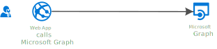
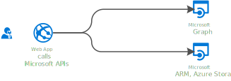
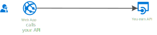

# Tutorial - Enable your Web Apps to sign-in users and call APIs with the Microsoft identity platform for developers

## About this tutorial

### Scope of this tutorial

In this tutorial, you will learn, incrementally, how to add sign-in users to your Web App, and how to call Web APIs, either from Microsoft or your own. Finally, you'll learn best practices and how to deploy your app to Azure

1. The first phase is to [add sign-in to your Web App](1.%20WebApp%20signs-in%20users%20with%20Microsoft%20Identity%20(OIDC)) leveraging the Microsoft identity platform for developers (fomerly Azure AD v2.0). You'll learn how to use  the ASP.NET Core OpenID Connect (OIDC) middleware itself leveraging [Microsoft Identity Model extensions for .NET](https://github.com/AzureAD/azure-activedirectory-identitymodel-extensions-for-dotnet/wiki) to protect your Web App.

   

   Depending on your business needs, you have the flexibility to decide which audience to sign-in to your application:
   1. If you are a Line of Business (LOB) developer, you'll want to [sign-in users in your organization](./1.%20WebApp%20signs-in%20users%20with%20Microsoft%20Identity%20(OIDC)/1.1.%20in%20my%20org) with their work or school accounts.
   1. If you are an ISV, you'll want to [sign-in users in any organization](./1.%20WebApp%20signs-in%20users%20with%20Microsoft%20Identity%20(OIDC)/1.2.%20in%20any%20org), still  with their work or school accounts.
   1. If you are an ISV targetting both organizations and individuals, you'll want to [sign-in users with their work and school accounts or Microsoft personal accounts](./1.%20WebApp%20signs-in%20users%20with%20Microsoft%20Identity%20(OIDC)/1.3.%20with%20work%20and%20school%20or%20personal%20accounts).
   1. LOB developer or ISV, if you target organizations (work or school accounts), you can also enable your application to sign-in users in [**poachable**]  [national and sovereign clouds](./1.%20WebApp%20signs-in%20users%20with%20Microsoft%20Identity%20(OIDC)/1.4.%20in%20national%20and%20sovereign%20clouds).
   1. If you are a business wanting to connect with your customers, or with small business partners, you might also want to [**poachable**]  [sign-in users with their social identities](./1.%20WebApp%20signs-in%20users%20with%20Microsoft%20Identity%20(OIDC)/1.5.%20with%20social%20identities%20(B2C)) using Microsoft Azure AD B2C.
   1. Finally, you'll want to let users [**poachable**] [sign-out](./1.%20WebApp%20signs-in%20users%20with%20Microsoft%20Identity%20(OIDC)/1.6.%20and%20lets%20them%20sign-out) of our application, or globally of the browser.

2. Your Web App might maintain its own resources (in that case you have all you need so far), but it could also be that it calls Microsoft APIs.

   

   Learn how to update your Web App to [call Microsoft Graph](2.%20WebApp%20calls%20Microsoft%20Graph%20on%20behalf%20of%20signed-in%20user):

   1. Using the [authorization code flow](2.%20WebApp%20calls%20Microsoft%20Graph%20on%20behalf%20of%20signed-in%20user/2.1.%20using%20authorization%20code%20flow), initiated by ASP.NET Core, but completed by Microsoft Authentication Library for .NET (MSAL.NET)
   2. Learn how to [**poachable**]  [customize the token cache serialization](2.%20WebApp%20calls%20Microsoft%20Graph%20on%20behalf%20of%20signed-in%20user/2.2.%20token%20cache%20serialization)
) with different technologies depending on your needs (in memory cache, Session token cache, SQL Cache, Redis Cache)
   3. Learn the [**poachable**]  [best practices and practices to avoid](./2.%20WebApp%20calls%20Microsoft%20Graph%20on%20behalf%20of%20signed-in%20user/2.3.%20best%20practices%20and%20practices%20to%20avoid) when calling an API.

3. Your Web App might also want to call other Web APIs than Microsoft Graph.

   

   Learn how  [**in-progress**]  [call several Microsoft APIS](./3.%20WebApp%20calls%20several%20APIS%20(incremental%20consent%20and%20CA)):

   1. the Azure Storage API. This is the opportunity to learn about incremental consent, and conditional access, and how to process them.
   2. the Azure ARM API. This is the opportunity to learn about admin consent.

4. [Planned] [**poachable**]  Then you might yourself have written a Web API, and want to call it from your Web App.

   

5. [Planned] [**poachable**] Once you know how to sign-in users and call Web APIs from your Web App, you might want to restrict part of the application depending on the user having a role in the application or belonging to a group. So far you've learnt how to add and process authentication. Now learn how to [add authorization to your Web application](/5.%20Adding%20authorization%20(roles%20and%20groups)):

   1. with application roles
   2. with Azure AD groups.

6. [Planned][**poachable**]  Chances are that you want to [deploy your complete app to Azure](./6.%20Deploy%20your%20full%20app%20to%20azure%20-%20best%20practices). Learn how to do that, applying best practices:

   1. Changing the app registration to add more ReplyUris
   2. Using certificates instead of client secrets
   3. Possibly leveraging Managed identities to get these certificates from KeyVault

### Reusable code for your Web Apps and Web APIs

In this tutorial, the complexities of ASP.NET Core OpenID connect middleware and MSAL.NET are encapsulated into a library project that you can reuse in your own code, to make it easier to build your Web Apps on top of Microsoft identity platform for developers: [Microsoft.Identity.Web](Microsoft.Identity.Web)

### Daemon apps  - Out of scope

This tutorial only covers the case the Web App calls a Web API on behalf of a user. If you are interested in Web Apps calling Web APIs with their own identity (daemon Web Apps), please see [Build a daemon Web App with Microsoft Identity platform for developers](https://github.com/Azure-Samples/active-directory-dotnet-daemon-v2)

## How to run this sample

### Pre-requisites

- Install .NET Core for Windows by following the instructions at [dot.net/core](https://dot.net/core), which will include [Visual Studio 2017](https://aka.ms/vsdownload).
- An Internet connection
- An Azure Active Directory (Azure AD) tenant. For more information on how to get an Azure AD tenant, see [How to get an Azure AD tenant](https://azure.microsoft.com/en-us/documentation/articles/active-directory-howto-tenant/)
- A user account in your Azure AD tenant, or a Microsoft personal account

### Step 1:  Clone or download this repository

From your shell or command line:

```Shell
git clone https://github.com/Azure-Samples/microsoft-identity-platform-aspnetcore-webapp-tutorial webapp
cd webapp
```

### Option 2: Restrict access to a list of organizations

You can restrict sign-in access to only user accounts that are in a specific list of Azure AD organizations:

1. In your **Extensions\AzureAdAuthenticationBuilderExtensions.cs** file, set the `ValidateIssuer` argument to **`true`**
2. Add a `ValidIssuers` `TokenValidationParameters` parameter containing the list of allowed organizations.

### Option 3: Use a custom method to validate issuers

You can implement a custom method to validate issuers by using the **IssuerValidator** parameter. For more information about how to use this parameter, read about the [TokenValidationParameters class](https://msdn.microsoft.com/library/system.identitymodel.tokens.tokenvalidationparameters.aspx) on MSDN.

### Variations

You can also decide which types of user accounts can sign in to your Web App by changing the Authority. The picture below shows all the possibilities


## About the code

This sample shows how to use the OpenID Connect ASP.NET Core middleware to sign in users from a single Azure AD tenant. The middleware is initialized in the `Startup.cs` file by passing it the Client ID of the app and the URL of the Azure AD tenant where the app is registered, which is read from the `appsettings.json` file. The middleware takes care of:

- Downloading the Azure AD metadata, finding the signing keys, and finding the issuer name for the tenant.
- Processing OpenID Connect sign-in responses by validating the signature and issuer in an incoming JWT, extracting the user's claims, and putting the claims in `ClaimsPrincipal.Current`.
- Integrating with the session cookie ASP.NET Core middleware to establish a session for the user.

- We recommend that you start by the first part [1. WebApp signs-in users with Microsoft identity (OIDC)](1.%20WebApp%20signs-in%20users%20with%20Microsoft%20Identity%20(OIDC)) where you will learn how to sign-in users within your own organization
- It's however possible to start at any phase of the tutorial as the full code is provided in each folder.

## Community Help and Support

Use [Stack Overflow](http://stackoverflow.com/questions/tagged/msal) to get support from the community.
Ask your questions on Stack Overflow first and browse existing issues to see if someone has asked your question before.
Make sure that your questions or comments are tagged with [`msal` `dotnet`].

If you find a bug in the sample, please raise the issue on [GitHub Issues](../../issues).

To provide a recommendation, visit the following [User Voice page](https://feedback.azure.com/forums/169401-azure-active-directory).

## Contributing

If you'd like to contribute to this sample, see [CONTRIBUTING.MD](/CONTRIBUTING.md).

The token validation is performed by the classes of the [Identity Model Extensions for DotNet](https://github.com/AzureAD/azure-activedirectory-identitymodel-extensions-for-dotnet) library. Learn how to customize
token validation by reading the *Conceptual Documentation* section of [ValidatingTokens](https://github.com/AzureAD/azure-activedirectory-identitymodel-extensions-for-dotnet/wiki/ValidatingTokens).

### Next steps - call a Web API from the Web App

- the documentation for the Microsoft identity platform for developers is available from [https://aka.ms/aadv2](https://aka.ms/aadv2)
- Other samples for the Microsoft identity platform for developers are available from [https://aka.ms/aaddevsamplesv2](https://aka.ms/aaddevsamplesv2)
- The conceptual documentation for MSAL.NET is available from [https://aka.ms/msalnet](https://aka.ms/msalnet)
