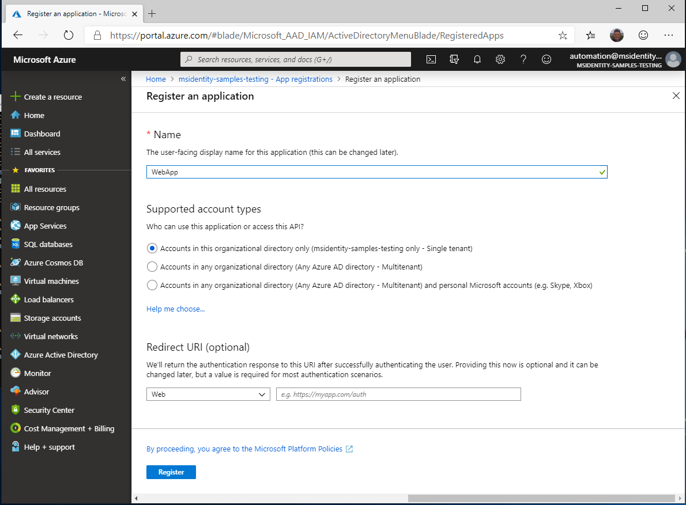
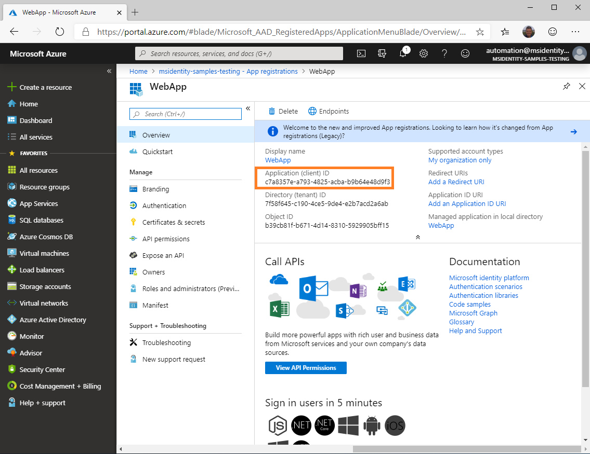
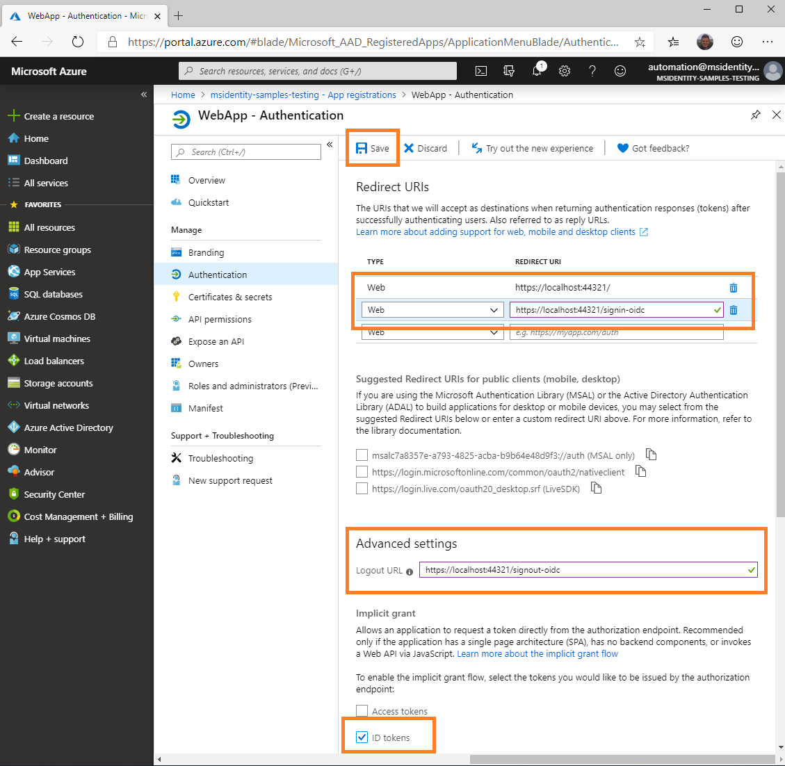

### Choose the Azure AD tenant where you want to create your applications

### 1. Sign in to the [Azure portal](https://portal.azure.com) using either a work or school account or a personal Microsoft account

### 2. If your account is present in more than one Azure AD tenant, select your profile at the top right corner in the menu on top of the page, and then **switch directory**

   Change your portal session to the desired Azure AD tenant.

#### Register the webApp app (WebApp)

##### 1. Navigate to the Microsoft identity platform for developers [App registrations](https://go.microsoft.com/fwlink/?linkid=2083908) page

##### 2. Select **New registration**

##### 3. When the **Register an application page** appears, enter your application's registration information

- In the **Name** section, enter a meaningful application name that will be displayed to users of the app, for example `WebApp`.
- In the **Supported account types** section, select **Accounts in this organizational directory only ({tenant name})**

  

   
Expand/collapse screenshot

   

  

     > Note that there are more than one redirect URIs. You'll need to add them from the **Authentication** tab later after the app has been created successfully.

##### 4. Select **Register** to create the application

##### 5. On the app **Overview** page, find the **Application (client) ID** value and record it for later. You'll need it to configure the Visual Studio configuration file for this project

 
Expand/collapse screenshot

 

##### 6. In the list of pages for the app, select **Authentication**..

- In the Redirect URIs section, select **Web** in the combo-box and enter the following redirect URIs.
- `https://localhost:44321/`
       - `https://localhost:44321/signin-oidc`
- In the **Advanced settings** section set **Logout URL** to `https://localhost:44321/signout-oidc`
- In the **Advanced settings** | **Implicit grant** section, check **ID tokens** as this sample requires
     the [ID Token](https://docs.microsoft.com/azure/active-directory/develop/id-tokens) to be enabled to sign-in the user.

     

      
Expand/collapse screenshot

     

     

##### 7. Select **Save**.

##### 8. In Visual Studio, if you didn't do it yet, replace in **appsettings.json** file

- `ClientID` value with the *Application ID* from the application you just registered.
- `TenantId` value with the *Tenant ID*.
- `Domain` value with the *Azure AD domain name*,  e.g. contoso.onmicrosoft.com.
  
> Note that unless the Web App calls a Web API, no certificate or secret is needed.
